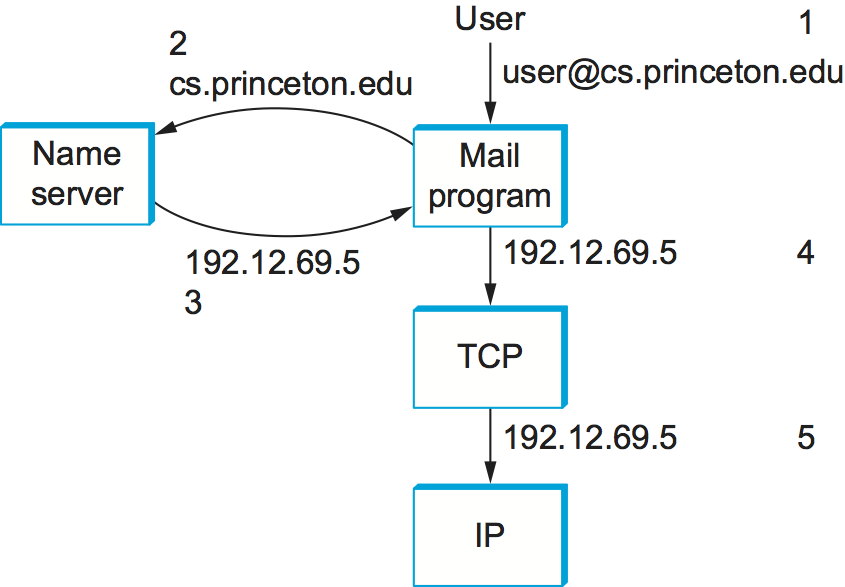
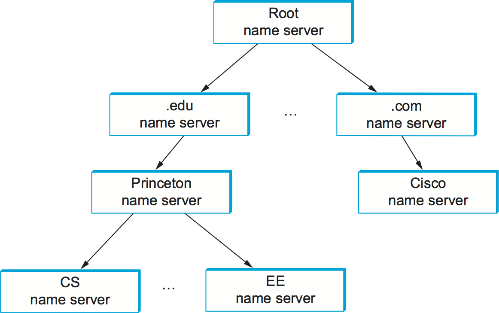
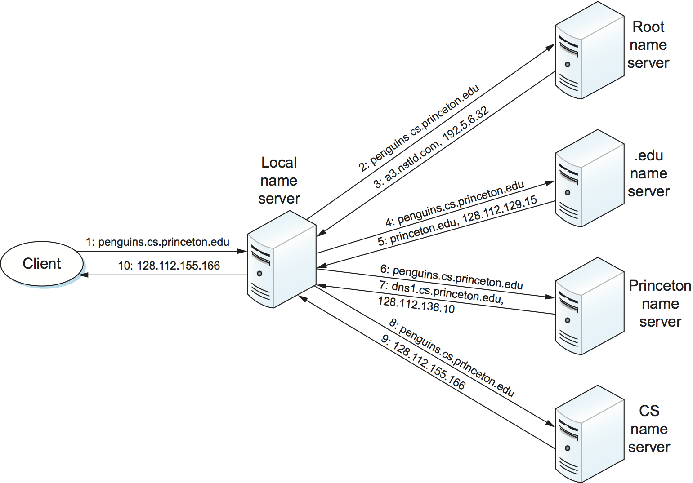

9.3 Infrastructure Applications
===============================

There are some protocols that are essential to the smooth running of the
Internet but that don’t fit neatly into the strictly layered model. One
of these is the Domain Name System (DNS)—not an application that users
normally invoke directly, but rather a service that almost all other
applications depend upon. This is because the name service is used to
translate host names into host addresses; the existence of such an
application allows the users of other applications to refer to remote
hosts by name rather than by address. In other words, a name service is
usually used by other applications, rather than by humans.

A second critical function is network management, which although not so
familiar to the average user, is performed most often by the people that
operate the network on behalf of users. Network management is widely
considered one of the hard problems of networking and continues to be
the focus of much innovation. We’ll look at some of the issues and
approaches to the problem below.

9.3.1 Name Service (DNS)
------------------------

In most of this book, we have been using addresses to identify hosts.
While perfectly suited for processing by routers, addresses are not
exactly user friendly. It is for this reason that a unique *name* is
also typically assigned to each host in a network. Already in this
section we have seen application protocols like HTTP using names such as
``www.princeton.edu``. We now describe how a naming service can be
developed to map user-friendly names into router-friendly addresses.
Name services are sometimes called *middleware* because they fill a gap
between applications and the underlying network.

Host names differ from host addresses in two important ways. First, they
are usually of variable length and mnemonic, thereby making them easier
for humans to remember. (In contrast, fixed-length numeric addresses are
easier for routers to process.) Second, names typically contain no
information that helps the network locate (route packets toward) the
host. Addresses, in contrast, sometimes have routing information
embedded in them; *flat* addresses (those not divisible into component
parts) are the exception.

Before getting into the details of how hosts are named in a network, we
first introduce some basic terminology. First, a *name space* defines
the set of possible names. A name space can be either *flat* (names are
not divisible into components) or *hierarchical* (Unix file names are an
obvious example). Second, the naming system maintains a collection of
*bindings* of names to values. The value can be anything we want the
naming system to return when presented with a name; in many cases, it is
an address. Finally, a *resolution mechanism* is a procedure that, when
invoked with a name, returns the corresponding value. A *name server* is
a specific implementation of a resolution mechanism that is available on
a network and that can be queried by sending it a message.

Because of its large size, the Internet has a particularly
well-developed naming system in place—the Domain Name System (DNS). We
therefore use DNS as a framework for discussing the problem of naming
hosts. Note that the Internet did not always use DNS. Early in its
history, when there were only a few hundred hosts on the Internet, a
central authority called the *Network Information Center* (NIC)
maintained a flat table of name-to-address bindings; this table was
called ``HOSTS.TXT``.\ [#]_ Whenever a site wanted to add a new host to the
Internet, the site administrator sent email to the NIC giving the new
host’s name/address pair. This information was manually entered into the
table, the modified table was mailed out to the various sites every few
days, and the system administrator at each site installed the table on
every host at the site. Name resolution was then simply implemented by a
procedure that looked up a host’s name in the local copy of the table
and returned the corresponding address.

.. [#] Believe it or not, there was also a paper book (like a phone
       book) published periodically that listed all the machines
       connected to the Internet and all the people that had an
       Internet email account.

It should come as no surprise that the approach to naming did not work
well as the number of hosts in the Internet started to grow. Therefore,
in the mid-1980s, the Domain Naming System was put into place. DNS
employs a hierarchical name space rather than a flat name space, and the
“table” of bindings that implements this name space is partitioned into
disjoint pieces and distributed throughout the Internet. These subtables
are made available in name servers that can be queried over the network.

What happens in the Internet is that a user presents a host name to an
application program (possibly embedded in a compound name such as an
email address or URL), and this program engages the naming system to
translate this name into a host address. The application then opens a
connection to this host by presenting some transport protocol (e.g.,
TCP) with the host’s IP address. This situation is illustrated (in the
case of sending email) in :numref:`Figure %s <fig-names>`. While this picture
makes the name resolution task look simple enough, there is a bit more
to it, as we shall see.

.. _fig-names:

   Names translated into addresses, where the numbers 1 to 5 show the
   sequence of steps in the process.

Domain Hierarchy
~~~~~~~~~~~~~~~~

DNS implements a hierarchical name space for Internet objects. Unlike
Unix file names, which are processed from left to right with the naming
components separated with slashes, DNS names are processed from right to
left and use periods as the separator. (Although they are processed from
right to left, humans still read domain names from left to right.) An
example domain name for a host is ``cicada.cs.princeton.edu``. Notice
that we said domain names are used to name Internet “objects.” What we
mean by this is that DNS is not strictly used to map host names into
host addresses. It is more accurate to say that DNS maps domain names
into values. For the time being, we assume that these values are IP
addresses; we will come back to this issue later in this section.

.. _fig-domains:
.. figure:: figures/f09-15-9780123850591.png
   :width: 700px
   :align: center

   Example of a domain hierarchy.

Like the Unix file hierarchy, the DNS hierarchy can be visualized as a
tree, where each node in the tree corresponds to a domain, and the
leaves in the tree correspond to the hosts being named. :numref:`Figure
%s <fig-domains>` gives an example of a domain hierarchy. Note that we
should not assign any semantics to the term *domain* other than that it
is simply a context in which additional names can be defined.\ [#]_

.. [#] Confusingly, the word *domain* is also used in Internet
       routing, where it means something different than it does in
       DNS, being roughly equivalent to the term *autonomous system*.

There was actually a substantial amount of discussion that took place
when the domain name hierarchy was first being developed as to what
conventions would govern the names that were to be handed out near the
top of the hierarchy. Without going into that discussion in any detail,
notice that the hierarchy is not very wide at the first level. There are
domains for each country, plus the “big six” domains: ``.edu``,
``.com``, ``.gov``, ``.mil``, ``.org``, and ``.net``. These six domains
were all originally based in the United States (where the Internet and
DNS were invented); for example, only U.S.-accredited educational
institutions can register an ``.edu`` domain name. In recent years, the
number of top-level domains has been expanded, partly to deal with the
high demand for ``.com`` domains names. The newer top-level domains
include ``.biz``, ``.coop``, and ``.info``. There are now over 1200
top-level domains.

Name Servers
~~~~~~~~~~~~

The complete domain name hierarchy exists only in the abstract. We now
turn our attention to the question of how this hierarchy is actually
implemented. The first step is to partition the hierarchy into
subtrees called *zones*. :numref:`Figure %s <fig-zones>` shows how the
hierarchy given in :numref:`Figure %s <fig-domains>` might be divided
into zones. Each zone can be thought of as corresponding to some
administrative authority that is responsible for that portion of the
hierarchy. For example, the top level of the hierarchy forms a zone
that is managed by the Internet Corporation for Assigned Names and
Numbers (ICANN). Below this is a zone that corresponds to Princeton
University. Within this zone, some departments do not want the
responsibility of managing the hierarchy (and so they remain in the
university-level zone), while others, like the Department of Computer
Science, manage their own department-level zone.

.. _fig-zones:
.. figure:: figures/f09-16-9780123850591.png
   :width: 700px
   :align: center

   Domain hierarchy partitioned into zones.

The relevance of a zone is that it corresponds to the fundamental unit
of implementation in DNS—the name server. Specifically, the information
contained in each zone is implemented in two or more name servers. Each
name server, in turn, is a program that can be accessed over the
Internet. Clients send queries to name servers, and name servers respond
with the requested information. Sometimes the response contains the
final answer that the client wants, and sometimes the response contains
a pointer to another server that the client should query next. Thus,
from an implementation perspective, it is more accurate to think of DNS
as being represented by a hierarchy of name servers rather than by a
hierarchy of domains, as illustrated in :numref:`Figure %s <fig-servers>`.

.. _fig-servers:

   Hierarchy of name servers.

Note that each zone is implemented in two or more name servers for the
sake of redundancy; that is, the information is still available even if
one name server fails. On the flip side, a given name server is free to
implement more than one zone.

Each name server implements the zone information as a collection of
*resource records*. In essence, a resource record is a name-to-value
binding or, more specifically, a 5-tuple that contains the following
fields:

::

   (Name, TTL, Type, Class, Value)

The ``Name`` and ``Value`` fields are exactly what you would expect,
while the ``Type`` field specifies how the ``Value`` should be
interpreted. For example, ``Type=A`` indicates that the ``Value`` is
an IP address.  Thus, ``A`` records implement the name-to-address
mapping we have been assuming. Other record types include:

-  ``NS``—The ``Value`` field gives the domain name for a host that is
   running a name server that knows how to resolve names within the
   specified domain.

-  ``CNAME``—The ``Value`` field gives the canonical name for a
   particular host; it is used to define aliases.

-  ``MX``—The ``Value`` field gives the domain name for a host that is
   running a mail server that accepts messages for the specified domain.

The time-to-live (``TTL``) field shows how long this resource record is
valid. It is used by servers that cache resource records from other
servers; when the ``TTL`` expires, the server must evict the record from
its cache.

Finally, the ``Class`` field was included to allow entities other than the NIC to
define useful record types. To date, the only widely used ``Class`` is
the one used by the Internet; it is denoted ``IN``. 

To better understand how resource records represent the information in
the domain hierarchy, consider the following examples drawn from the
domain hierarchy given in :numref:`Figure %s <fig-domains>`. To
simplify the example, we ignore the ``TTL`` and ``Class`` fields and we give the
relevant information for only one of the name servers that implement
each zone.

First, a root name server contains an ``NS`` record for each top-level
domain (TLD) name server. This identifies a server that can resolve
queries for this part of the DNS hierarchy (``.edu`` and ``.com``\ in
this example). It also has ``A`` records that translates these names
into the corresponding IP addresses. Taken together, these two records
effectively implement a pointer from the root name server to one of the
TLD servers.

::

   (edu, NS, a3.nstld.com)
   (a3.nstld.com, A, 192.5.6.32)
   (com, NS, a.gtld-servers.net)
   (a.gtld-servers.net, A, 192.5.6.30)
   ...

Moving our way down the hierarchy by one level, the server has records
for domains like this:

::

   (princeton.edu, NS, dns.princeton.edu)
   (dns.princeton.edu, A, 128.112.129.15)
   ...

In this case, we get an ``NS`` record and an ``A`` record for the name
server that is responsible for the ``princeton.edu`` part of the
hierarchy. That server might be able to directly resolve some queries
(e.g., for\ ``email.princeton.edu``) while it would redirect others to a
server at yet another layer in the hierarchy (e.g., for a query about
``penguins.cs.princeton.edu``).

::

   (email.princeton.edu, A, 128.112.198.35)
   (penguins.cs.princeton.edu, NS, dns1.cs.princeton.edu)
   (dns1.cs.princeton.edu, A, 128.112.136.10)
   ...

Finally, a third-level name server, such as the one managed by domain
``cs.princeton.edu``, contains ``A`` records for all of its hosts. It
might also define a set of aliases (``CNAME`` records) for each of those
hosts. Aliases are sometimes just convenient (e.g., shorter) names for
machines, but they can also be used to provide a level of indirection.
For example,\ ``www.cs.princeton.edu`` is an alias for the host named
``coreweb.cs.princeton.edu``.This allows the site’s web server to move
to another machine without affecting remote users; they simply continue
to use the alias without regard for what machine currently runs the
domain’s web server. The mail exchange (``MX``) records serve the same
purpose for the email application—they allow an administrator to change
which host receives mail on behalf of the domain without having to
change everyone’s email address.

::

   (penguins.cs.princeton.edu, A, 128.112.155.166)
   (www.cs.princeton.edu, CNAME, coreweb.cs.princeton.edu)
   (coreweb.cs.princeton.edu, A, 128.112.136.35)
   (cs.princeton.edu, MX, mail.cs.princeton.edu)
   (mail.cs.princeton.edu, A, 128.112.136.72)
   ...

Note that, although resource records can be defined for virtually any
type of object, DNS is typically used to name hosts (including servers)
and sites. It is not used to name individual people or other objects
like files or directories; other naming systems are typically used to
identify such objects. For example, X.500 is an ISO naming system
designed to make it easier to identify people. It allows you to name a
person by giving a set of attributes: name, title, phone number, postal
address, and so on. X.500 proved too cumbersome—and, in some sense, was
usurped by powerful search engines now available on the Web—but it did
eventually evolve into the Lightweight Directory Access Protocol (LDAP).
LDAP is a subset of X.500 originally designed as a PC front end to
X.500. Today, widely used, mostly at the enterprise level, as a system
for learning information about users.

Name Resolution
~~~~~~~~~~~~~~~

Given a hierarchy of name servers, we now consider the issue of how a
client engages these servers to resolve a domain name. To illustrate the
basic idea, suppose the client wants to resolve the name
``penguins.cs.princeton.edu`` relative to the set of servers given in
the previous subsection. The client could first send a query containing
this name to one of the root servers (as we’ll see below, this rarely
happens in practice but will suffice to illustrate the basic operation
for now). The root server, unable to match the entire name, returns the
best match it has—the ``NS`` record for ``edu`` which points to the TLD
server ``a3.nstld.com``. The server also returns all records that are
related to this record, in this case, the ``A`` record for
``a3.nstld.com``. The client, having not received the answer it was
after, next sends the same query to the name server at IP host
``192.5.6.32``. This server also cannot match the whole name and so
returns the ``NS`` and corresponding ``A`` records for the
``princeton.edu`` domain. Once again, the client sends the same query as
before to the server at IP host ``128.112.129.15``, and this time gets
back the ``NS`` record and corresponding ``A`` record for the
``cs.princeton.edu`` domain. This time, the server that can fully
resolve the query has been reached. A final query to the server at
``128.112.136.10`` yields the ``A`` record for
``penguins.cs.princeton.edu``, and the client learns that the
corresponding IP address is ``128.112.155.166``.

This example still leaves a couple of questions about the resolution
process unanswered. The first question is how did the client locate the
root server in the first place, or, put another way, how do you resolve
the name of the server that knows how to resolve names? This is a
fundamental problem in any naming system, and the answer is that the
system has to be bootstrapped in some way. In this case, the
name-to-address mapping for one or more root servers is well known; that
is, it is published through some means outside the naming system itself.

In practice, however, not all clients know about the root servers.
Instead, the client program running on each Internet host is initialized
with the address of a *local* name server. For example, all the hosts in
the Department of Computer Science at Princeton know about the server on
``dns1.cs.princeton.edu``. This local name server, in turn, has resource
records for one or more of the root servers, for example:

::

   ('root', NS, a.root-servers.net)
   (a.root-servers.net, A, 198.41.0.4, A)

Thus, resolving a name actually involves a client querying the local
server, which in turn acts as a client that queries the remote servers
on the original client’s behalf. This results in the client/server
interactions illustrated in :numref:`Figure %s <fig-resolution>`. One
advantage of this model is that all the hosts in the Internet do not
have to be kept up-to-date on where the current root servers are
located; only the servers have to know about the root. A second
advantage is that the local server gets to see the answers that come
back from queries that are posted by all the local clients. The local
server *caches* these responses and is sometimes able to resolve
future queries without having to go out over the network. The ``TTL``
field in the resource records returned by remote servers indicates how
long each record can be safely cached. This caching mechanism can be
used further up the hierarchy as well, reducing the load on the root
and TLD servers.

The second question is how the system works when a user submits a
partial name (e.g., ``penguins``) rather than a complete domain name
(e.g., ``penguins.cs.princeton.edu``). The answer is that the client
program is configured with the local domain in which the host resides
(e.g., ``cs.princeton.edu``), and it appends this string to any simple
names before sending out a query.

.. _fig-resolution:

   Name resolution in practice, where the numbers 1 to 10 show the sequence
   of steps in the process.

If you want to get a hands-on view of how name resolution works, you
can use the command-line tool ``dig`` to make queries and receive
responses in the form

::

   Name TTL Class Type Value

If you invoke ``dig`` with the ``+trace`` option you can see the
recursive process happening as the tool starts at the top of the DNS
hierarchy and works its way down to resolve the query. Here is a subset of the
output when we use the simple form of ``dig`` to look up ``www.cs.princeton.edu``

::

  $ dig www.cs.princeton.edu

  ...

  ;; QUESTION SECTION:
  ;www.cs.princeton.edu.		IN	A

  ;; ANSWER SECTION:
  www.cs.princeton.edu.	60	IN	CNAME	coreweb.cs.princeton.edu.
  coreweb.cs.princeton.edu. 60	IN	A	128.112.136.35

.. _key-naming:
.. admonition:: Key Takeaway

   Just to make sure we are clear, we have now seen three different
   levels of identifiers—domain names, IP addresses, and physical
   network addresses—and the mapping of identifiers at one level into
   identifiers at another level happens at different points in the
   network architecture. First, users specify domain names when
   interacting with the application. Second, the application engages DNS
   to translate this name into an IP address; it is the IP address that
   is placed in each datagram, not the domain name. (As an aside, this
   translation process involves IP datagrams being sent over the
   Internet, but these datagrams are addressed to a host that runs a
   name server, not to the ultimate destination.) Third, IP does
   forwarding at each router, which often means that it maps one IP
   address into another; that is, it maps the ultimate destination’s
   address into the address for the next hop router. Finally, IP engages
   the Address Resolution Protocol (ARP) to translate the next hop IP
   address into the physical address for that machine; the next hop
   might be the ultimate destination or it might be an intermediate
   router. Frames sent over the physical network have these physical
   addresses in their headers. :ref:`[Next] <key-virtualization>`

9.3.2 Network Management (SNMP, OpenConfig)
-------------------------------------------

A network is a complex system, both in terms of the number of nodes that
are involved and in terms of the suite of protocols that can be running
on any one node. Even if you restrict yourself to worrying about the
nodes within a single administrative domain, such as a campus, there
might be dozens of routers and hundreds—or even thousands—of hosts to
keep track of. If you think about all the state that is maintained and
manipulated on any one of those nodes—address translation tables,
routing tables, TCP connection state, and so on—then it is easy to
become overwhelmed by the prospect of having to manage all of this
information.

It is easy to imagine wanting to know about the state of various
protocols on different nodes. For example, you might want to monitor the
number of IP datagram reassemblies that have been aborted, so as to
determine if the timeout that garbage collects partially assembled
datagrams needs to be adjusted. As another example, you might want to
keep track of the load on various nodes (i.e., the number of packets
sent or received) so as to determine if new routers or links need to be
added to the network. Of course, you also have to be on the watch for
evidence of faulty hardware and misbehaving software.

What we have just described is the problem of network management, an
issue that pervades the entire network architecture. Since the nodes we
want to keep track of are distributed, our only real option is to use
the network to manage the network. This means we need a protocol that
allows us to read and write various pieces of state information on
different network nodes. The following describes two approaches.

SNMP
~~~~

A widely used protocol for network management is SNMP (*Simple Network
Management Protocol*). SNMP is essentially a specialized request/reply
protocol that supports two kinds of request messages: ``GET`` and
``SET``. The former is used to retrieve a piece of state from some node,
and the latter is used to store a new piece of state in some node. (SNMP
also supports a third operation, ``GET-NEXT``, which we explain below.)
The following discussion focuses on the ``GET`` operation, since it is
the one most frequently used.

SNMP is used in the obvious way. An operator interacts with a client
program that displays information about the network. This client program
usually has a graphical interface. You can think of this interface as
playing the same role as a web browser. Whenever the operator selects a
certain piece of information that he or she wants to see, the client
program uses SNMP to request that information from the node in question.
(SNMP runs on top of UDP.) An SNMP server running on that node receives
the request, locates the appropriate piece of information, and returns
it to the client program, which then displays it to the user.

There is only one complication to this otherwise simple scenario:
Exactly how does the client indicate which piece of information it wants
to retrieve, and, likewise, how does the server know which variable in
memory to read to satisfy the request? The answer is that SNMP depends
on a companion specification called the *management information base*
(MIB). The MIB defines the specific pieces of information—the MIB
*variables*—that you can retrieve from a network node.

The current version of MIB, called MIB-II, organizes variables into
different *groups*. You will recognize that most of the groups
correspond to one of the protocols described in this book, and nearly
all of the variables defined for each group should look familiar. For
example:

-  System—General parameters of the system (node) as a whole, including
   where the node is located, how long it has been up, and the system’s
   name

-  Interfaces—Information about all the network interfaces (adaptors)
   attached to this node, such as the physical address of each interface
   and how many packets have been sent and received on each interface

-  Address translation—Information about the Address Resolution
   Protocol, and in particular, the contents of its address translation
   table

-  IP—Variables related to IP, including its routing table, how many
   datagrams it has successfully forwarded, and statistics about
   datagram reassembly; includes counts of how many times IP drops a
   datagram for one reason or another

-  TCP—Information about TCP connections, such as the number of passive
   and active opens, the number of resets, the number of timeouts,
   default timeout settings, and so on; per-connection information
   persists only as long as the connection exists

-  UDP—Information about UDP traffic, including the total number of UDP
   datagrams that have been sent and received.

There are also groups for Internet Control Message Protocol (ICMP) and
SNMP itself.

Returning to the issue of the client stating exactly what information it
wants to retrieve from a node, having a list of MIB variables is only
half the battle. Two problems remain. First, we need a precise syntax
for the client to use to state which of the MIB variables it wants to
fetch. Second, we need a precise representation for the values returned
by the server. Both problems are addressed using Abstract Syntax
Notation One (ASN.1).

Consider the second problem first. As we already saw in a previous
chapter, ASN.1/Basic Encoding Rules (BER) defines a representation for
different data types, such as integers. The MIB defines the type of each
variable, and then it uses ASN.1/BER to encode the value contained in
this variable as it is transmitted over the network. As far as the first
problem is concerned, ASN.1 also defines an object identification
scheme. The MIB uses this identification system to assign a globally
unique identifier to each MIB variable. These identifiers are given in a
“dot” notation, not unlike domain names. For example, 1.3.6.1.2.1.4.3 is
the unique ASN.1 identifier for the IP-related MIB variable
``ipInReceives``; this variable counts the number of IP datagrams that
have been received by this node. In this example, the 1.3.6.1.2.1 prefix
identifies the MIB database (remember, ASN.1 object IDs are for all
possible objects in the world), the 4 corresponds to the IP group, and
the final 3 denotes the third variable in this group.

Thus, network management works as follows. The SNMP client puts the
ASN.1 identifier for the MIB variable it wants to get into the request
message, and it sends this message to the server. The server then maps
this identifier into a local variable (i.e., into a memory location
where the value for this variable is stored), retrieves the current
value held in this variable, and uses ASN.1/BER to encode the value it
sends back to the client.

There is one final detail. Many of the MIB variables are either tables
or structures. Such compound variables explain the reason for the SNMP
``GET-NEXT`` operation. This operation, when applied to a particular
variable ID, returns the value of that variable plus the ID of the next
variable, for example, the next item in the table or the next field in
the structure. This aids the client in “walking through” the elements of
a table or structure.

OpenConfig
~~~~~~~~~~

SNMP is still widely used and has historically been “the” management
protocol for switches and routers, but there has recently been growing
attention paid to more flexible and powerful ways to manage networks.
There isn’t yet complete agreement on an industry-wide standard, but a
consensus about the general approach is starting to emerge. We describe
one example, called *OpenConfig*, that is both getting a lot of traction
and illustrates many of the key ideas that are being pursued.

The general strategy is to automate network management as much as
possible, with the goal of getting the error-prone human out of the
loop. This is sometimes called *zero-touch* management, and it implies
two things have to happen. First, whereas historically operators used
tools like SNMP to *monitor* the network, but had to log into any
misbehaving network device and use a command line interface (CLI) to fix
the problem, zero-touch management implies that we also need to
*configure* the network programmatically. In other words, network
management is equal parts reading status information and writing
configuration information. The goal is to build a closed control loop,
although there will always be scenarios where the operator has to be
alerted that manual intervention is required.

Second, whereas historically the operator had to configure each network
device individually, all the devices have to be configured in a
consistent way if they are going to function correctly as a network. As
a consequence, zero-touch also implies that the operator should be able
to declare their network-wide *intent*, with the management tool being
smart enough to issue the necessary per-device configuration directives
in a globally consistent way.

.. _fig-mgmt:
.. figure:: figures/apps/Slide1.png
   :width: 400px
   :align: center

   Operator manages a network through a configuration and management tool,
   which in turn programmatically interacts with the underlying network
   devices (e.g., using gNMI as the transport protocol and YANG to specify
   the schema for the data being exchanged).

:numref:`Figure %s <fig-mgmt>` gives a high-level depiction of this
idealized approach to network management. We say “idealized” because
achieving true zero-touch management is still more aspirational than
reality. But progress is being made. For example, new management tools
are starting to leverage standard protocols like HTTP to monitor and
configure network devices. This is a positive step because it gets us
out of the business of creating yet another request/reply protocol and
lets us focus on creating smarter management tools, perhaps by taking
advantage of Machine Learning algorithms to determine if something is
amiss.

In the same way HTTP is starting to replace SNMP as the protocol for
talking to network devices, there is a parallel effort to replace the
MIB with a new standard for what status information various types of
devices can report, *plus* what configuration information those same
devices are able to respond to. Agreeing to a single standard for
configuration is inherently challenging because every vendor claims
their device is special, unlike any of the devices their competitors
sell. (That is to say, the challenge is not entirely technical.)

The general approach is to allow each device manufacturer to publish a
*data model* that specifies the configuration knobs (and available
monitoring data) for its product, and limit standardization to the
modeling language. The leading candidate is YANG, which stands for *Yet
Another Next Generation*, a name chosen to poke fun at how often a
do-over proves necessary. YANG can be viewed as a restricted version of
XSD, which you may recall is a language for defining a schema (model)
for XML. That is, YANG defines the structure of the data. But unlike
XSD, YANG is not XML-specific. It can instead be used in conjunction
with different over-the-wire message formats, including XML, but also
Protobufs and JSON.

What’s important about this approach is that the data model
defines the semantics of the variables that are available to be
read and written in a programmatic form (i.e., it’s not just text in a
standards specification). It’s not a free-for-all with each vendor
defining a unique model since the network operators that buy network
hardware have a strong incentive to drive the models for similar
devices towards convergence. YANG makes the process of creating,
using, and modifying models more programmable, and hence, adaptable to
this process.

This is where OpenConfig comes in. It uses YANG as its modeling
language, but has also established a process for driving the industry
towards common models. OpenConfig is officially agnostic as to the RPC
mechanism used to communicate with network devices, but one approach it
is actively pursuing is called gNMI (*gRPC Network Management
Interface*). As you might guess from its name, gNMI uses gRPC, which you
may recall, runs on top of HTTP. This means gNMI also adopts Protobufs
as the way it specifies the data actually communicated over the HTTP
connection. Thus, as depicted in :numref:`Figure %s <fig-mgmt>`, gNMI
is intended as a standard management interface for network devices.
What’s not standardized is the richness of the management tool’s ability to
automate, or the exact form of the operator-facing interface. Like any
application that is trying to serve a need and support more features
than the alternatives, there is still much room for innovation in tools
for network management.

For completeness, we note that NETCONF is another of the post-SNMP
protocols for communicating configuration information to network
devices. OpenConfig works with NETCONF, but our reading of the tea
leaves points to gNMI as the future.

We conclude by emphasizing that a sea change is underway. While listing
SNMP and OpenConfig in the title to this section suggests they are
equivalent, it is more accurate to say that each is “what we call” these
two approaches, but the approaches are quite different. On the one hand,
SNMP is really just a transport protocol, analogous to gNMI in the
OpenConfig world. It historically enabled monitoring devices, but had
virtually nothing to say about configuring devices. (The latter has
historically required manual intervention.) On the other hand,
OpenConfig is primarily an effort to define a common set of data models
for network devices, roughly similar to the role MIB plays in the SNMP
world, except OpenConfig is (1) model-based, using YANG, and (2) equally
focused on monitoring and configuration.
