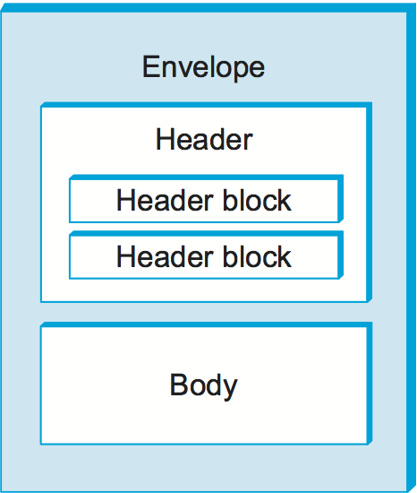

9.1 Traditional Applications
============================

We begin our discussion of applications by focusing on two of the most
popular—the World Wide Web and email. Broadly speaking, both of these
applications use the request/reply paradigm—users send requests to
servers, which then respond accordingly. We refer to these as
“traditional” applications because they typify the sort of applications
that have existed since the early days of computer networks (although
the Web is a lot newer than email but has its roots in file transfers
that predated it). By contrast, later sections will look at a class of
applications that have become popular more recently: streaming
applications (e.g., multimedia applications like video and audio) and
various overlay-based applications. (Note that there is a bit of a
blurring between these classes, as you can of course get access to
streaming multimedia data over the Web, but for now we’ll focus on the
general usage of the Web to request pages, images, etc.)

Before taking a close look at each of these applications, there are
three general points that we need to make. The first is that it is
important to distinguish between application *programs* and application
*protocols*. For example, the HyperText Transport Protocol (HTTP) is an
application protocol that is used to retrieve Web pages from remote
servers. Many different application programs—that is, web clients like
Internet Explorer, Chrome, Firefox, and Safari—provide users with a
different look and feel, but all of them use the same HTTP protocol to
communicate with web servers over the Internet. Indeed, it is the fact
that the protocol is published and standardized that enables application
programs developed by many different companies and individuals to
interoperate. That is how so many browsers are able to interoperate with
all the web servers (of which there are also many varieties).

This section looks at two very widely used, standardized application
protocols:

-  Simple Mail Transfer Protocol (SMTP) is used to exchange electronic
   mail.

-  HyperText Transport Protocol (HTTP) is used to communicate between
   web browsers and web servers.

Second, we observe that many application layer protocols, including HTTP
and SMTP, have a companion protocol that specifies the format of the
data that can be exchanged. This is one reason WHY these protocols are
relatively simple: Much of the complexity is managed in this companion
standard. For example, SMTP is a protocol for exchanging electronic mail
messages, but RFC 822 and Multipurpose Internet Mail Extensions (MIME)
define the format of email messages. Similarly, HTTP is a protocol for
fetching Web pages, but HyperText Markup Language (HTML) is a companion
specification that defines the basic form of those pages.

Finally, since the application protocols described in this section
follow the same request/reply communication pattern, you might expect
that they would be built on top of a Remote Procedure Call (RPC)
transport protocol. This is not the case, however, as they are instead
implemented on top of TCP. In effect, each protocol reinvents a simple
RPC-like mechanism on top of a reliable transport protocol (TCP). We say
“simple” because each protocol is not designed to support arbitrary
remote procedure calls of the sort discussed in an earlier chapter, but
is instead designed to send and respond to a specific set of request
messages. Interestingly, the approach taken by HTTP has proven quite
powerful, which has led to it being adopted widely by the *Web Services*
architecture, with general RPC mechanisms built *on top of HTTP* rather
than the other way around. More on this topic at the end of this
section.

9.1.1 Electronic Mail (SMTP, MIME, IMAP)
----------------------------------------

Email is one of the oldest network applications. After all, what could
be more natural than wanting to send a message to the user at the other
end of a cross-country link you just managed to get running? It’s the
20th century’s version of “*Mr. Watson, come here… I want to see you.*”
Surprisingly, the pioneers of the ARPANET had not really envisioned
email as a key application when the network was created—remote access to
computing resources was the main design goal—but it turned out to be the
Internet’s original killer app.

As noted above, it is important (1) to distinguish the user interface
(i.e., your mail reader) from the underlying message transfer protocols
(such as SMTP or IMAP), and (2) to distinguish between this transfer
protocol and a companion standard (RFC 822 and MIME) that defines the
format of the messages being exchanged. We start by looking at the
message format.

Message Format
~~~~~~~~~~~~~~

RFC 822 defines messages to have two parts: a *header* and a *body*.
Both parts are represented in ASCII text. Originally, the body was
assumed to be simple text. This is still the case, although RFC 822 has
been augmented by MIME to allow the message body to carry all sorts of
data. This data is still represented as ASCII text, but because it may
be an encoded version of, say, a JPEG image, it’s not necessarily
readable by human users. More on MIME in a moment.

The message header is a series of ``<CRLF>``-terminated lines.
(``<CRLF>`` stands for carriage-return plus line-feed, which are a pair
of ASCII control characters often used to indicate the end of a line of
text.) The header is separated from the message body by a blank line.
Each header line contains a type and value separated by a colon. Many of
these header lines are familiar to users, since they are asked to fill
them out when they compose an email message; for example, the header
identifies the message recipient, and the header says something about
the purpose of the message. Other headers are filled in by the
underlying mail delivery system. Examples include (when the message was
transmitted), (what user sent the message), and (each mail server that
handled this message). There are, of course, many other header lines;
the interested reader is referred to RFC 822.

RFC 822 was extended in 1993 (and updated quite a few times since then)
to allow email messages to carry many different types of data: audio,
video, images, PDF documents, and so on. MIME consists of three basic
pieces. The first piece is a collection of header lines that augment the
original set defined by RFC 822. These header lines describe, in various
ways, the data being carried in the message body. They include (the
version of MIME being used), (a human-readable description of what’s in
the message, analogous to the line), (the type of data contained in the
message), and (how the data in the message body is encoded).

The second piece is definitions for a set of content types (and
subtypes). For example, MIME defines several different image types,
including ``image/gif`` and ``image/jpeg``, each with the obvious
meaning. As another example, ``text/plain`` refers to simple text you
might find in a vanilla 822-style message, while ``text/richtext``
denotes a message that contains “marked up” text (text using special
fonts, italics, etc.). As a third example, MIME defines an
``application`` type, where the subtypes correspond to the output of
different application programs (e.g., ``application/postscript`` and
``application/msword``).

MIME also defines a ``multipart`` type that says how a message carrying
more than one data type is structured. This is like a programming
language that defines both base types (e.g., integers and floats) and
compound types (e.g., structures and arrays). One possible ``multipart``
subtype is ``mixed``, which says that the message contains a set of
independent data pieces in a specified order. Each piece then has its
own header line that describes the type of that piece.

The third piece is a way to encode the various data types so they can be
shipped in an ASCII email message. The problem is that, for some data
types (a JPEG image, for example), any given 8-bit byte in the image
might contain one of 256 different values. Only a subset of these values
are valid ASCII characters. It is important that email messages contain
only ASCII, because they might pass through a number of intermediate
systems (gateways, as described below) that assume all email is ASCII
and would corrupt the message if it contained non-ASCII characters. To
address this issue, MIME uses a straightforward encoding of binary data
into the ASCII character set. The encoding is called ``base64``. The
idea is to map every three bytes of the original binary data into four
ASCII characters. This is done by grouping the binary data into 24-bit
units and breaking each such unit into four 6-bit pieces. Each 6-bit
piece maps onto one of 64 valid ASCII characters; for example, 0 maps
onto A, 1 maps onto B, and so on. If you look at a message that has been
encoded using the base64 encoding scheme, you’ll notice only the 52
upper- and lowercase letters, the 10 digits 0 through 9, and the special
characters + and /. These are the first 64 values in the ASCII character
set.

As one aside, so as to make reading mail as painless as possible for
those who still insist on using text-only mail readers, a MIME message
that consists of regular text only can be encoded using 7-bit ASCII.
There’s also a readable encoding for mostly ASCII data.

Putting this all together, a message that contains some plain text, a
JPEG image, and a PostScript file would look something like this:

::

   MIME-Version: 1.0
   Content-Type: multipart/mixed;
   boundary="-------417CA6E2DE4ABCAFBC5"
   From: Alice Smith <Alice@cisco.com>
   To: Bob@cs.Princeton.edu
   Subject: promised material
   Date: Mon, 07 Sep 1998 19:45:19 -0400

   ---------417CA6E2DE4ABCAFBC5
   Content-Type: text/plain; charset=us-ascii
   Content-Transfer-Encoding: 7bit

   Bob,

   Here are the jpeg image and draft report I promised.

   --Alice

   ---------417CA6E2DE4ABCAFBC5
   Content-Type: image/jpeg
   Content-Transfer-Encoding: base64
   ... unreadable encoding of a jpeg figure
   ---------417CA6E2DE4ABCAFBC5
   Content-Type: application/postscript; name="draft.ps"
   Content-Transfer-Encoding: 7bit
   ... readable encoding of a PostScript document

In this example, the line in the message header says that this message
contains various pieces, each denoted by a character string that does
not appear in the data itself. Each piece then has its own
``Content-Type`` and ``Content-Transfer-Encoding`` lines.

Message Transfer
~~~~~~~~~~~~~~~~

For many years, the majority of email was moved from host to host using
only SMTP. While SMTP continues to play a central role, it is now just
one email protocol of several, Internet Message Access Protocol (IMAP)
and Post Office Protocol (POP) being two other important protocols for
retrieving mail messages. We’ll begin our discussion by looking at SMTP,
and move on to IMAP below.

To place SMTP in the right context, we need to identify the key players.
First, users interact with a *mail reader* when they compose, file,
search, and read their email. Countless mail readers are available, just
like there are many web browsers to choose from. In the early days of
the Internet, users typically logged into the machine on which their
*mailbox* resided, and the mail reader they invoked was a local
application program that extracted messages from the file system. Today,
of course, users remotely access their mailbox from their laptop or
smartphone; they do not first log into the host that stores their mail
(a mail server). A second mail transfer protocol, such as POP or IMAP,
is used to remotely download email from a mail server to the user’s
device.

Second, there is a *mail daemon* (or process) running on each host that
holds a mailbox. You can think of this process, also called a *message
transfer agent* (MTA), as playing the role of a post office: Users (or
their mail readers) give the daemon messages they want to send to other
users, the daemon uses SMTP running over TCP to transmit the message to
a daemon running on another machine, and the daemon puts incoming
messages into the user’s mailbox (where that user’s mail reader can
later find them). Since SMTP is a protocol that anyone could implement,
in theory there could be many different implementations of the mail
daemon. It turns out, though, that there are only a few popular
implementations, with the old ``sendmail`` program from Berkeley Unix
and ``postfix`` being the most widespread.

.. _fig-mail:
.. figure:: figures/f09-01-9780123850591.png
   :width: 600px
   :align: center

   Sequence of mail gateways store and forward email messages.

While it is certainly possible that the MTA on a sender’s machine
establishes an SMTP/TCP connection to the MTA on the recipient’s mail
server, in many cases the mail traverses one or more *mail gateways* on
its route from the sender’s host to the receiver’s host. Like the end
hosts, these gateways also run a message transfer agent process. It’s
not an accident that these intermediate nodes are called *gateways*
since their job is to store and forward email messages, much like an “IP
gateway” (which we have referred to as a *router*) stores and forwards
IP datagrams. The only difference is that a mail gateway typically
buffers messages on disk and is willing to try retransmitting them to
the next machine for several days, while an IP router buffers datagrams
in memory and is only willing to retry transmitting them for a fraction
of a second. :numref:`Figure %s <fig-mail>` illustrates a two-hop path from the
sender to the receiver.

Why, you might ask, are mail gateways necessary? Why can’t the sender’s
host send the message to the receiver’s host? One reason is that the
recipient does not want to include the specific host on which he or she
reads email in his or her address. Another is scale: In large
organizations, it’s often the case that a number of different machines
hold the *mailboxes* for the organization. For example, mail delivered
to ``bob@cs.princeton.edu`` is first sent to a mail gateway in the CS
Department at Princeton (that is, to the host named
``cs.princeton.edu``), and then forwarded—involving a second
connection—to the specific machine on which Bob has a mailbox. The
forwarding gateway maintains a database that maps users into the machine
on which their mailbox resides; the sender need not be aware of this
specific name. (The list of header lines in the message will help you
trace the mail gateways that a given message traversed.) Yet another
reason, particularly true in the early days of email, is that the
machine that hosts any given user’s mailbox may not always be up or
reachable, in which case the mail gateway holds the message until it can
be delivered.

Independent of how many mail gateways are in the path, an independent
SMTP connection is used between each host to move the message closer to
the recipient. Each SMTP session involves a dialog between the two mail
daemons, with one acting as the client and the other acting as the
server. Multiple messages might be transferred between the two hosts
during a single session. Since RFC 822 defines messages using ASCII as
the base representation, it should come as no surprise to learn that
SMTP is also ASCII based. This means it is possible for a human at a
keyboard to pretend to be an SMTP client program.

SMTP is best understood by a simple example. The following is an
exchange between sending host ``cs.princeton.edu`` and receiving host
``cisco.com`` . In this case, user Bob at Princeton is trying to send
mail to users Alice and Tom at Cisco. Extra blank lines have been added
to make the dialog more readable.

.. code-block:: shell

   HELO cs.princeton.edu
   250 Hello daemon@mail.cs.princeton.edu [128.12.169.24]

   MAIL FROM:<Bob@cs.princeton.edu>
   250 OK

   RCPT TO:<Alice@cisco.com>
   250 OK

   RCPT TO:<Tom@cisco.com>
   550 No such user here

   DATA
   354 Start mail input; end with <CRLF>.<CRLF>
   Blah blah blah...
   ...etc. etc. etc.
   <CRLF>.<CRLF>
   250 OK

   QUIT
   221 Closing connection

As you can see, SMTP involves a sequence of exchanges between the
client and the server. In each exchange, the client posts a command
(e.g., ``QUIT``) and the server responds with a code (e.g., ``250``,
``550``, ``354``, ``221``). The server also returns a human-readable
explanation for the code (e.g., ``No such user here``).  In this
particular example, the client first identifies itself to the server
with the ``HELO`` command. It gives its domain name as an
argument. The server verifies that this name corresponds to the IP
address being used by the TCP connection; you’ll notice the server
states this IP address back to the client. The client then asks the
server if it is willing to accept mail for two different users; the
server responds by saying “yes” to one and “no” to the other. Then the
client sends the message, which is terminated by a line with a single
period (“.”) on it. Finally, the client terminates the connection.

There are, of course, many other commands and return codes. For example,
the server can respond to a client’s ``RCPT`` command with a ``251``
code, which indicates that the user does not have a mailbox on this
host, but that the server promises to forward the message onto another
mail daemon. In other words, the host is functioning as a mail gateway.
As another example, the client can issue a ``VRFY`` operation to verify
a user’s email address, but without actually sending a message to the
user.

The only other point of interest is the arguments to the ``MAIL`` and
``RCPT`` operations; for example, ``FROM:<Bob@cs.princeton.edu>`` and
``TO:<Alice@cisco.com>``, respectively. These look a lot like 822 header
fields, and in some sense they are. What actually happens is that the
mail daemon parses the message to extract the information it needs to
run SMTP. The information it extracts is said to form an *envelope* for
the message. The SMTP client uses this envelope to parameterize its
exchange with the SMTP server. One historical note: The reason
``sendmail`` became so popular is that no one wanted to reimplement this
message parsing function. While today’s email addresses look pretty tame
(e.g., ``Bob@cs.princeton.edu``), this was not always the case. In the
days before everyone was connected to the Internet, it was not uncommon
to see email addresses of the form ``user%host@site!neighbor``.

Mail Reader
~~~~~~~~~~~

The final step is for the user to actually retrieve his or her messages
from the mailbox, read them, reply to them, and possibly save a copy for
future reference. The user performs all these actions by interacting
with a mail reader. As pointed out earlier, this reader was originally
just a program running on the same machine as the user’s mailbox, in
which case it could simply read and write the file that implements the
mailbox. This was the common case in the pre-laptop era. Today, most
often the user accesses his or her mailbox from a remote machine using
yet another protocol, such as POP or IMAP. It is beyond the scope of
this book to discuss the user interface aspects of the mail reader, but
it is definitely within our scope to talk about the access protocol. We
consider IMAP, in particular.

IMAP is similar to SMTP in many ways. It is a client/server protocol
running over TCP, where the client (running on the user’s desktop
machine) issues commands in the form of ``<CRLF>``-terminated ASCII
text lines and the mail server (running on the machine that maintains
the user’s mailbox) responds in kind. The exchange begins with the
client authenticating him- or herself and identifying the mailbox he
or she wants to access. This can be represented by the simple state
transition diagram shown in :numref:`Figure %s <fig-imap>`. In this
diagram, ``LOGIN`` and ``LOGOUT`` are example commands that the client
can issue, while ``OK`` is one possible server response. Other common
commands include ``FETCH`` and ``EXPUNGE``, with the obvious
meanings. Additional server responses include ``NO`` (client does not
have permission to perform that operation) and ``BAD`` (command is ill
formed).

.. _fig-imap:
.. figure:: figures/f09-02-9780123850591.png
   :width: 400px
   :align: center

   IMAP state transition diagram.

When the user asks to ``FETCH`` a message, the server returns it in
MIME format and the mail reader decodes it. In addition to the message
itself, IMAP also defines a set of message *attributes* that are
exchanged as part of other commands, independent of transferring the
message itself. Message attributes include information like the size
of the message and, more interestingly, various *flags* associated
with the message (e.g., ``Seen``, ``Answered``, ``Deleted``, and
``Recent``). These flags are used to keep the client and server
synchronized; that is, when the user deletes a message in the mail
reader, the client needs to report this fact to the mail server.
Later, should the user decide to expunge all deleted messages, the
client issues an ``EXPUNGE`` command to the server, which knows to
actually remove all earlier deleted messages from the mailbox.

Finally, note that when the user replies to a message, or sends a new
message, the mail reader does not forward the message from the client to
the mail server using IMAP, but it instead uses SMTP. This means that
the user’s mail server is effectively the first mail gateway traversed
along the path from the desktop to the recipient’s mailbox.

9.1.2 World Wide Web (HTTP)
---------------------------

The World Wide Web has been so successful and has made the Internet
accessible to so many people that sometimes it seems to be synonymous
with the Internet. In fact, the design of the system that became the Web
started around 1989, long after the Internet had become a widely
deployed system. The original goal of the Web was to find a way to
organize and retrieve information, drawing on ideas about
hypertext—interlinked documents—that had been around since at least the
1960s.\ [#]_ The core idea of hypertext is that one document can link to
another document, and the protocol (HTTP) and document language (HTML)
were designed to meet that goal.

.. [#] A short history of the Web provided by the World Wide Web
       consortium traces its roots to a 1945 article describing links
       between microfiche documents.

One helpful way to think of the Web is as a set of cooperating clients
and servers, all of whom speak the same language: HTTP. Most people are
exposed to the Web through a graphical client program or web browser
like Safari, Chrome, Firefox, or Internet Explorer. :numref:`Figure %s
<fig-netscape>` shows the Safari browser in use, displaying a page of
information from Princeton University.

.. _fig-netscape:

   The Safari web browser.

Clearly, if you want to organize information into a system of linked
documents or objects, you need to be able to retrieve one document to
get started. Hence, any web browser has a function that allows the user
to obtain an object by opening a URL. Uniform Resource Locators (URLs)
are so familiar to most of us by now that it’s easy to forget that they
haven’t been around forever. They provide information that allows
objects on the Web to be located, and they look like the following:

.. code-block:: html

   http://www.cs.princeton.edu/index.html

If you opened that particular URL, your web browser would open a TCP
connection to the web server at a machine called
``www.cs.princeton.edu`` and immediately retrieve and display the file
called ``index.html``. Most files on the Web contain images and text,
and many have other objects such as audio and video clips, pieces of
code, etc. They also frequently include URLs that point to other files
that may be located on other machines, which is the core of the
“hypertext” part of HTTP and HTML. A web browser has some way in which
you can recognize URLs (often by highlighting or underlining some text)
and then you can ask the browser to open them. These embedded URLs are
called *hypertext links*. When you ask your web browser to open one of
these embedded URLs (e.g., by pointing and clicking on it with a mouse),
it will open a new connection and retrieve and display a new file. This
is called *following a link*. It thus becomes very easy to hop from one
machine to another around the network, following links to all sorts of
information. Once you have a means to embed a link in a document and
allow a user to follow that link to get another document, you have the
basis of a hypertext system.

When you ask your browser to view a page, your browser (the client)
fetches the page from the server using HTTP running over TCP. Like SMTP,
HTTP is a text-oriented protocol. At its core, HTTP is a
request/response protocol, where every message has the general form

::

   START_LINE <CRLF>
   MESSAGE_HEADER <CRLF>
   <CRLF>
   MESSAGE_BODY <CRLF>

where, as before, ``<CRLF>`` stands for carriage-return+line-feed. The
first line (``START_LINE``) indicates whether this is a request message
or a response message. In effect, it identifies the “remote procedure”
to be executed (in the case of a request message), or the *status* of
the request (in the case of a response message). The next set of lines
specifies a collection of options and parameters that qualify the
request or response. There are zero or more of these ``MESSAGE_HEADER``
lines—the set is terminated by a blank line—each of which looks like a
header line in an email message. HTTP defines many possible header
types, some of which pertain to request messages, some to response
messages, and some to the data carried in the message body. Instead of
giving the full set of possible header types, though, we just give a
handful of representative examples. Finally, after the blank line comes
the contents of the requested message (``MESSAGE_BODY``); this part of
the message is where a server would place the requested page when
responding to a request, and it is typically empty for request messages.

Why does HTTP run over TCP? The designers didn’t have to do it that way,
but TCP does provide a pretty good match to what HTTP needs,
particularly by providing reliable delivery (who wants a Web page with
missing data?), flow control, and congestion control. However, as we’ll
see below, there are a few issues that can arise from building a
request/response protocol on top of TCP, especially if you ignore the
subtleties of the interactions between the application and transport
layer protocols.

Request Messages
~~~~~~~~~~~~~~~~

The first line of an HTTP request message specifies three things: the
operation to be performed, the Web page the operation should be
performed on, and the version of HTTP being used. Although HTTP
defines a wide assortment of possible request operations—including
*write* operations that allow a Web page to be posted on a server—the
two most common operations are ``GET`` (fetch the specified Web page)
and ``HEAD`` (fetch status information about the specified Web
page). The former is obviously used when your browser wants to
retrieve and display a Web page. The latter is used to test the
validity of a hypertext link or to see if a particular page has been
modified since the browser last fetched it. The full set of operations
is summarized in :numref:`Table %s <tab-ops>`. As innocent as it
sounds, the ``POST`` command enables much mischief (including spam) on
the Internet.

.. _tab-ops:
.. table::  HTTP Request Operations. 
   :align: center
   :widths: auto

   +-----------+-----------------------------------------------------------+
   | Operation | Description                                               |
   +===========+===========================================================+
   | OPTIONS   | Request information about available options               |
   +-----------+-----------------------------------------------------------+
   | GET       | Retrieve document identified in URL                       |
   +-----------+-----------------------------------------------------------+
   | HEAD      | Retrieve metainformation about document identified in URL |
   +-----------+-----------------------------------------------------------+
   | POST      | Give information (e.g., annotation) to server             |
   +-----------+-----------------------------------------------------------+
   | PUT       | Store document under specified URL                        |
   +-----------+-----------------------------------------------------------+
   | DELETE    | Delete specified URL                                      |
   +-----------+-----------------------------------------------------------+
   | TRACE     | Loopback request message                                  |
   +-----------+-----------------------------------------------------------+
   | CONNECT   | For use by proxies                                        |
   +-----------+-----------------------------------------------------------+

For example, the ``START_LINE``

::

   GET http://www.cs.princeton.edu/index.html HTTP/1.1

says that the client wants the server on host to return the page named
``index.html``.  This particular example uses an absolute URL. It is
also possible to request a path in the ``START_LINE` and specify the host name
in one of the ``MESSAGE_HEADER`` lines; for example,

.. code-block:: http

   GET /index.html HTTP/1.1
   Host: www.cs.princeton.edu

Here, ``Host`` is one of the possible ``MESSAGE_HEADER`` fields. One
of the more interesting of these is ``If-Modified-Since``, which gives
the client a way to conditionally request a Web page—the server
returns the page only if it has been modified since the time specified
in that header line.

Response Messages
~~~~~~~~~~~~~~~~~

Like request messages, response messages begin with a single
``START_LINE``. In this case, the line specifies the version of HTTP
being used, a three-digit code indicating whether or not the request was
successful, and a text string giving the reason for the response. For
example, the ``START_LINE``

.. code-block:: http

   HTTP/1.1 202 Accepted

indicates that the server was able to satisfy the request, while

.. code-block:: http

   HTTP/1.1 404 Not Found

indicates that it was not able to satisfy the request because the page
was not found. There are five general types of response codes, with the
first digit of the code indicating its type. :numref:`Table %s <tab-codes>`
summarizes the five types of codes.

.. _tab-codes:
.. table::  Five Types of HTTP Result Codes. 
   :align: center
   :widths: auto

   +------+---------------+--------------------------------------------------------+
   | Code | Type          | Example Reasons                                        |
   +======+===============+========================================================+
   | 1xx  | Informational | request received, continuing process                   |
   +------+---------------+--------------------------------------------------------+
   | 2xx  | Success       | action successfully received, understood, and accepted |
   +------+---------------+--------------------------------------------------------+
   | 3xx  | Redirection   | further action must be taken to complete the request   |
   +------+---------------+--------------------------------------------------------+
   | 4xx  | Client Error  | request contains bad syntax or cannot be fulfilled     |
   +------+---------------+--------------------------------------------------------+
   | 5xx  | Server Error  | server failed to fulfill an apparently valid request   |
   +------+---------------+--------------------------------------------------------+

As with the unexpected consequences of the ``POST`` request message, it
is sometimes surprising how various response messages are used in
practice. For example, request redirection (specifically code 302) turns
out to be a powerful mechanism that plays a big role in Content
Distribution Networks (CDNs) by redirecting requests to a nearby cache.

Also similar to request messages, response messages can contain one or
more ``MESSAGE_HEADER`` lines. These lines relay additional
information back to the client. For example, the ``Location`` header
line specifies that the requested URL is available at another
location. Thus, if the Princeton CS Department Web page had moved from
``http://www.cs.princeton.edu/index.html`` to
``http://www.princeton.edu/cs/index.html``, for example, then the
server at the original address might respond with

.. code-block:: http

   HTTP/1.1 301 Moved Permanently
   Location: http://www.princeton.edu/cs/index.html

In the common case, the response message will also carry the requested
page. This page is an HTML document, but since it may carry nontextual
data (e.g., a GIF image), it is encoded using MIME (see the previous
section). Certain of the ``MESSAGE_HEADER`` lines give attributes of the
page contents, including (number of bytes in the contents), ``Expires``
(time at which the contents are considered stale), and (time at which
the contents were last modified at the server).

Uniform Resource Identifiers
~~~~~~~~~~~~~~~~~~~~~~~~~~~~

The URLs that HTTP uses as addresses are one type of *Uniform Resource
Identifier* (URI). A URI is a character string that identifies a
resource, where a resource can be anything that has identity, such as a
document, an image, or a service.

The format of URIs allows various more specialized kinds of resource
identifiers to be incorporated into the URI space of identifiers. The
first part of a URI is a *scheme* that names a particular way of
identifying a certain kind of resource, such as ``mailto`` for email
addresses or ``file`` for file names. The second part of a URI,
separated from the first part by a colon, is the *scheme-specific part*.
It is a resource identifier consistent with the scheme in the first
part, as in the URIs ``mailto:santa@northpole.org`` and
``file:///C:/foo.html``.

A resource doesn’t have to be retrievable or accessible. We saw an
example of this in an earlier chapter—extensible markup language (XML)
namespaces are identified by URIs that look an awful lot like URLs, but
strictly speaking they are not *locators* because they don’t tell you
how to locate something; they just provide a globally unique identifier
for the namespace. There is no requirement that you can retrieve
anything at the URI given as the target namespace of an XML document.
We’ll see another example of a URI that is not a URL in a later section.

TCP Connections
~~~~~~~~~~~~~~~

The original version of HTTP (1.0) established a separate TCP
connection for each data item retrieved from the server. It’s not too
hard to see how this was a very inefficient mechanism: connection
setup and teardown messages had to be exchanged between the client and
server even if all the client wanted to do was verify that it had the
most recent copy of a page. Thus, retrieving a page that included some
text and a dozen icons or other small graphics would result in 13
separate TCP connections being established and closed. :numref:`Figure
%s <fig-oldhttp>` shows the sequence of events for fetching a page
that has just a single embedded object.  Colored lines indicate TCP
messages, while black lines indicate the HTTP requests and
responses. (Some of the TCP ACKs are not shown to avoid cluttering the
picture.) You can see two round trip times are spent setting up TCP
connections while another two (at least) are spent getting the page
and image. As well as the latency impact, there is also processing
cost on the server to handle the extra TCP connection establishment
and termination.

.. _fig-oldhttp:
.. figure:: figures/f09-04-9780123850591.png
   :width: 500px
   :align: center

   HTTP 1.0 behavior.

To overcome this situation, HTTP version 1.1 introduced *persistent
connections*—the client and server can exchange multiple
request/response messages over the same TCP connection. Persistent
connections have many advantages. First, they obviously eliminate the
connection setup overhead, thereby reducing the load on the server,
the load on the network caused by the additional TCP packets, and the
delay perceived by the user. Second, because a client can send
multiple request messages down a single TCP connection, TCP’s
congestion window mechanism is able to operate more efficiently. This
is because it’s not necessary to go through the slow start phase for
each page. :numref:`Figure %s <fig-persist>` shows the transaction
from :numref:`Figure %s <fig-oldhttp>` using a persistent connection
in the case where the connection is already open (presumably due to
some prior access of the same server).

.. _fig-persist:
.. figure:: figures/f09-05-9780123850591.png
   :width: 500px
   :align: center

   HTTP 1.1 behavior with persistent connections.

Persistent connections do not come without a price, however. The problem
is that neither the client nor server necessarily knows how long to keep
a particular TCP connection open. This is especially critical on the
server, which might be asked to keep connections opened on behalf of
thousands of clients. The solution is that the server must time out and
close a connection if it has received no requests on the connection for
a period of time. Also, both the client and server must watch to see if
the other side has elected to close the connection, and they must use
that information as a signal that they should close their side of the
connection as well. (Recall that both sides must close a TCP connection
before it is fully terminated.) Concerns about this added complexity may
be one reason why persistent connections were not used from the outset,
but today it is widely accepted that the benefits of persistent
connections more than offset the drawbacks.

While 1.1 is still widely supported, a new version (2.0) was formally
approved by the IETF in 2015. Known as HTTP/2, the new version is
backwards compatible with 1.1 (i.e,. it adopts the same syntax for
header fields, status codes, and URIs), but it adds two new features.

The first is to make it easier for web servers to *minify* the
information they send back to web browsers. If you look closely at the
makeup of the HTML in a typical web page, you will find a plethora of
references to other bits-and-pieces (e.g., images, scripts, style files)
that the browser needs to render the page. Rather than force the client
to request these bits-and-pieces (technically known as *resources*) in
subsequent requests, HTTP/2 provides a means for the server to bundle
the required resources and proactively *push* them to the client without
incurring the round-trip delay of forcing the client to request them.
This feature is coupled with a compression mechanism that reduces the
number of bytes that need to be pushed. The whole goal is to minimize
the latency an end-user experiences from the moment they click on a
hyperlink until the selected page is fully rendered.

The second big advance of HTTP/2 is to multiplex several requests on a
single TCP connection. This goes beyond what version 1.1
supports—allowing a *sequence* of requests to reuse a TCP
connection—by permitting these requests to overlap with each
other. The way HTTP/2 does this should sound familiar: it defines a
*channel* abstraction (technically, the channels are called
*streams*), permits multiple concurrent streams to be active at a
given time (each labeled with a unique *stream id*), and limits each
stream to one active request/reply exchange at a time.

Caching
~~~~~~~

An important implementation strategy that makes the web more usable is
to cache Web pages. Caching has many benefits. From the client’s
perspective, a page that can be retrieved from a nearby cache can be
displayed much more quickly than if it has to be fetched from across the
world. From the server’s perspective, having a cache intercept and
satisfy a request reduces the load on the server.

Caching can be implemented in many different places. For example, a
user’s browser can cache recently accessed pages and simply display the
cached copy if the user visits the same page again. As another example,
a site can support a single site-wide cache. This allows users to take
advantage of pages previously downloaded by other users. Closer to the
middle of the Internet, Internet Service Providers (ISPs) can cache
pages.\ [#]_ Note that, in the second case, the users within the site most
likely know what machine is caching pages on behalf of the site, and
they configure their browsers to connect directly to the caching host.
This node is sometimes called a *proxy*. In contrast, the sites that
connect to the ISP are probably not aware that the ISP is caching pages.
It simply happens to be the case that HTTP requests coming out of the
various sites pass through a common ISP router. This router can peek
inside the request message and look at the URL for the requested page.
If it has the page in its cache, it returns it. If not, it forwards the
request to the server and watches for the response to fly by in the
other direction. When it does, the router saves a copy in the hope that
it can use it to satisfy a future request.

.. [#] There are quite a few issues with this sort of caching, ranging
       from the technical to the regulatory. One example of a
       technical challenge is the effect of *asymmetric paths*, when
       the request to the server and the response to the client do not
       follow the same sequence of router hops.

No matter where pages are cached, the ability to cache Web pages is
important enough that HTTP has been designed to make the job easier. The
trick is that the cache needs to make sure it is not responding with an
out-of-date version of the page. For example, the server assigns an
expiration date (the ``Expires`` header field) to each page it sends
back to the client (or to a cache between the server and client). The
cache remembers this date and knows that it need not reverify the page
each time it is requested until after that expiration date has passed.
After that time (or if that header field is not set) the cache can use
the ``HEAD`` or conditional ``GET`` operation (``GET`` with header line)
to verify that it has the most recent copy of the page. More generally,
there are a set of *cache directives* that must be obeyed by all caching
mechanisms along the request/response chain. These directives specify
whether or not a document can be cached, how long it can be cached, how
fresh a document must be, and so on. We’ll look at the related issue of
CDNs—which are effectively distributed caches—in a later section.

9.1.3 Web Services
------------------

So far we have focused on interactions between a human and a web server.
For example, a human uses a web browser to interact with a server, and
the interaction proceeds in response to input from the user (e.g., by
clicking on links). However, there is increasing demand for direct
computer-to-computer interaction. And, just as the applications
described above need protocols, so too do the applications that
communicate directly with each other. We conclude this section by
looking at the challenges of building large numbers of
application-to-application protocols and some of the proposed solutions.

Much of the motivation for enabling direct application-to-application
communication comes from the business world. Historically, interactions
between enterprises—businesses or other organizations—have involved some
manual steps such as filling out an order form or making a phone call to
determine whether some product is in stock. Even within a single
enterprise it is common to have manual steps between software systems
that cannot interact directly because they were developed independently.
Increasingly, such manual interactions are being replaced with direct
application-to-application interaction. An ordering application at
enterprise A would send a message to an order fulfillment application at
enterprise B, which would respond immediately indicating whether the
order can be filled. Perhaps, if the order cannot be filled by B, the
application at A would immediately order from another supplier or
solicit bids from a collection of suppliers.

Here is a simple example of what we are talking about. Suppose you buy a
book at an online retailer like Amazon. Once your book has been
shipped, Amazon could send you the tracking number in an email, and then
you could head over to the website for the shipping
company—\ ``http://www.fedex.com``, perhaps—and track the package.
However, you can also track your package directly from the Amazon.com
website. In order to make this happen, Amazon has to be able to send a
query to FedEx, in a format that FedEx understands, interpret the
result, and display it in a Web page that perhaps contains other
information about your order. Underlying the user experience of getting
all the information about the order served up at once on the Amazon.com
Web page is the fact that Amazon and FedEx had to have a protocol for
exchanging the information needed to track packages—call it the Package
Tracking Protocol. It should be clear that there are so many potential
protocols of this type that we’d better have some tools to simplify the
task of specifying them and building them.

Network applications, even those that cross organization boundaries, are
not new—email and web browsing cross such boundaries. What is new about
this problem is the scale. Not scale in the size of the network, but
scale in the number of different kinds of network applications. Both the
protocol specifications and the implementations of those protocols for
traditional applications like electronic mail and file transfer have
typically been developed by a small group of networking experts. To
enable the vast number of potential network applications to be developed
quickly, it was necessary to come up with some technologies that
simplify and automate the task of application protocol design and
implementation.

Two architectures have been advocated as solutions to this problem. Both
architectures are called *Web Services*, taking their name from the term
for the individual applications that offer a remotely accessible service
to client applications to form network applications. The terms used as
informal shorthand to distinguish the two Web Services architectures are
*SOAP* and *REST*. We will discuss the technical meanings of those terms
shortly.

The SOAP architecture’s approach to the problem is to make it feasible,
at least in theory, to generate protocols that are customized to each
network application. The key elements of the approach are a framework
for protocol specification, software toolkits for automatically
generating protocol implementations from the specifications, and modular
partial specifications that can be reused across protocols.

The REST architecture’s approach to the problem is to regard individual
Web Services as World Wide Web resources—identified by URIs and accessed
via HTTP. Essentially, the REST architecture is just the Web
architecture. The Web architecture’s strengths include stability and a
demonstrated scalability (in the network-size sense). It could be
considered a weakness that HTTP is not well suited to the usual
procedural or operation-oriented style of invoking a remote service.
REST advocates argue, however, that rich services can nonetheless be
exposed using a more data-oriented or document-passing style for which
HTTP is well suited.

Custom Application Protocols (WSDL, SOAP)
~~~~~~~~~~~~~~~~~~~~~~~~~~~~~~~~~~~~~~~~~

The architecture informally referred to as SOAP is based on *Web
Services Description Language* (WSDL) and *SOAP*.\ [#]_ Both of these
standards are issued by the World Wide Web Consortium (W3C). This is the
architecture that people usually mean when they use the term Web
Services without any preceding qualifier. As these standards are still
evolving, our discussion here is effectively a snapshot.

.. [#] Although the name *SOAP* originated as an acronym, it
       officially no longer stands for anything.

WSDL and SOAP are frameworks for specifying and implementing application
protocols and transport protocols, respectively. They are generally used
together, although that is not strictly required. WSDL is used to
specify application-specific details such as what operations are
supported, the formats of the application data to invoke or respond to
those operations, and whether an operation involves a response. SOAP’s
role is to make it easy to define a transport protocol with exactly the
desired semantics regarding protocol features such as reliability and
security.

Both WSDL and SOAP consist primarily of a protocol specification
language. Both languages are based on XML with an eye toward making
specifications accessible to software tools such as stub compilers and
directory services. In a world of many custom protocols, support for
automating generation of implementations is crucial to avoid the effort
of manually implementing each protocol. Support software generally takes
the form of toolkits and application servers developed by third-party
vendors, which allows developers of individual Web Services to focus
more on the business problem they need to solve (such as tracking the
package purchased by a customer).

Defining Application Protocols
~~~~~~~~~~~~~~~~~~~~~~~~~~~~~~

WSDL has chosen a procedural *operation* model of application protocols.
An abstract Web Service interface consists of a set of named operations,
each representing a simple interaction between a client and the Web
Service. An operation is analogous to a remotely callable procedure in
an RPC system. An example from W3C’s WSDL Primer is a hotel reservation
Web Service with two operations, CheckAvailability and MakeReservation.

Each operation specifies a *Message Exchange Pattern* (MEP) that gives
the sequence in which the messages are to be transmitted, including the
fault messages to be sent when an error disrupts the message flow.
Several MEPs are predefined, and new custom MEPs can be defined, but it
appears that in practice only two MEPs are being used: **In-Only** (a
single message from client to service) and **In-Out** (a request from
client and a corresponding reply from service). These patterns should be
very familiar, and suggest that the costs of supporting MEP flexibility
perhaps outweigh the benefits.

MEPs are templates that have placeholders instead of specific message
types or formats, so part of the definition of an operation involves
specifying which message formats to map into the placeholders in the
pattern. Message formats are not defined at the bit level that is
typical of protocols we have discussed. They are instead defined as an
abstract data model using XML. XML Schema provides a set of primitive
data types and ways to define compound data types. Data that conforms to
an XML Schema-defined format—its abstract data model—can be concretely
represented using XML, or it can use another representation, such as the
“binary” representation Fast Infoset.

WSDL nicely separates the parts of a protocol that can be specified
abstractly—operations, MEPs, abstract message formats—from the parts
that must be concrete. WSDL’s concrete part specifies an underlying
protocol, how MEPs are mapped onto it, and what bit-level representation
is used for messages on the wire. This part of a specification is known
as a *binding*, although it is better described as an implementation, or
a mapping onto an implementation. WSDL has predefined bindings for HTTP
and SOAP-based protocols, with parameters that allow the protocol
designer to fine-tune the mapping onto those protocols. There is a
framework for defining new bindings, but SOAP protocols dominate.

A crucial aspect of how WSDL mitigates the problem of specifying large
numbers of protocols is through reuse of what are essentially
specification modules. The WSDL specification of a Web Service may be
composed of multiple WSDL documents, and individual WSDL documents may
also be used in other Web Service specifications. This modularity makes
it easier to develop a specification and easier to ensure that, if two
specifications are supposed to have some elements that are identical
(for example, so that they can be supported by the same tool), then
those elements are indeed identical. This modularity, together with
WSDL’s defaulting rules, also helps keep specifications from becoming
overwhelmingly verbose for human protocol designers.

WSDL modularity should be familiar to anyone who has developed
moderately large pieces of software. A WSDL document need not be a
complete specification; it could, for example, define a single message
format. The partial specifications are uniquely identified using XML
Namespaces; each WSDL document specifies the URI of a *target
namespace*, and any new definitions in the document are named in the
context of that namespace. One WSDL document can incorporate components
of another by *including* the second document if both share the same
target namespace or *importing* it if the target namespaces differ.

Defining Transport Protocols
~~~~~~~~~~~~~~~~~~~~~~~~~~~~

Although SOAP is sometimes called a protocol, it is better thought of as
a framework for defining protocols. As the SOAP 1.2 specification
explains, “SOAP provides a simple messaging framework whose core
functionality is concerned with providing extensibility.” SOAP uses many
of the same strategies as WSDL, including message formats defined using
XML Schema, bindings to underlying protocols, Message Exchange Patterns,
and reusable specification elements identified using XML namespaces.

SOAP is used to define transport protocols with exactly the features
needed to support a particular application protocol. SOAP aims to make
it feasible to define many such protocols by using reusable components.
Each component captures the header information and logic that go into
implementing a particular feature. To define a protocol with a certain
set of features, just compose the corresponding components. Let’s look
more closely at this aspect of SOAP.

SOAP 1.2 introduced a *feature* abstraction, which the specification
describes thus:

   *A SOAP feature is an extension of the SOAP messaging
   framework. Although SOAP poses no constraints on the potential
   scope of such features, example features may include “reliability,”
   “security,” “correlation,” “routing,” and message exchange patterns
   (MEPs) such as request/response, one-way, and peer-to-peer
   conversations.*

A SOAP feature specification must include:

-  A URI that identifies the feature

-  The state information and processing, abstractly described, that is
   required at each SOAP node to implement the feature

-  The information to be relayed to the next node

-  (If the feature is a MEP) the life cycle and temporal/causal
   relationships of the messages exchanged—for example, responses follow
   requests and are sent to the originator of the request

Note that this formalization of the concept of a protocol feature is
rather low level; it is almost a design.

Given a set of features, there are two strategies for defining a SOAP
protocol that will implement them. One is by layering: binding SOAP to
an underlying protocol in such a way as to derive the features. For
example, we could obtain a request/response protocol by binding SOAP to
HTTP, with a SOAP request in an HTTP request and a SOAP reply in an HTTP
response. Because this is such a common example, it happens that SOAP
has a predefined binding to HTTP; new bindings may be defined using the
SOAP Protocol Binding Framework.

The second and more flexible way to implement features involves *header
blocks*. A SOAP message consists of an Envelope, which contains a Header
that contains header blocks, and a Body, which contains the payload
destined for the ultimate receiver. This message structure is
illustrated in :numref:`Figure %s <fig-soapFormat>`.

.. _fig-soapFormat:

   SOAP message structure.

It should be a familiar notion by now that certain header information
corresponds to particular features. A digital signature is used to
implement authentication, a sequence number is used for reliability, and
a checksum is used to detect message corruption. A SOAP header block is
intended to encapsulate the header information that corresponds to a
particular feature. The correspondence is not always one-to-one since
multiple header blocks could be involved in a single feature, or a
single header block could be used in multiple features. A *SOAP module*
is a specification of the syntax and the semantics of one or more header
blocks. Each module is intended to provide one or more features and must
declare the features it implements.

The goal behind SOAP modules is to be able to compose a protocol with a
set of features by simply including each of the corresponding module
specifications. If your protocol is required to have at-most-once
semantics and authentication, include the corresponding modules in your
specification. This represents a novel approach to modularizing protocol
services, an alternative to the protocol layering we have seen
throughout this book. It is a bit like flattening a series of protocol
layers into a single protocol, but in a structured way. It remains to be
seen how well SOAP features and modules, introduced in version 1.2 of
SOAP, will work in practice. The main weakness of this scheme is that
modules may well interfere with each other. A module specification is
required to specify any *known* interactions with other SOAP modules,
but clearly that doesn’t do much to alleviate the problem. On the other
hand, a core set of features and modules that provides the most
important properties may be small enough to be well known and well
understood.

Standardizing Web Services Protocols
~~~~~~~~~~~~~~~~~~~~~~~~~~~~~~~~~~~~

As we’ve said, WSDL and SOAP aren’t protocols; they are standards for
*specifying* protocols. For different enterprises to implement Web
Services that interoperate with each other, it is not enough to agree to
use WSDL and SOAP to define their protocols; they must agree
on—standardize—specific protocols. For example, you could imagine that
online retailers and shipping companies might like to standardize a
protocol by which they exchange information, along the lines of the
simple package tracking example at the start of this section. This
standardization is crucial for tool support as well as interoperability.
And, yet, different network applications in this architecture must
necessarily differ in at least the message formats and operations they
use.

This tension between standardization and customization is tackled by
establishing partial standards called *profiles*. A profile is a set of
guidelines that narrow or constrain choices available in WSDL, SOAP, and
other standards that may be referenced in defining a protocol. They may
at the same time resolve ambiguities or gaps in those standards. In
practice, a profile often formalizes an emerging *de facto* standard.

The broadest and most widely adopted profile is known as the *WS-I Basic
Profile*. It was proposed by the Web Services Interoperability
Organization (WS-I), an industry consortium, while WSDL and SOAP are
specified by the World Wide Web Consortium (W3C). The Basic Profile
resolves some of the most basic choices faced in defining a Web Service.
Most notably it requires that WSDL be bound exclusively to SOAP and SOAP
be bound exclusively to HTTP and use the HTTP POST method. It also
specifies which versions of WSDL and SOAP must be used.

The *WS-I Basic Security Profile* adds security constraints to the Basic
Profile by specifying how the SSL/TLS layer is to be used and requiring
conformance to *WS-Security* (Web Services Security). WS-Security
specifies how to use various existing techniques such as X.509 public
key certificates and Kerberos to provide security features in SOAP
protocols.

WS-Security is just the first of a growing suite of SOAP-level standards
established by the industry consortium OASIS (Organization for the
Advancement of Structured Information Standards). The standards known
collectively as *WS-*\ \* include WS-Reliability, WS-ReliableMessaging,
WS-Coordination, and WS-AtomicTransaction.

A Generic Application Protocol (REST)
~~~~~~~~~~~~~~~~~~~~~~~~~~~~~~~~~~~~~

The WSDL/SOAP Web Services architecture is based on the assumption that
the best way to integrate applications across networks is via protocols
that are customized to each application. That architecture is designed
to make it practical to specify and implement all those protocols. In
contrast, the REST Web Services architecture is based on the assumption
that the best way to integrate applications across networks is by
re-applying the model underlying the World Wide Web architecture. This
model, articulated by Web architect Roy Fielding, is known as
*REpresentational State Transfer* (REST). There is no need for a new
REST architecture for Web Services—the existing Web architecture is
sufficient, although a few extensions are probably necessary. In the Web
architecture, individual Web Services are regarded as resources
identified by URIs and accessed via HTTP—a single generic application
protocol with a single generic addressing scheme.

Where WSDL has user-defined operations, REST uses the small set of
available HTTP methods, such as ``GET`` and ``POST`` (see :numref:`Table
%s <tab-ops>`). So how can these simple methods provide an interface to a
rich Web Service? By employing the REST model, in which the complexity
is shifted from the protocol to the payload. The payload is a
representation of the abstract state of a resource. For example, a
``GET`` could return a representation of the current state of the
resource, and a ``POST`` could send a representation of a desired state
of the resource.

The representation of a resource state is abstract; it need not resemble
how the resource is actually implemented by a particular Web Service
instance. It is not necessary to transmit a complete resource state in
each message. The size of messages can be reduced by transmitting just
the parts of a state that are of interest (e.g., just the parts that are
being modified). And, because Web Services share a single protocol and
address space with other web resources, parts of states can be passed by
reference—by URI—even when they are other Web Services.

This approach is best summarized as a data-oriented or document-passing
style, as opposed to a procedural style. Defining an application
protocol in this architecture consists of defining the document
structure (i.e., the state representation). XML and the lighter-weight
JavaScript Object Notation (JSON) are the most frequently used
presentation languages for this state. Interoperability depends on
agreement, between a Web Service and its clients, on the state
representation. Of course, the same is true in the SOAP architecture; a
Web Service and its client have to be in agreement on payload format.
The difference is that in the SOAP architecture interoperability
additionally depends on agreement on the protocol; in the REST
architecture, the protocol is always HTTP, so that source of
interoperability problems is eliminated.

One of the selling features of REST is that it leverages the
infrastructure that has been deployed to support the Web. For example,
Web proxies can enforce security or cache information. Existing content
distribution networks (CDNs) can be used to support RESTful
applications.

In contrast with WSDL/SOAP, the Web has had time for standards to
stabilize and to demonstrate that it scales very well. It also comes
with some security in the form of Secure Socket Layer (SSL)/Transport
Layer Security (TLS). The Web and REST may also have an advantage in
evolvability. Although the WSDL and SOAP *frameworks* are highly
flexible with regard to what new features and bindings can go into the
definition of a protocol, that flexibility is irrelevant once the
protocol is defined. Standardized protocols such as HTTP are designed
with a provision for being extended in a backward-compatible way. HTTP’s
own extensibility takes the form of headers, new methods, and new
content types. Protocol designers using WSDL/SOAP need to design such
extensibility into each of their custom protocols. Of course, the
designers of state representations in a REST architecture also have to
design for evolvability.

An area where WSDL/SOAP may have an advantage is in adapting or
wrapping previously written, “legacy” applications to conform to Web
Services.  This is an important point since most Web Services will be
based on legacy applications for the near future at least. These
applications usually have a procedural interface that maps more easily
into WSDL’s operations than REST states. The REST versus WSDL/SOAP
competition may very well hinge on how easy or difficult it turns out
to be to devise REST-style interfaces for individual Web Services. We
may find that some Web Services are better served by WSDL/SOAP and
others by REST.

The online retailer Amazon, as it happens, was an early adopter
(2002) of Web Services. Interestingly, Amazon made its systems publicly
accessible via *both* of the Web Services architectures, and according
to some reports a substantial majority of developers use the REST
interface. Of course, this is just one data point and may well reflect
factors specific to Amazon.

From Web Services to Cloud Services
~~~~~~~~~~~~~~~~~~~~~~~~~~~~~~~~~~~

If Web Services is what we call it when the web server that implements
my application sends a request to the web server that implements your
application, then what do we call it when we both put our applications
in the cloud so that they can support scalable workloads? We can call
both of them *Cloud Services* if we want to, but is that a distinction
without a difference? It depends.

Moving a server process from a physical machine running in my machine
room into a virtual machine running in a cloud provider’s datacenter
shifts responsibility for keeping the machine running from my system
admin to the cloud provider’s operations team, but the application is
still designed according to the Web Services architecture. On the other
hand, if the application is designed from scratch to run on a scalable
cloud platform, for example by adhering to the *micro-services
architecture*, then we say the application is *cloud native*. So the
important distinction is cloud native versus legacy web services
deployed in the cloud.

We briefly saw the micro-services architecture in Chapter 5 when
describing gRPC, and although it’s difficult to definitively declare
micro-services superior to web services, the current trend in industry
almost certainly favors the former. More interesting, perhaps, is the
ongoing debate about REST+Json versus gRPC+Protbufs as the preferred RPC
mechanism for implementing micro-services. Keeping in mind that both run
on top of HTTP, we leave it as an exercise for the reader to pick a side
and defend it.
