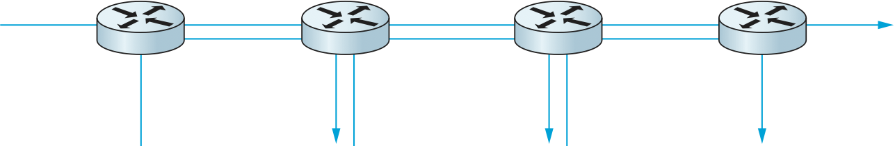

6.1 Issues in Resource Allocation
=================================

Resource allocation and congestion control are complex issues that have
been the subject of much study ever since the first network was
designed. They are still active areas of research. One factor that makes
these issues complex is that they are not isolated to one single level
of a protocol hierarchy. Resource allocation is partially implemented in
the routers, switches, and links inside the network and partially in the
transport protocol running on the end hosts. End systems may use
signalling protocols to convey their resource requirements to network
nodes, which respond with information about resource availability. One
of the main goals of this chapter is to define a framework in which
these mechanisms can be understood, as well as to give the relevant
details about a representative sample of mechanisms.

We should clarify our terminology before going any further. By *resource
allocation*, we mean the process by which network elements try to meet
the competing demands that applications have for network
resources—primarily link bandwidth and buffer space in routers or
switches. Of course, it will often not be possible to meet all the
demands, meaning that some users or applications may receive fewer
network resources than they want. Part of the resource allocation
problem is deciding when to say no and to whom.

We use the term *congestion control* to describe the efforts made by
network nodes to prevent or respond to overload conditions. Since
congestion is generally bad for everyone, the first order of business is
making congestion subside, or preventing it in the first place. This
might be achieved simply by persuading a few hosts to stop sending, thus
improving the situation for everyone else. However, it is more common
for congestion-control mechanisms to have some aspect of fairness—that
is, they try to share the pain among all users, rather than causing
great pain to a few. Thus, we see that many congestion-control
mechanisms have some sort of resource allocation built into them.

It is also important to understand the difference between flow control
and congestion control. Flow control involves keeping a fast sender from
overrunning a slow receiver. Congestion control, by contrast, is
intended to keep a set of senders from sending too much data *into the
network* because of lack of resources at some point. These two concepts
are often confused; as we will see, they also share some mechanisms.

6.1.1 Network Model
-------------------

We begin by defining three salient features of the network architecture.
For the most part, this is a summary of material presented in the
previous chapters that is relevant to the problem of resource
allocation.

Packet-Switched Network
~~~~~~~~~~~~~~~~~~~~~~~

We consider resource allocation in a packet-switched network (or
internet) consisting of multiple links and switches (or routers). Since
most of the mechanisms described in this chapter were designed for use
on the Internet, and therefore were originally defined in terms of
routers rather than switches, we use the term *router* throughout our
discussion. The problem is essentially the same, whether on a network or
an internetwork.

In such an environment, a given source may have more than enough
capacity on the immediate outgoing link to send a packet, but somewhere
in the middle of a network its packets encounter a link that is being
used by many different traffic sources. :numref:`Figure %s <fig-congestion>`
illustrates this situation—two high-speed links are feeding a low-speed
link. This is in contrast to shared-access networks like Ethernet and
wireless networks, where the source can directly observe the traffic on
the network and decide accordingly whether or not to send a packet. We
have already seen the algorithms used to allocate bandwidth on
shared-access networks (e.g., Ethernet and Wi-Fi). These access-control
algorithms are, in some sense, analogous to congestion-control
algorithms in a switched network.

.. _key-congestion:
.. admonition:: Key Takeaway

   Note that congestion control is a different problem than routing.
   While it is true that a congested link could be assigned a large edge
   weight by the routing protocol, and, as a consequence, routers would
   route around it, “routing around” a congested link does not generally
   solve the congestion problem. To see this, we need look no further
   than the simple network depicted in :numref:`Figure %s <fig-congestion>`,
   where all traffic has to flow through the same router to reach the
   destination. Although this is an extreme example, it is common to
   have a certain router that it is not possible to route around. This
   router can become congested, and there is nothing the routing
   mechanism can do about it. This congested router is sometimes called
   the *bottleneck* router. :ref:`[Next] <key-policy-mechanism>`

Connectionless Flows
~~~~~~~~~~~~~~~~~~~~

For much of our discussion, we assume that the network is essentially
connectionless, with any connection-oriented service implemented in the
transport protocol that is running on the end hosts. (We explain the
qualification “essentially” in a moment.) This is precisely the model of
the Internet, where IP provides a connectionless datagram delivery
service and TCP implements an end-to-end connection abstraction. Note
that this assumption does not hold in virtual circuit networks such as
ATM and X.25. In such networks, a connection setup message traverses the
network when a circuit is established. This setup message reserves a set
of buffers for the connection at each router, thereby providing a form
of congestion control—a connection is established only if enough buffers
can be allocated to it at each router. The major shortcoming of this
approach is that it leads to an underutilization of resources—buffers
reserved for a particular circuit are not available for use by other
traffic even if they were not currently being used by that circuit. The
focus of this chapter is on resource allocation approaches that apply in
an internetwork, and thus we focus mainly on connectionless networks.
   
.. _fig-congestion:
.. figure:: figures/f06-01-9780123850591.png
   :width: 500px
   :align: center

   A potential bottleneck router.

We need to qualify the term *connectionless* because our classification
of networks as being either connectionless or connection oriented is a
bit too restrictive; there is a gray area in between. In particular, the
assumption that all datagrams are completely independent in a
connectionless network is too strong. The datagrams are certainly
switched independently, but it is usually the case that a stream of
datagrams between a particular pair of hosts flows through a particular
set of routers. This idea of a *flow*—a sequence of packets sent between
a source/destination pair and following the same route through the
network—is an important abstraction in the context of resource
allocation; it is one that we will use in this chapter.

One of the powers of the flow abstraction is that flows can be defined
at different granularities. For example, a flow can be host-to-host
(i.e., have the same source/destination host addresses) or
process-to-process (i.e., have the same source/destination host/port
pairs). In the latter case, a flow is essentially the same as a
channel, as we have been using that term throughout this book. The
reason we introduce a new term is that a flow is visible to the
routers inside the network, whereas a channel is an end-to-end
abstraction. :numref:`Figure %s <fig-flow>` illustrates several flows
passing through a series of routers.
   
.. _fig-flow:
.. figure:: figures/f06-02-9780123850591.png
   :width: 500px
   :align: center

   Multiple flows passing through a set of routers.
   
Because multiple related packets flow through each router, it sometimes
makes sense to maintain some state information for each flow,
information that can be used to make resource allocation decisions about
the packets that belong to the flow. This state is sometimes called
*soft state*. The main difference between soft state and hard state is
that soft state need not always be explicitly created and removed by
signalling. Soft state represents a middle ground between a purely
connectionless network that maintains *no* state at the routers and a
purely connection-oriented network that maintains hard state at the
routers. In general, the correct operation of the network does not
depend on soft state being present (each packet is still routed
correctly without regard to this state), but when a packet happens to
belong to a flow for which the router is currently maintaining soft
state, then the router is better able to handle the packet.

Note that a flow can be either implicitly defined or explicitly
established. In the former case, each router watches for packets that
happen to be traveling between the same source/destination pair—the
router does this by inspecting the addresses in the header—and treats
these packets as belonging to the same flow for the purpose of
congestion control. In the latter case, the source sends a flow setup
message across the network, declaring that a flow of packets is about to
start. While explicit flows are arguably no different than a connection
across a connection-oriented network, we call attention to this case
because, even when explicitly established, a flow does not imply any
end-to-end semantics and, in particular, does not imply the reliable and
ordered delivery of a virtual circuit. It simply exists for the purpose
of resource allocation. We will see examples of both implicit and
explicit flows in this chapter.

Service Model
~~~~~~~~~~~~~

In the early part of this chapter, we will focus on mechanisms that
assume the best-effort service model of the Internet. With best-effort
service, all packets are given essentially equal treatment, with end
hosts given no opportunity to ask the network that some packets or flows
be given certain guarantees or preferential service. Defining a service
model that supports some kind of preferred service or guarantee—for
example, guaranteeing the bandwidth needed for a video stream—is the
subject of a later section. Such a service model is said to provide
multiple *qualities of service* (QoS). As we will see, there is actually
a spectrum of possibilities, ranging from a purely best-effort service
model to one in which individual flows receive quantitative guarantees
of QoS. One of the greatest challenges is to define a service model that
meets the needs of a wide range of applications and even allows for the
applications that will be invented in the future.

6.1.2 Taxonomy
---------------

There are countless ways in which resource allocation mechanisms differ,
so creating a thorough taxonomy is a difficult proposition. For now, we
describe three dimensions along which resource allocation mechanisms can
be characterized; more subtle distinctions will be called out during the
course of this chapter.

Router-Centric versus Host-Centric
~~~~~~~~~~~~~~~~~~~~~~~~~~~~~~~~~~

Resource allocation mechanisms can be classified into two broad groups:
those that address the problem from inside the network (i.e., at the
routers or switches) and those that address it from the edges of the
network (i.e., in the hosts, perhaps inside the transport protocol).
Since it is the case that both the routers inside the network and the
hosts at the edges of the network participate in resource allocation,
the real issue is where the majority of the burden falls.

In a router-centric design, each router takes responsibility for
deciding when packets are forwarded and selecting which packets are to
be dropped, as well as for informing the hosts that are generating the
network traffic how many packets they are allowed to send. In a
host-centric design, the end hosts observe the network conditions (e.g.,
how many packets they are successfully getting through the network) and
adjust their behavior accordingly. Note that these two groups are not
mutually exclusive. For example, a network that places the primary
burden for managing congestion on routers still expects the end hosts to
adhere to any advisory messages the routers send, while the routers in
networks that use end-to-end congestion control still have some policy,
no matter how simple, for deciding which packets to drop when their
queues do overflow.

Reservation-Based versus Feedback-Based
~~~~~~~~~~~~~~~~~~~~~~~~~~~~~~~~~~~~~~~

A second way that resource allocation mechanisms are sometimes
classified is according to whether they use *reservations* or
*feedback*. In a reservation-based system, some entity (e.g., the end
host) asks the network for a certain amount of capacity to be allocated
for a flow. Each router then allocates enough resources (buffers and/or
percentage of the link’s bandwidth) to satisfy this request. If the
request cannot be satisfied at some router, because doing so would
overcommit its resources, then the router rejects the reservation. This
is analogous to getting a busy signal when trying to make a phone call.
In a feedback-based approach, the end hosts begin sending data without
first reserving any capacity and then adjust their sending rate
according to the feedback they receive. This feedback can be either
*explicit* (i.e., a congested router sends a “please slow down” message
to the host) or *implicit* (i.e., the end host adjusts its sending rate
according to the externally observable behavior of the network, such as
packet losses).

Note that a reservation-based system always implies a router-centric
resource allocation mechanism. This is because each router is
responsible for keeping track of how much of its capacity is currently
available and deciding whether new reservations can be admitted. Routers
may also have to make sure each host lives within the reservation it
made. If a host sends data faster than it claimed it would when it made
the reservation, then that host’s packets are good candidates for
discarding, should the router become congested. On the other hand, a
feedback-based system can imply either a router- or host-centric
mechanism. Typically, if the feedback is explicit, then the router is
involved, to at least some degree, in the resource allocation scheme. If
the feedback is implicit, then almost all of the burden falls to the end
host; the routers silently drop packets when they become congested.

Reservations do not have to be made by end hosts. It is possible for a
network administrator to allocate resources to flows or to larger
aggregates of traffic, as we will see in a later section.

Window Based versus Rate Based
~~~~~~~~~~~~~~~~~~~~~~~~~~~~~~

A third way to characterize resource allocation mechanisms is according
to whether they are *window based* or *rate based*. This is one of the
areas, noted above, where similar mechanisms and terminology are used
for both flow control and congestion control. Both flow-control and
resource allocation mechanisms need a way to express, to the sender, how
much data it is allowed to transmit. There are two general ways of doing
this: with a *window* or with a *rate*. We have already seen
window-based transport protocols, such as TCP, in which the receiver
advertises a window to the sender. This window corresponds to how much
buffer space the receiver has, and it limits how much data the sender
can transmit; that is, it supports flow control. A similar
mechanism—window advertisement—can be used within the network to reserve
buffer space (i.e., to support resource allocation). TCP’s
congestion-control mechanisms are window based.

It is also possible to control a sender’s behavior using a rate—that is,
how many bits per second the receiver or network is able to absorb.
Rate-based control makes sense for many multimedia applications, which
tend to generate data at some average rate and which need at least some
minimum throughput to be useful. For example, a video codec might
generate video at an average rate of 1 Mbps with a peak rate of 2 Mbps.
As we will see later in this chapter, rate-based characterization of
flows is a logical choice in a reservation-based system that supports
different qualities of service—the sender makes a reservation for so
many bits per second, and each router along the path determines if it
can support that rate, given the other flows it has made commitments to.

Summary of Resource Allocation Taxonomy
~~~~~~~~~~~~~~~~~~~~~~~~~~~~~~~~~~~~~~~

Classifying resource allocation approaches at two different points along
each of three dimensions, as we have just done, would seem to suggest up
to eight unique strategies. While eight different approaches are
certainly possible, we note that in practice two general strategies seem
to be most prevalent; these two strategies are tied to the underlying
service model of the network.

On the one hand, a best-effort service model usually implies that
feedback is being used, since such a model does not allow users to
reserve network capacity. This, in turn, means that most of the
responsibility for congestion control falls to the end hosts, perhaps
with some assistance from the routers. In practice, such networks use
window-based information. This is the general strategy adopted in the
Internet.

On the other hand, a QoS-based service model probably implies some form
of reservation. Support for these reservations is likely to require
significant router involvement, such as queuing packets differently
depending on the level of reserved resources they require. Moreover, it
is natural to express such reservations in terms of rate, since windows
are only indirectly related to how much bandwidth a user needs from the
network. We discuss this topic in a later section.

6.1.3 Evaluation Criteria
-------------------------

The final issue is one of knowing whether a resource allocation
mechanism is good or not. Recall that in the problem statement at the
start of this chapter we posed the question of how a network
*effectively* and *fairly* allocates its resources. This suggests at
least two broad measures by which a resource allocation scheme can be
evaluated. We consider each in turn.

Effective Resource Allocation
~~~~~~~~~~~~~~~~~~~~~~~~~~~~~

A good starting point for evaluating the effectiveness of a resource
allocation scheme is to consider the two principal metrics of
networking: throughput and delay. Clearly, we want as much throughput
and as little delay as possible. Unfortunately, these goals are often
somewhat at odds with each other. One sure way for a resource allocation
algorithm to increase throughput is to allow as many packets into the
network as possible, so as to drive the utilization of all the links up
to 100%. We would do this to avoid the possibility of a link becoming
idle because an idle link necessarily hurts throughput. The problem with
this strategy is that increasing the number of packets in the network
also increases the length of the queues at each router. Longer queues,
in turn, mean packets are delayed longer in the network.

To describe this relationship, some network designers have proposed
using the ratio of throughput to delay as a metric for evaluating the
effectiveness of a resource allocation scheme. This ratio is sometimes
referred to as the *power* of the network:

::

   Power = Throughput / Delay

Note that it is not obvious that power is the right metric for judging
resource allocation effectiveness. For one thing, the theory behind
power is based on an M/M/1 queuing network that assumes infinite
queues;\ [#]_ real networks have finite buffers and sometimes have to
drop packets.  For another, power is typically defined relative to a
single connection (flow); it is not clear how it extends to multiple,
competing connections. Despite these rather severe limitations,
however, no alternatives have gained wide acceptance, and so power
continues to be used.

.. [#] Since this is not a queuing theory book, we provide only this
       brief description of an M/M/1 queue. The 1 means it has a
       single server, and the Ms mean that the distribution of both
       packet arrival and service times is *Markovian,* that is,
       exponential.

The objective is to maximize this ratio, which is a function of how
much load you place on the network. The load, in turn, is set by the
resource allocation mechanism. :numref:`Figure %s <fig-power>` gives a
representative power curve, where, ideally, the resource allocation
mechanism would operate at the peak of this curve. To the left of the
peak, the mechanism is being too conservative; that is, it is not
allowing enough packets to be sent to keep the links busy. To the
right of the peak, so many packets are being allowed into the network
that increases in delay due to queuing are starting to dominate any
small gains in throughput.

Interestingly, this power curve looks very much like the system
throughput curve in a timesharing computer system. System throughput
improves as more jobs are admitted into the system, until it reaches a
point when there are so many jobs running that the system begins to
thrash (spends all of its time swapping memory pages) and the throughput
begins to drop.
   
.. _fig-power:
.. figure:: figures/f06-03-9780123850591.png
   :width: 350px
   :align: center

   Ratio of throughput to delay as a function of load.

As we will see in later sections of this chapter, many
congestion-control schemes are able to control load in only very crude
ways; that is, it is simply not possible to turn the “knob” a little
and allow only a small number of additional packets into the
network. As a consequence, network designers need to be concerned
about what happens even when the system is operating under extremely
heavy load—that is, at the rightmost end of the curve in
:numref:`Figure %s <fig-power>`. Ideally, we would like to avoid the
situation in which the system throughput goes to zero because the
system is thrashing. In networking terminology, we want a system that
is *stable*—where packets continue to get through the network even
when the network is operating under heavy load. If a mechanism is not
stable, the network may experience *congestion collapse*.

Fair Resource Allocation
~~~~~~~~~~~~~~~~~~~~~~~~

The effective utilization of network resources is not the only criterion
for judging a resource allocation scheme. We must also consider the
issue of fairness. However, we quickly get into murky waters when we try
to define what exactly constitutes fair resource allocation. For
example, a reservation-based resource allocation scheme provides an
explicit way to create controlled unfairness. With such a scheme, we
might use reservations to enable a video stream to receive 1 Mbps across
some link while a file transfer receives only 10 kbps over the same
link.

In the absence of explicit information to the contrary, when several
flows share a particular link, we would like for each flow to receive
an equal share of the bandwidth. This definition presumes that a
*fair* share of bandwidth means an *equal* share of bandwidth. But,
even in the absence of reservations, equal shares may not equate to
fair shares.  Should we also consider the length of the paths being
compared? For example, as illustrated in :numref:`Figure %s
<fig-path-len>`, what is fair when one four-hop flow is competing with
three one-hop flows?
   
.. _fig-path-len:

   One four-hop flow competing with three one-hop flows.

Assuming that fair implies equal and that all paths are of equal length,
networking researcher Raj Jain proposed a metric that can be used to
quantify the fairness of a congestion-control mechanism. Jain’s fairness
index is defined as follows. Given a set of flow throughputs

.. math::

   (x_{1}, x_{2}, \ldots , x_{n})

(measured in consistent units such as bits/second), the following
function assigns a fairness index to the flows:

.. math::

   f(x_{1}, x_{2}, \ldots ,x_{n}) = \frac{( \sum_{i=1}^{n} x_{i}
   )^{2}} {n  \sum_{i=1}^{n} x_{i}^{2}}

The fairness index always results in a number between 0 and 1, with 1
representing greatest fairness. To understand the intuition behind this
metric, consider the case where all *n* flows receive a throughput of
1 unit of data per second. We can see that the fairness index in this
case is

.. math::

   \frac{n^2}{n \times n} = 1

Now, suppose one flow receives a throughput of :math:`1 + \Delta`. 
Now the fairness index is

.. math::

   \frac{((n - 1) + 1 + \Delta)^2}{n(n - 1 + (1 + \Delta)^2)}
   = \frac{n^2 + 2n\Delta + \Delta^2}{n^2 + 2n\Delta + n\Delta^2}

Note that the denominator exceeds the numerator by :math:`(n-1)\Delta^2`.
Thus, whether the odd flow out was getting more or less than all the
other flows (positive or negative :math:`\Delta`), the fairness index has 
now dropped below one. Another simple case to
consider is where only *k* of the *n* flows receive equal throughput,
and the remaining *n-k* users receive zero throughput, in which case the
fairness index drops to \ *k/n*.
