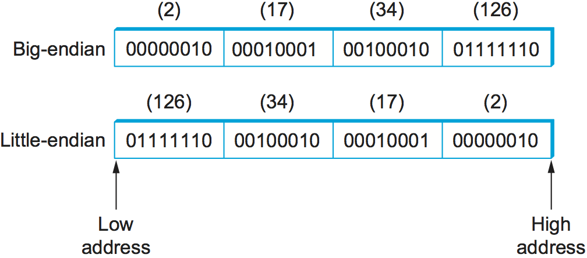
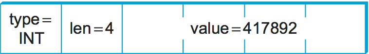
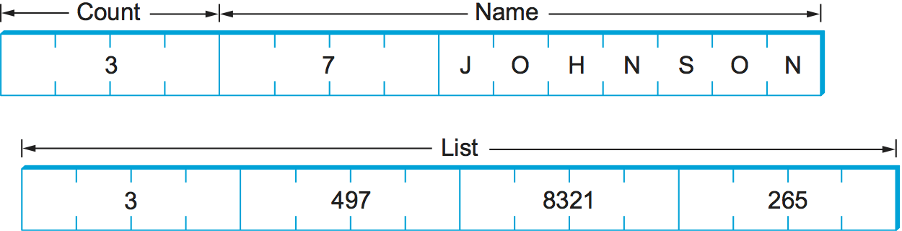
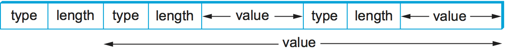
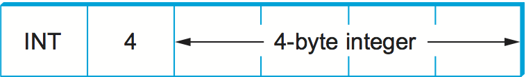

7.1 Presentation Formatting
===========================

One of the most common transformations of network data is from the
representation used by the application program into a form that is
suitable for transmission over a network and *vice versa*. This
transformation is typically called *presentation formatting*. As
illustrated in :numref:`Figure %s <fig-marshal1>`, the sending program
translates the data it wants to transmit from the representation it
uses internally into a message that can be transmitted over the
network; that is, the data is *encoded* in a message. On the receiving
side, the application translates this arriving message into a
representation that it can then process; that is, the message is
*decoded*. This process is sometimes called *argument marshalling* or
*serialization*. This terminology comes from the Remote Procedure Call
(RPC) world, where the client thinks it is invoking a procedure with a
set of arguments, but these arguments are then “brought together and
ordered in an appropriate and effective way” to form a network
message.

.. _fig-marshal1:
.. figure:: figures/f07-01-9780123850591.png
   :width: 400px
   :align: center

   Presentation formatting involves encoding and decoding application data.

You might ask what makes this problem challenging. One reason is that
computers represent data in different ways. For example, some computers
represent floating-point numbers in IEEE standard 754 format, while some
older machines still use their own nonstandard format. Even for
something as simple as integers, different architectures use different
sizes (e.g., 16-bit, 32-bit, 64-bit). To make matters worse, on some
machines integers are represented in *big-endian* form (the most
significant bit of a word is in the byte with the highest address),
while on other machines integers are represented in *little-endian* form
(the most significant bit is in the byte with the lowest address). For
example, PowerPC processors are big-endian machines, and the Intel x86
family is a little-endian architecture. Today, many architectures
support both representations (and so are called *bi-endian*), but the
point is that you can never be sure how the host you are communicating
with stores integers. The big-endian and little-endian representations
of the integer 34,677,374 are given in :numref:`Figure %s <fig-endian>`.

.. _fig-endian:

   Big-endian and little-endian byte order for the integer 34,677,374

Another reason that marshalling is difficult is that application
programs are written in different languages, and even when you are using
a single language there may be more than one compiler. For example,
compilers have a fair amount of latitude in how they lay out structures
(records) in memory, such as how much padding they put between the
fields that make up the structure. Thus, you could not simply transmit a
structure from one machine to another, even if both machines were of the
same architecture and the program was written in the same language,
because the compiler on the destination machine might align the fields
in the structure differently.

7.1.1 Taxonomy
---------------

Although argument marshalling is not rocket science—it is a small matter
of bit twiddling—there are a surprising number of design choices that
you must address. We begin by giving a simple taxonomy for argument
marshalling systems. The following is by no means the only viable
taxonomy, but it is sufficient to cover most of the interesting
alternatives.

Data Types
~~~~~~~~~~

The first question is what data types the system is going to support. In
general, we can classify the types supported by an argument marshalling
mechanism at three levels. Each level complicates the task faced by the
marshalling system.

At the lowest level, a marshalling system operates on some set of *base
types*. Typically, the base types include integers, floating-point
numbers, and characters. The system might also support ordinal types and
Booleans. As described above, the implication of the set of base types
is that the encoding process must be able to convert each base type from
one representation to another—for example, convert an integer from
big-endian to little-endian.

At the next level are *flat types*—structures and arrays. While flat
types might at first not appear to complicate argument marshalling, the
reality is that they do. The problem is that the compilers used to
compile application programs sometimes insert padding between the fields
that make up the structure so as to align these fields on word
boundaries. The marshalling system typically *packs* structures so that
they contain no padding.

At the highest level, the marshalling system might have to deal with
*complex types*—those types that are built using pointers. That is, the
data structure that one program wants to send to another might not be
contained in a single structure, but might instead involve pointers from
one structure to another. A tree is a good example of a complex type
that involves pointers. Clearly, the data encoder must prepare the data
structure for transmission over the network because pointers are
implemented by memory addresses, and just because a structure lives at a
certain memory address on one machine does not mean it will live at the
same address on another machine. In other words, the marshalling system
must *serialize* (flatten) complex data structures.

In summary, depending on how complicated the type system is, the task
of argument marshalling usually involves converting the base types,
packing the structures, and linearizing the complex data structures,
all to form a contiguous message that can be transmitted over the
network. :numref:`Figure %s <fig-marshal2>` illustrates this task.

.. _fig-marshal2:
.. figure:: figures/f07-03-9780123850591.png
   :width: 400px
   :align: center

   Argument marshalling: converting, packing, and linearizing

Conversion Strategy
~~~~~~~~~~~~~~~~~~~

Once the type system is established, the next issue is what conversion
strategy the argument marshaller will use. There are two general
options: *canonical intermediate form* and *receiver-makes-right*. We
consider each, in turn.

The idea of canonical intermediate form is to settle on an external
representation for each type; the sending host translates from its
internal representation to this external representation before sending
data, and the receiver translates from this external representation into
its local representation when receiving data. To illustrate the idea,
consider integer data; other types are treated in a similar manner. You
might declare that the big-endian format will be used as the external
representation for integers. The sending host must translate each
integer it sends into big-endian form, and the receiving host must
translate big-endian integers into whatever representation it uses.
(This is what is done in the Internet for protocol headers.) Of course,
a given host might already use big-endian form, in which case no
conversion is necessary.

The alternative, receiver-makes-right, has the sender transmit data in
its own internal format; the sender does not convert the base types, but
usually has to pack and flatten more complex data structures. The
receiver is then responsible for translating the data from the sender’s
format into its own local format. The problem with this strategy is that
every host must be prepared to convert data from all other machine
architectures. In networking, this is known as an *N-by-N solution*:
Each of N machine architectures must be able to handle all N
architectures. In contrast, in a system that uses a canonical
intermediate form, each host needs to know only how to convert between
its own representation and a single other representation—the external
one.

Using a common external format is clearly the correct thing to do,
right? This has certainly been the conventional wisdom in the networking
community for over 30 years. The answer is not cut and dried, however.
It turns out that there are not that many different representations for
the various base classes, or, said another way, N is not that large. In
addition, the most common case is for two machines of the same type to
be communicating with each other. In this situation, it seems silly to
translate data from that architecture’s representation into some foreign
external representation, only to have to translate the data back into
the same architecture’s representation on the receiver.

A third option, although we know of no existing system that exploits it,
is to use receiver-makes-right if the sender knows that the destination
has the same architecture; the sender would use some canonical
intermediate form if the two machines use different architectures. How
would a sender learn the receiver’s architecture? It could learn this
information either from a name server or by first using a simple test
case to see if the appropriate result occurs.

Tags
~~~~

The third issue in argument marshalling is how the receiver knows what
kind of data is contained in the message it receives. There are two
common approaches: *tagged* and *untagged* data. The tagged approach is
more intuitive, so we describe it first.

A tag is any additional information included in a message—beyond the
concrete representation of the base types—that helps the receiver
decode the message. There are several possible tags that might be
included in a message. For example, each data item might be augmented
with a *type* tag. A type tag indicates that the value that follows is
an integer, a floating-point number, or whatever. Another example is a
*length* tag.  Such a tag is used to indicate the number of elements
in an array or the size of an integer. A third example is an
*architecture* tag, which might be used in conjunction with the
receiver-makes-right strategy to specify the architecture on which the
data contained in the message was generated. :numref:`Figure %s
<fig-tags>` depicts how a simple 32-bit integer might be encoded in a
tagged message.

.. _fig-tags:

   A 32-bit integer encoded in a tagged message.

The alternative, of course, is not to use tags. How does the receiver
know how to decode the data in this case? It knows because it was
programmed to know. In other words, if you call a remote procedure that
takes two integers and a floating-point number as arguments, then there
is no reason for the remote procedure to inspect tags to know what it
has just received. It simply assumes that the message contains two
integers and a float and decodes it accordingly. Note that, while this
works for most cases, the one place it breaks down is when sending
variable-length arrays. In such a case, a length tag is commonly used to
indicate how long the array is.

It is also worth noting that the untagged approach means that the
presentation formatting is truly end to end. It is not possible for some
intermediate agent to interpret the message unless the data is tagged.
Why would an intermediate agent need to interpret a message, you might
ask? Stranger things have happened, mostly resulting from *ad hoc*
solutions to unexpected problems that the system was not engineered to
handle. Poor network design is beyond the scope of this book.

Stubs
~~~~~

A stub is the piece of code that implements argument marshalling. Stubs
are typically used to support RPC. On the client side, the stub marshals
the procedure arguments into a message that can be transmitted by means
of the RPC protocol. On the server side, the stub converts the message
back into a set of variables that can be used as arguments to call the
remote procedure. Stubs can either be interpreted or compiled.

In a compilation-based approach, each procedure has a customized client
and server stub. While it is possible to write stubs by hand, they are
typically generated by a stub compiler, based on a description of the
procedure’s interface. This situation is illustrated in :numref:`Figure
%s <fig-stubs>`. Since the stub is compiled, it is usually very efficient.
In an interpretation-based approach, the system provides generic client
and server stubs that have their parameters set by a description of the
procedure’s interface. Because it is easy to change this description,
interpreted stubs have the advantage of being flexible. Compiled stubs
are more common in practice.

.. _fig-stubs:
.. figure:: figures/f07-05-9780123850591.png
   :width: 500px
   :align: center

   Stub compiler takes interface description as input and outputs client
   and server stubs.

7.1.2 Examples (XDR, ASN.1, NDR, ProtoBufs)
-------------------------------------------

We now briefly describe four popular network data representations in
terms of this taxonomy. We use the integer base type to illustrate how
each system works.

XDR
~~~

External Data Representation (XDR) is the network format used with
SunRPC. In the taxonomy just introduced, XDR

-  Supports the entire C-type system with the exception of function
   pointers

-  Defines a canonical intermediate form

-  Does not use tags (except to indicate array lengths)

-  Uses compiled stubs

An XDR integer is a 32-bit data item that encodes a C integer. It is
represented in twos’ complement notation, with the most significant byte
of the C integer in the first byte of the XDR integer and the least
significant byte of the C integer in the fourth byte of the XDR integer.
That is, XDR uses big-endian format for integers. XDR supports both
signed and unsigned integers, just as C does.

XDR represents variable-length arrays by first specifying an unsigned
integer (4 bytes) that gives the number of elements in the array,
followed by that many elements of the appropriate type. XDR encodes the
components of a structure in the order of their declaration in the
structure. For both arrays and structures, the size of each
element/component is represented in a multiple of 4 bytes. Smaller data
types are padded out to 4 bytes with 0s. The exception to this “pad to
4 bytes” rule is made for characters, which are encoded one per byte.

.. _fig-xdr:

   Example encoding of a structure in XDR.

The following code fragment gives an example C structure (``item``) and
the XDR routine that encodes/decodes this structure (``xdr_item``).
:numref:`Figure %s <fig-xdr>` schematically depicts XDR’s on-the-wire
representation of this structure when the field ``name`` is seven
characters long and the array ``list`` has three values in it.

In this example, ``xdr_array``, ``xdr_int``, and ``xdr_string`` are
three primitive functions provided by XDR to encode and decode arrays,
integers, and character strings, respectively. Argument ``xdrs`` is a
context variable that XDR uses to keep track of where it is in the
message being processed; it includes a flag that indicates whether this
routine is being used to encode or decode the message. In other words,
routines like ``xdr_item`` are used on both the client and the server.
Note that the application programmer can either write the routine
``xdr_item`` by hand or use a stub compiler called ``rpcgen`` (not
shown) to generate this encoding/decoding routine. In the latter case,
``rpcgen`` takes the remote procedure that defines the data structure
``item`` as input and outputs the corresponding stub.

.. code-block:: c

   #define MAXNAME 256;
   #define MAXLIST 100;

   struct item {
      int     count;
      char    name[MAXNAME];
      int     list[MAXLIST];
   };

   bool_t
   xdr_item(XDR *xdrs, struct item *ptr)
   {
       return(xdr_int(xdrs, &ptr->count) &&
          xdr_string(xdrs, &ptr->name, MAXNAME) &&
          xdr_array(xdrs, &ptr->list, &ptr->count, MAXLIST,
                    sizeof(int), xdr_int));
   }

Exactly how XDR performs depends, of course, on the complexity of the
data. In a simple case of an array of integers, where each integer has
to be converted from one byte order to another, an average of three
instructions are required for each byte, meaning that converting the
whole array is likely to be limited by the memory bandwidth of the
machine. More complex conversions that require significantly more
instructions per byte will be CPU limited and thus perform at a data
rate less than the memory bandwidth.

ASN.1
~~~~~

Abstract Syntax Notation One (ASN.1) is an ISO standard that defines,
among other things, a representation for data sent over a network. The
representation-specific part of ASN.1 is called the *Basic Encoding
Rules* (BER). ASN.1 supports the C-type system without function
pointers, defines a canonical intermediate form, and uses type tags. Its
stubs can be either interpreted or compiled. One of the claims to fame
of ASN.1 BER is that it is used by the Internet standard Simple Network
Management Protocol (SNMP).

ASN.1 represents each data item with a triple of the form

::

   (tag, length, value)

The ``tag`` is typically an 8-bit field, although ASN.1 allows for the
definition of multibyte tags. The ``length`` field specifies how many
bytes make up the ``value``; we discuss ``length`` more
below. Compound data types, such as structures, can be constructed by
nesting primitive types, as illustrated in :numref:`Figure %s <fig-ber1>`.

.. _fig-ber1:

   Compound types created by means of nesting in ASN.1 BER.

.. _fig-ber2:

   ASN.1 BER representation for a 4-byte integer.

If the ``value`` is 127 or fewer bytes long, then the ``length`` is
specified in a single byte. Thus, for example, a 32-bit integer is
encoded as a 1-byte ``type``, a 1-byte ``length``, and the 4 bytes that
encode the integer, as illustrated in :numref:`Figure %s <fig-ber2>`. The
``value`` itself, in the case of an integer, is represented in twos’
complement notation and big-endian form, just as in XDR. Keep in mind
that, even though the ``value`` of the integer is represented in exactly
the same way in both XDR and ASN.1, the XDR representation has neither
the ``type`` nor the ``length`` tags associated with that integer. These
two tags both take up space in the message and, more importantly,
require processing during marshalling and unmarshalling. This is one
reason why ASN.1 is not as efficient as XDR. Another is that the very
fact that each data value is preceded by a ``length`` field means that
the data value is unlikely to fall on a natural byte boundary (e.g., an
integer beginning on a word boundary). This complicates the
encoding/decoding process.

If the ``value`` is 128 or more bytes long, then multiple bytes are
used to specify its ``length``. At this point you may be asking why a
byte can specify a length of up to 127 bytes rather than 256. The
reason is that 1 bit of the ``length`` field is used to denote how
long the ``length`` field is. A 0 in the eighth bit indicates a 1-byte
``length`` field. To specify a longer ``length``, the eighth bit is
set to 1, and the other 7 bits indicate how many additional bytes make
up the ``length``. :numref:`Figure %s <fig-ber3>` illustrates a simple
1-byte ``length`` and a multibyte ``length``.

.. _fig-ber3:
.. figure:: figures/f07-09-9780123850591.png
   :width: 400px
   :align: center

   ASN.1 BER representation for length: (a) 1 byte; (b) multibyte.

NDR
~~~

Network Data Representation (NDR) is the data-encoding standard used in
the Distributed Computing Environment (DCE). Unlike XDR and ASN.1, NDR
uses receiver-makes-right. It does this by inserting an architecture tag
at the front of each message; individual data items are untagged. NDR
uses a compiler to generate stubs. This compiler takes a description of
a program written in the Interface Definition Language (IDL) and
generates the necessary stubs. IDL looks pretty much like C, and so
essentially supports the C-type system.

.. _fig-ndr:
.. figure:: figures/f07-10-9780123850591.png
   :width: 600px
   :align: center

   NDR’s architecture tag.

:numref:`Figure %s <fig-ndr>` illustrates the 4-byte architecture
definition tag that is included at the front of each NDR-encoded
message. The first byte contains two 4-bit fields. The first field,
``IntegrRep``, defines the format for all integers contained in the
message. A 0 in this field indicates big-endian integers, and a 1
indicates little-endian integers.  The ``CharRep`` field indicates
what character format is used: 0 means ASCII (American Standard Code
for Information Interchange) and 1 means EBCDIC (an older, IBM-defined
alternative to ASCII). Next, the ``FloatRep`` byte defines which
floating-point representation is being used: 0 means IEEE 754, 1 means
VAX, 2 means Cray, and 3 means IBM. The final 2 bytes are reserved for
future use. Note that, in simple cases such as arrays of integers, NDR
does the same amount of work as XDR, and so it is able to achieve the
same performance.

ProtoBufs
~~~~~~~~~

Protocol Buffers (Protobufs, for short) provide a language-neutral and
platform-neutral way of serializing structured data, commonly used with
gRPC. They use a tagged strategy with a canonical intermediate form,
where the stub on both sides is generated from a shared ``.proto`` file.
This specification uses a simple C-like syntax, as the following example
illustrates:

.. code-block:: c

   message Person {
       required string name = 1;
       required int32 id = 2;
       optional string email = 3;

       enum PhoneType {
           MOBILE = 0;
           HOME = 1;
           WORK = 2;
       }

       message PhoneNumber {
           required string number = 1;
           optional PhoneType type = 2 [default = HOME];
       }

       required PhoneNumber phone = 4;
   }

where ``message`` could roughly be interpreted as equivalent to
``typedef struct`` in C. The rest of the example is fairly intuitive,
except that every field is given a numeric identifier to ensure
uniqueness should the specification change over time, and each field can
be annotated as being either ``required`` or ``optional``.

The way Protobufs encode integers is novel. They use a technique called
*varints* (variable length integers) in which each 8-bit byte uses the
most significant bit to indicate whether there are more bytes in the
integer, and the lower seven bits to encode the two’s complement
representation of the next group of seven bits in the value. The least
significant group is first in the serialization.

This means a small integer (less than 128) can be encoded in a single
byte (e.g., the integer 2 is encoded as ``0000 0010``), while for an
integer bigger than 128, more bytes are needed. For example, 365 would
be encoded as

::

   1110 1101 0000 0010

To see this, first drop the most significant bit from each byte, as it
is there to tell us whether we’ve reached the end of the integer. In
this example, the ``1`` in the most significant bit of the first byte
indicates there is more than one byte in the varint:

::

   1110 1101 0000 0010
   → 110 1101  000 0010

Since varints store numbers with the least significant group first, you
next reverse the two groups of seven bits. Then you concatenate them to
get your final value:

::

   000 0010  110 1101
   →  000 0010 || 110 1101
   →  101101101
   →  256 + 64 + 32 + 8 + 4 + 1 = 365

For the larger message specification, you can think of the serialized
byte stream as a collection of key/value pairs, where the key (i.e.,
tag) has two sub-parts: the unique identifier for the field (i.e., those
extra numbers in the example ``.proto`` file) and the *wire type* of the
value (e.g., ``Varint`` is the one example wire type we have seen so
far). Other supported wire types include ``32-bit`` and ``64-bit`` (for
fixed-length integers), and ``length-delimited`` (for strings and
embedded messages). The latter tells you how many bytes long the
embedded message (structure) is, but it’s another ``message``
specification in the ``.proto`` file that tells you how to interpret
those bytes.

7.1.3 Markup Languages (XML)
----------------------------

Although we have been discussing the presentation formatting problem
from the perspective of RPC—that is, how does one encode primitive data
types and compound data structures so they can be sent from a client
program to a server program—the same basic problem occurs in other
settings. For example, how does a web server describe a Web page so that
any number of different browsers know what to display on the screen? In
this specific case, the answer is the HyperText Markup Language (HTML),
which indicates that certain character strings should be displayed in
bold or italics, what font type and size should be used, and where
images should be positioned.

The availability of all sorts of Web applications and data have also
created a situation in which different Web applications need to
communicate with each other and understand each other’s data. For
example, an e-commerce website might need to talk to a shipping
company’s website to allow a customer to track a package without ever
leaving the e-commerce website. This quickly starts to look a lot like
RPC, and the approach taken in the Web today to enable such
communication among web servers is based on the *Extensible Markup
Language* (XML)—a way to describe the data being exchanged between Web
apps.

Markup languages, of which HTML and XML are both examples, take the
tagged data approach to the extreme. Data is represented as text, and
text tags known as *markup* are intermingled with the data text to
express information about the data. In the case of HTML, markup
indicates how the text should be displayed; other markup languages like
XML can express the type and structure of the data.

XML is actually a framework for defining different markup languages for
different kinds of data. For example, XML has been used to define a
markup language that is roughly equivalent to HTML called *Extensible
HyperText Markup Language* (XHTML). XML defines a basic syntax for
mixing markup with data text, but the designer of a specific markup
language has to name and define its markup. It is common practice to
refer to individual XML-based languages simply as XML, but we will
emphasize the distinction in this introductory material.

XML syntax looks much like HTML. For example, an employee record in a
hypothetical XML-based language might look like the following XML
*document*, which might be stored in a file named ``employee.xml``. The
first line indicates the version of XML being used, and the remaining
lines represent four fields that make up the employee record, the last
of which (``hiredate``) contains three subfields. In other words, XML
syntax provides for a nested structure of tag/value pairs, which is
equivalent to a tree structure for the represented data (with
``employee`` as the root). This is similar to XDR, ASN.1, and NDR’s
ability to represent compound types, but in a format that can be both
processed by programs and read by humans. More importantly, programs
such as parsers can be used across different XML-based languages,
because the definitions of those languages are themselves expressed as
machine-readable data that can be input to the programs.

.. code:: xml

   <?xml version="1.0"?>
   <employee>
      <name>John Doe</name>
      <title>Head Bottle Washer</title>
      <id>123456789</id>
      <hiredate>
         <day>5</day>
         <month>June</month>
         <year>1986</year>
      </hiredate>
   </employee>

Although the markup and the data in this document are highly suggestive
to the human reader, it is the definition of the employee record
language that actually determines what tags are legal, what they mean,
and what data types they imply. Without some formal definition of the
tags, a human reader (or a computer) can’t tell whether ``1986`` in the
``year`` field, for example, is a string, an integer, an unsigned
integer, or a floating point number.

The definition of a specific XML-based language is given by a *schema*,
which is a database term for a specification of how to interpret a
collection of data. Several schema languages have been defined for XML;
we will focus here on the leading standard, known by the
none-too-surprising name *XML Schema*. An individual schema defined
using XML Schema is known as an *XML Schema Document* (XSD). The
following is an XSD specification for the example; in other words, it
defines the language to which the example document conforms. It might be
stored in a file named ``employee.xsd``.

.. code:: xml

   <?xml version="1.0"?>
   <schema xmlns="http://www.w3.org/2001/XMLSchema">
     <element name="employee">
       <complexType>
         <sequence>
           <element name="name" type="string"/>
           <element name="title" type="string"/>
           <element name="id" type="string"/>
           <element name="hiredate">
             <complexType>
               <sequence>
                 <element name="day" type="integer"/>
                 <element name="month" type="string"/>
                 <element name="year" type="integer"/>
               </sequence>
             </complexType>
           </element>
         </sequence>
       </complexType>
     </element>
   </schema>

This XSD looks superficially similar to our example document
``employee.xml``, and for good reason: XML Schema is itself an XML-based
language. There is an obvious relationship between this XSD and the
document defined above. For example,

.. code:: xml

   <element name="title" type="string"/>

indicates that the value bracketed by the markup ``title`` is to be
interpreted as a string. The sequence and nesting of that line in the
XSD indicate that a ``title`` field must be the second item in an
employee record.

Unlike some schema languages, XML Schema provides datatypes such as
string, integer, decimal, and Boolean. It allows the datatypes to be
combined in sequences or nested, as in ``employee.xsd``, to create
compound data types. So an XSD defines more than a syntax; it defines
its own abstract data model. A document that conforms to the XSD
represents a collection of data that conforms to the data model.

The significance of an XSD defining an abstract data model and not just
a syntax is that there can be other ways besides XML of representing
data that conforms to the model. And XML does, after all, have some
shortcomings as an on-the-wire representation: it is not as compact as
other data representations, and it is relatively slow to parse. A number
of alternative representations described as binary are in use. The
International Standards Organization (ISO) has published one called
*Fast Infoset*, while the World Wide Web Consortium (W3C) has produced
the *Efficient XML Interchange* (EXI) proposal. Binary representations
sacrifice human readability for greater compactness and faster parsing.

XML Namespaces
~~~~~~~~~~~~~~

XML has to solve a common problem, that of name clashes. The problem
arises because schema languages such as XML Schema support modularity in
the sense that a schema can be reused as part of another schema. Suppose
two XSDs are defined independently, and both happen to define the markup
name *idNumber*. Perhaps one XSD uses that name to identify employees of
a company, and the other XSD uses it to identify laptop computers owned
by the company. We might like to reuse those two XSDs in a third XSD for
describing which assets are associated with which employees, but to do
that we need some mechanism for distinguishing employees’ idNumbers from
laptop idNumbers.

XML’s solution to this problem is *XML namespaces*. A namespace is a
collection of names. Each XML namespace is identified by a Uniform
Resource Identifier (URI). URIs will be described in some detail in a
later chapter; for now, all you really need to know is that URIs are a
form of globally unique identifier. (An HTTP URL is a particular type of
UNI.) A simple markup name like *idNumber* can be added to a namespace
as long as it is unique within that namespace. Since the namespace is
globally unique and the simple name is unique within the namespace, the
combination of the two is a globally unique *qualified name* that cannot
clash.

An XSD usually specifies a *target namespace* with a line like the
following:

.. code:: xml

   targetNamespace="http://www.example.com/employee"

is a Uniform Resource Identifier, identifying a made-up namespace. All
the new markup defined in that XSD will belong to that namespace.

Now, if an XSD wants to reference names that have been defined in other
XSDs, it can do so by qualifying those names with a namespace prefix.
This prefix is a short abbreviation for the full URI that actually
identifies the namespace. For example, the following line assigns
``emp`` as the namespace prefix for the employee namespace:

.. code:: xml

   xmlns:emp="http://www.example.com/employee"

Any markup from that namespace would be qualified by prefixing it with
``emp:`` , as is ``title`` in the following line:

.. code:: xml

   <emp:title>Head Bottle Washer</emp:title>

In other words, ``emp:title`` is a qualified name, which will not clash
with the name ``title`` from some other namespace.

It is remarkable how widely XML is now used in applications that range
from RPC-style communication among Web-based services to office
productivity tools to instant messaging. It is certainly one of the core
protocols on which the upper layers of the Internet now depend.
