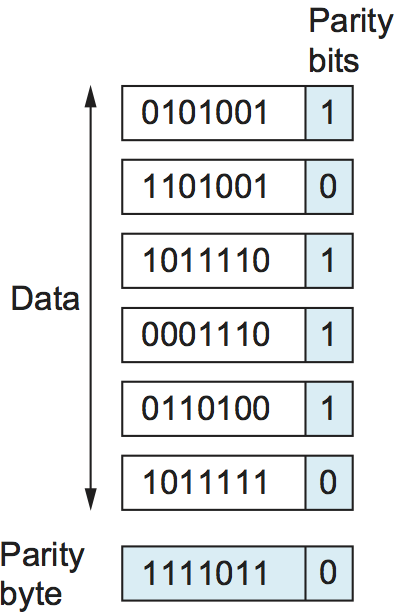
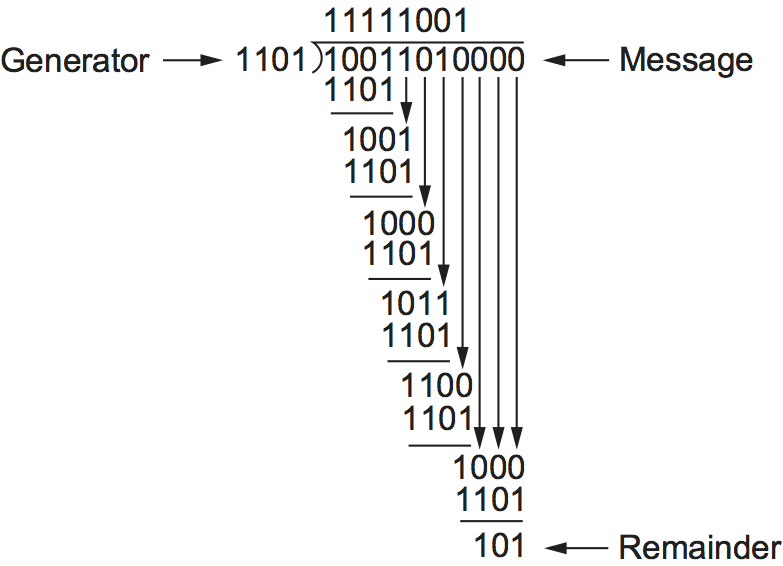
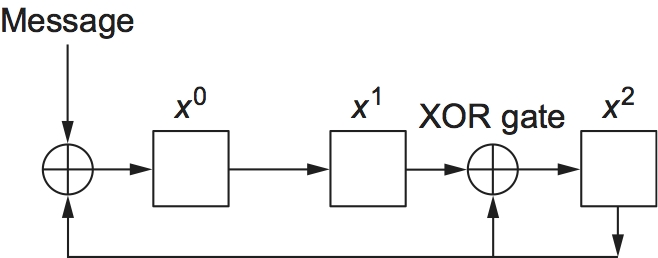

# {{ page.title }}

As discussed in Chapter 1, bit errors are sometimes introduced into
frames. This happens, for example, because of electrical interference or
thermal noise. Although errors are rare, especially on optical links,
some mechanism is needed to detect these errors so that corrective
action can be taken. Otherwise, the end user is left wondering why the C
program that successfully compiled just a moment ago now suddenly has a
syntax error in it, when all that happened in the interim is that it was
copied across a network file system.

There is a long history of techniques for dealing with bit errors in
computer systems, dating back to at least the 1940s. Hamming and
Reed-Solomon codes are two notable examples that were developed for use
in punch card readers, when storing data on magnetic disks, and in early
core memories. This section describes some of the error detection
techniques most commonly used in networking.

Detecting errors is only one part of the problem. The other part is
correcting errors once detected. Two basic approaches can be taken when
the recipient of a message detects an error. One is to notify the sender
that the message was corrupted so that the sender can retransmit a copy
of the message. If bit errors are rare, then in all probability the
retransmitted copy will be error free. Alternatively, some types of
error detection algorithms allow the recipient to reconstruct the
correct message even after it has been corrupted; such algorithms rely
on *error-correcting codes*, discussed below.

One of the most common techniques for detecting transmission errors is a
technique known as the *cyclic redundancy check* (CRC). It is used in
nearly all the link-level protocols discussed in the previous section
(e.g., HDLC, DDCMP), as well as in the CSMA and wireless protocols
described later in this chapter. outlines the basic CRC algorithm.
Before discussing that approach, we consider two simpler schemes:
*two-dimensional parity* and *checksums*. The former is used by the
BISYNC protocol when it is transmitting ASCII characters (CRC is used as
the error-detecting code when BISYNC is used to transmit EBCDIC, an
alternative character encoding scheme used in the 1960s), and the
latter is used by several Internet protocols.

The basic idea behind any error detection scheme is to add redundant
information to a frame that can be used to determine if errors have been
introduced. In the extreme, we could imagine transmitting two complete
copies of the data. If the two copies are identical at the receiver,
then it is probably the case that both are correct. If they differ, then
an error was introduced into one (or both) of them, and they must be
discarded. This is a rather poor error detection scheme for two reasons.
First, it sends $$n$$ redundant bits for an $$n$$-bit message. Second, many
errors will go undetected—any error that happens to corrupt the same
bit positions in the first and second copies of the message. In general,
the goal of error detecting codes is to provide a high probability of
detecting errors combined with a relatively low number of redundant
bits.

Fortunately, we can do a lot better than this simple scheme. In general,
we can provide quite strong error detection capability while sending
only $$k$$ redundant bits for an $$n$$-bit message, where $$k$$ is
much smaller than $$n$$. On an
for example, a frame carrying up to 12,000 bits (1500 bytes) of data
requires only a 32-bit CRC code, or as it is commonly expressed, uses
CRC-32. Such a code will catch the overwhelming majority of errors, as
we will see below.

We say that the extra bits we send are redundant because they add no new
information to the message. Instead, they are derived directly from the
original message using some well-defined algorithm. Both the sender and
the receiver know exactly what that algorithm is. The sender applies the
algorithm to the message to generate the redundant bits. It then
transmits both the message and those few extra bits. When the receiver
applies the same algorithm to the received message, it should (in the
absence of errors) come up with the same result as the sender. It
compares the result with the one sent to it by the sender. If they
match, it can conclude (with high likelihood) that no errors were
introduced in the message during transmission. If they do not match, it
can be sure that either the message or the redundant bits were
corrupted, and it must take appropriate action—that is, discarding the
message or correcting it if that is possible.

One note on the terminology for these extra bits. In general, they are
referred to as *error-detecting codes*. In specific cases, when the
algorithm to create the code is based on addition, they may be called a
*checksum*. We will see that the Internet checksum is appropriately
named: It is an error check that uses a summing algorithm.
Unfortunately, the word *checksum* is often used imprecisely to mean any
form of error-detecting code, including CRCs. This can be confusing, so
we urge you to use the word *checksum* only to apply to codes that
actually do use addition and to use *error-detecting code* to refer to
the general class of codes described in this section.

## Two-Dimensional Parity

Two-dimensional parity is exactly what the name suggests. It is based on
"simple" (one-dimensional) parity, which usually involves adding one
extra bit to a 7-bit code to balance the number of 1s in the byte. For
example, odd parity sets the eighth bit to 1 if needed to give an odd
number of 1s in the byte, and even parity sets the eighth bit to 1 if
needed to give an even number of 1s in the byte. Two-dimensional parity
does a similar calculation for each bit position across each of the
bytes contained in the frame. This results in an extra parity byte for
the entire frame, in addition to a parity bit for each
byte. [Figure 1](#two-dparity) below illustrates how two-dimensional
even parity works for an example frame containing 6 bytes of
data. Notice that the third bit of the parity byte is 1 since there is
an odd number of 1s in the third bit across the 6 bytes in the
frame. It can be shown that two-dimensional parity catches all 1-, 2-,
and 3-bit errors, and most 4-bit errors. In this case, we have added
14 bits of redundant information to a 42-bit message, and yet we have
stronger protection against common errors than the "repetition code"
described above.

<figure class="line">
	<a id="two-dparity"></a>
	
	<figcaption>Two-dimensional parity.</figcaption>
</figure>

## Internet Checksum Algorithm

A second approach to error detection is exemplified by the Internet
checksum. Although it is not used at the link level, it nevertheless
provides the same sort of functionality as CRCs and parity, so we
discuss it here.

The idea behind the Internet checksum is very simple—you add up all
the words that are transmitted and then transmit the result of that sum.
The result is the checksum. The receiver performs the same calculation
on the received data and compares the result with the received checksum.
If any transmitted data, including the checksum itself, is corrupted,
then the results will not match, so the receiver knows that an error
occurred.

You can imagine many different variations on the basic idea of a
checksum. The exact scheme used by the Internet protocols works as
follows. Consider the data being checksummed as a sequence of 16-bit
integers. Add them together using 16-bit ones complement arithmetic
(explained below) and then take the ones complement of the result. That
16-bit number is the checksum.

In ones complement arithmetic, a negative integer (-x) is represented
as the complement of x; that is, each bit of x is inverted. When
adding numbers in ones complement arithmetic, a carryout from the most
bit needs to be added to the result. Consider, for example, the addition
of -5 and -3 in ones complement arithmetic on 4-bit integers: +5
is 0101, so -5 is 1010; +3 is 0011, so -3 is 1100. If we add 1010
and 1100, ignoring the carry, we get 0110. In ones complement
arithmetic, the fact that this operation caused a carry from the most
significant bit causes us to increment the result, giving 0111, which is
the ones complement representation of -8 (obtained by inverting the
bits in 1000), as we would expect.

The following routine gives a straightforward implementation of the
Internet's checksum algorithm. The `count` argument gives the length of
`buf` measured in 16-bit units. The routine assumes that `buf` has
already been padded with 0s to a 16-bit boundary.

```c
u_short 
cksum(u_short *buf, int count) 
{
    register u_long sum = 0;

    while (count--) 
    {
        sum += *buf++;
        if (sum & 0xFFFF0000) 
        {
            /* carry occurred, so wrap around */
            sum &= 0xFFFF;
            sum++;
        }
    }
    return (sum & 0xFFFF);
}
```

This code ensures that the calculation uses ones complement arithmetic
rather than the twos complement that is used in most machines. Note the
`if` statement inside the `while` loop. If there is a carry into the top
16 bits of `sum`, then we increment `sum` just as in the previous
example.

Compared to our repetition code, this algorithm scores well for using a
small number of redundant bits—only 16 for a message of any
length—but it does not score extremely well for strength of error
detection. For example, a pair of single-bit errors, one of which
increments a word and one of which decrements another word by the same
amount, will go undetected. The reason for using an algorithm like this
in spite of its relatively weak protection against errors (compared to a
CRC, for example) is simple: This algorithm is much easier to implement
in software. Experience in the ARPANET suggested that a checksum of this
form was adequate. One reason it is adequate is that this checksum is
the last line of defense in an end-to-end protocol; the majority of
errors are picked up by stronger error detection algorithms, such as
CRCs, at the link level.

## Cyclic Redundancy Check

It should be clear by now that a major goal in designing error detection
algorithms is to maximize the probability of detecting errors using only
a small number of redundant bits. Cyclic redundancy checks use some
fairly powerful mathematics to achieve this goal. For example, a 32-bit
CRC gives strong protection against common bit errors in messages that
are thousands of bytes long. The theoretical foundation of the cyclic
redundancy check is rooted in a branch of mathematics called *finite
fields*. While this may sound daunting, the basic ideas can be easily
understood.

To start, think of an (n+1)-bit message as being represented by an $$n$$
degree polynomial, that is, a polynomial whose highest-order term is
$$x^{n}$$. The message is represented by a polynomial by using the value
of each bit in the message as the coefficient for each term in the
polynomial, starting with the most significant bit to represent the
highest-order term. For example, an 8-bit message consisting of the bits
10011010 corresponds to the polynomial

$$
M(x) = (1 \times x^7) + (0 \times x^6) + (0 \times x^5) + (1 \times
x^4 )+ (1 \times x^3) + (0 \times x^2) + (1 \times x^1) + (0 \times x^0)
$$

$$
M(x) = x^7 + x^4 + x^3 + x^1
$$

We can thus think of a sender and a receiver as exchanging polynomials
with each other.

For the purposes of calculating a CRC, a sender and receiver have to
agree on a *divisor* polynomial, $$C(x)$$. $$C(x)$$ is a polynomial of
degree $$k$$. For example, suppose $$C(x) = x^3 + x^2 + 1$$. In this case,
$$k=3$$. The answer to the question "Where did $$C(x)$$ come from?" is, in
most practical cases, "You look it up in a book." In fact, the choice of
$$C(x)$$ has a significant impact on what types of errors can be reliably
detected, as we discuss below. There are a handful of divisor
polynomials that are very good choices for various environments, and the
exact choice is normally made as part of the protocol design. For
example, the Ethernet standard uses a well-known polynomial of
degree 32.

When a sender wishes to transmit a message $$M(x)$$ that is n+1 bits
long, what is actually sent is the (n+1)-bit message plus $$k$$ bits. We
call the complete transmitted message, including the redundant bits,
$$P(x)$$. What we are going to do is contrive to make the polynomial
representing $$P(x)$$ exactly divisible by $$C(x)$$; we explain how this is
achieved below. If $$P(x)$$ is transmitted over a link and there are no
errors introduced during transmission, then the receiver should be able
to divide $$P(x)$$ by $$C(x)$$ exactly, leaving a remainder of zero. On the
other hand, if some error is introduced into $$P(x)$$ during transmission,
then in all likelihood the received polynomial will no longer be exactly
divisible by $$C(x)$$, and thus the receiver will obtain a nonzero
remainder implying that an error has occurred.

It will help to understand the following if you know a little about
polynomial arithmetic; it is just slightly different from normal integer
arithmetic. We are dealing with a special class of polynomial arithmetic
here, where coefficients may be only one or zero, and operations on the
coefficients are performed using modulo 2 arithmetic. This is referred
to as "polynomial arithmetic modulo 2." Since this is a networking book,
not a mathematics text, let's focus on the key properties of this type
of arithmetic for our purposes (which we ask you to accept on faith):

- Any polynomial $$B(x)$$ can be divided by a divisor polynomial $$C(x)$$
    if $$B(x)$$ is of higher degree than $$C(x)$$.

- Any polynomial $$B(x)$$ can be divided once by a divisor polynomial
    $$C(x)$$ if $$B(x)$$ is of the same degree as $$C(x)$$.

- The remainder obtained when $$B(x)$$ is divided by $$C(x)$$ is obtained
    by performing the exclusive OR (XOR) operation on each pair of
    matching coefficients.

For example, the polynomial $$x^3 + 1$$ can be divided by $$x^3 + x^2 + 1$$
(because they are both of degree 3) and the remainder would be
$$0 \times x^3 + 1 \times x^2 + 0 \times x^1 + 0 
\times x^0 = x^2$$ (obtained by XORing the coefficients of each term). In
terms of messages, we could say that 1001 can be divided by 1101 and
leaves a remainder of 0100. You should be able to see that the remainder
is just the bitwise exclusive OR of the two messages.

Now that we know the basic rules for dividing polynomials, we are able
to do long division, which is necessary to deal with longer messages. An
example appears below.

Recall that we wanted to create a polynomial for transmission that is
derived from the original message $$M(x)$$, is $$k$$ bits longer than
$$M(x)$$, and is exactly divisible by $$C(x)$$. We can do this in the
following way:

1. Multiply $$M(x)$$ by $$x^{k}$$; that is, add $$k$$ zeros at the end of the
    message. Call this zero-extended message $$T(x)$$.

2. Divide $$T(x)$$ by $$C(x)$$ and find the remainder.

3. Subtract the remainder from $$T(x)$$.

It should be obvious that what is left at this point is a message that
is exactly divisible by $$C(x)$$. We may also note that the resulting
message consists of $$M(x)$$ followed by the remainder obtained in step 2,
because when we subtracted the remainder (which can be no more than
$$k$$ bits long), we were just XORing it with the $$k$$ zeros added in
step 1. This part will become clearer with an example.

Consider the message $$x^7 + x^4 + x^3 + x^1$$, or 10011010. We begin by
multiplying by $$x^3$$, since our divisor polynomial is of degree 3. This
gives 10011010000. We divide this by $$C(x)$$, which corresponds to 1101
in this case. [Figure 2](#crcalc) shows the polynomial long-division
operation. Given the rules of polynomial arithmetic described above,
the long-division operation proceeds much as it would if we were
dividing integers. Thus, in the first step of our example, we see that
the divisor 1101 divides once into the first four bits of the message
(1001), since they are of the same degree, and leaves a remainder
of 100 (1101 XOR 1001). The next step is to bring down a digit from
the message polynomial until we get another polynomial with the same
degree as $$C(x)$$, in this case 1001. We calculate the remainder
again (100) and continue until the calculation is complete. Note that
the "result" of the long division, which appears at the top of the
calculation, is not really of much interest—it is the remainder at the
end that matters.

You can see from the very bottom of [Figure 2](#crcalc) that the
remainder of the example calculation is 101. So we know that 10011010000
minus 101 would be exactly divisible by $$C(x)$$, and this is what we
send. The minus operation in polynomial arithmetic is the logical XOR
operation, so we actually send 10011010101. As noted above, this turns
out to be just the original message with the remainder from the long
division calculation appended to it. The recipient divides the received
polynomial by $$C(x)$$ and, if the result is 0, concludes that there were
no errors. If the result is nonzero, it may be necessary to discard the
corrupted message; with some codes, it may be possible to *correct* a
small error (e.g., if the error affected only one bit). A code that
enables error correction is called an *error-correcting code* (ECC).

<figure class="line">
	<a id="crcalc"></a>
	
	<figcaption>CRC calculation using polynomial long division.</figcaption>
</figure>

Now we will consider the question of where the polynomial $$C(x)$$ comes
from. Intuitively, the idea is to select this polynomial so that it is
very unlikely to divide evenly into a message that has errors introduced
into it. If the transmitted message is $$P(x)$$, we may think of the
introduction of errors as the addition of another polynomial $$E(x)$$, so
the recipient sees $$P(x) + E(x)$$. The only way that an error could slip
by undetected would be if the received message could be evenly divided
by $$C(x)$$, and since we know that $$P(x)$$ can be evenly divided by
$$C(x)$$, this could only happen if $$E(x)$$ can be divided evenly by
$$C(x)$$. The trick is to pick $$C(x)$$ so that this is very unlikely for
common types of errors.

One common type of error is a single-bit error, which can be expressed
as $$E(x) = x^i$$ when it affects bit position $$i$$. If we select $$C(x)$$
such that the first and the last term (that is, the $$x^k$$ and $$x^0$$
terms) are nonzero, then we already have a two-term polynomial that
cannot divide evenly into the one term $$E(x)$$. Such a $$C(x)$$ can,
therefore, detect all single-bit errors. In general, it is possible to
prove that the following types of errors can be detected by a $$C(x)$$
with the stated properties:

- All single-bit errors, as long as the $$x^{k}$$ and $$x^{0}$$ terms have
    nonzero coefficients

- All double-bit errors, as long as $$C(x)$$ has a factor with at least
    three terms

- Any odd number of errors, as long as $$C(x)$$ contains the factor
    $$(x + 1)$$

We have mentioned that it is possible to use codes that not only detect
the presence of errors but also enable errors to be corrected. Since the
details of such codes require yet more complex mathematics than that
required to understand CRCs, we will not dwell on them here. However, it
is worth considering the merits of correction versus detection.

At first glance, it would seem that correction is always better, since
with detection we are forced to throw away the message and, in general,
ask for another copy to be transmitted. This uses up bandwidth and may
introduce latency while waiting for the retransmission. However, there
is a downside to correction, as it generally requires a greater number
of redundant bits to send an error-correcting code that is as strong
(that is, able to cope with the same range of errors) as a code that
only detects errors. Thus, while error detection requires more bits to
be sent when errors occur, error correction requires more bits to be
sent *all the time*. As a result, error correction tends to be most
useful when (1) errors are quite probable, as they may be, for example,
in a wireless environment, or (2) the cost of retransmission is too
high, for example, because of the latency involved retransmitting a
packet over a satellite link.

The use of error-correcting codes in networking is sometimes referred to
as *forward error correction* (FEC) because the correction of errors is
handled "in advance" by sending extra information, rather than waiting
for errors to happen and dealing with them later by retransmission. FEC
is commonly used in wireless networks such as 802.11.

- Any "burst" error (i.e., sequence of consecutive errored bits) for
    which the length of the burst is less than $$k$$ bits (Most burst
    errors of length greater than $$k$$ bits can also be detected.)

Six versions of $$C(x)$$ are widely used in link-level protocols.
For example, Ethernet uses CRC-32, which is defined as follows:

- CRC-32 = $$x^{32} + x^{26} + x^{23} + x^{22} + x^{16} + x^{12} +
  x^{11} + x^{10} + x^8 + x^7 + x^5 + x^4 + x^2 + x + 1$$

Finally, we note that the CRC algorithm, while seemingly complex, is
easily implemented in hardware using a $$k$$-bit shift register and XOR
gates. The number of bits in the shift register equals the degree of the
generator polynomial ($$k$$). [Figure 3](#crc-hard) shows the hardware
that would be used for the generator $$x^3 + x^2 + 1$$ from our previous
example. The message is shifted in from the left, beginning with the
most significant bit and ending with the string of $$k$$ zeros that is
attached to the message, just as in the long division example. When all
the bits have been shifted in and appropriately XORed, the register
contains the remainder—that is, the CRC (most significant bit on the
right). The position of the XOR gates is determined as follows: If the
bits in the shift register are labeled 0 through $$k-1$$, left to right,
then put an XOR gate in front of bit $$n$$ if there is a term $$x^n$$ in the
generator polynomial. Thus, we see an XOR gate in front of positions 0
and 2 for the generator $$x^3 + x^2 + x^0$$.

<figure class="line">
	<a id="crc-hard"></a>
	
	<figcaption>CRC calculation using shift register.</figcaption>
</figure>

