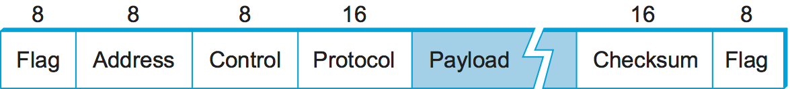
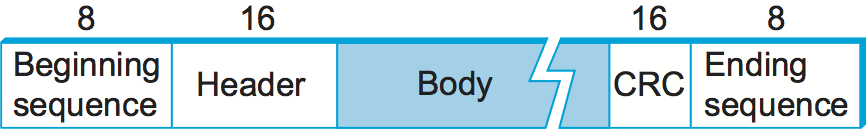

2.3 Framing
===========

Now that we have seen how to transmit a sequence of bits over a
point-to-point link—from adaptor to adaptor—let’s consider the
scenario in :numref:`Figure %s <fig-host-link>`. Recall from Chapter 1
that we are focusing on packet-switched networks, which means that
blocks of data (called *frames* at this level), not bit streams, are
exchanged between nodes.  It is the network adaptor that enables the
nodes to exchange frames.  When node A wishes to transmit a frame to
node B, it tells its adaptor to transmit a frame from the node’s
memory. This results in a sequence of bits being sent over the
link. The adaptor on node B then collects together the sequence of
bits arriving on the link and deposits the corresponding frame in B’s
memory. Recognizing exactly what set of bits constitutes a frame—that
is, determining where the frame begins and ends—is the central
challenge faced by the adaptor.

.. _fig-host-link:
.. figure:: figures/f02-06-9780123850591.png
   :width: 500px
   :align: center

   Bits flow between adaptors, frames between hosts.

There are several ways to address the framing problem. This section uses
three different protocols to illustrate the various points in the design
space. Note that while we discuss framing in the context of
point-to-point links, the problem is a fundamental one that must also be
addressed in multiple-access networks like Ethernet and Wi-Fi.

Byte-Oriented Protocols (PPP)
-----------------------------

One of the oldest approaches to framing—it has its roots in connecting
terminals to mainframes—is to view each frame as a collection of bytes
(characters) rather than a collection of bits. Early examples of such
*byte-oriented* protocols are the Binary Synchronous Communication
(BISYNC) protocol developed by IBM in the late 1960s, and the Digital
Data Communication Message Protocol (DDCMP) used in Digital Equipment
Corporation’s DECNET. (Once upon a time, large computer companies like
IBM and DEC also built private networks for their customers.) The widely
used Point-to-Point Protocol (PPP) is a recent example of this approach.

At a high level, there are two approaches to byte-oriented framing. The
first is to use special characters known as *sentinel characters* to
indicate where frames start and end. The idea is to denote the beginning
of a frame by sending a special SYN (synchronization) character. The
data portion of the frame is then sometimes contained between two more
special characters: STX (start of text) and ETX (end of text). BISYNC
used this approach. The problem with the sentinel approach, of course,
is that one of the special characters might appear in the data portion
of the frame. The standard way to overcome this problem by “escaping”
the character by preceding it with a DLE (data-link-escape) character
whenever it appears in the body of a frame; the DLE character is also
escaped (by preceding it with an extra DLE) in the frame body. (C
programmers may notice that this is analogous to the way a quotation
mark is escaped by the backslash when it occurs inside a string.) This
approach is often called *character stuffing* because extra characters
are inserted in the data portion of the frame.

The alternative to detecting the end of a frame with a sentinel value is
to include the number of bytes in the frame at the beginning of the
frame, in the frame header. DDCMP used this approach. One danger with
this approach is that a transmission error could corrupt the count
field, in which case the end of the frame would not be correctly
detected. (A similar problem exists with the sentinel-based approach if
the ETX field becomes corrupted.) Should this happen, the receiver will
accumulate as many bytes as the bad count field indicates and then use
the error detection field to determine that the frame is bad. This is
sometimes called a *framing error*. The receiver will then wait until it
sees the next SYN character to start collecting the bytes that make up
the next frame. It is therefore possible that a framing error will cause
back-to-back frames to be incorrectly received.

The Point-to-Point Protocol (PPP), which is commonly used to carry
Internet Protocol packets over various sorts of point-to-point links,
uses sentinels and character stuffing. The format for a PPP frame is
given in :numref:`Figure %s <fig-ppp>`.
 
.. _fig-ppp:

   
   PPP frame format.

This figure is the first of many that you will see in this book that are
used to illustrate frame or packet formats, so a few words of
explanation are in order. We show a packet as a sequence of labeled
fields. Above each field is a number indicating the length of that field
in bits. Note that the packets are transmitted beginning with the
leftmost field.

The special start-of-text character, denoted as the ``Flag`` field is
``01111110``. The ``Address`` and ``Control`` fields usually contain
default values and so are uninteresting. The (Protocol) field is used
for demultiplexing; it identifies the high-level protocol, such as IP.
The frame payload size can be negotiated, but it is 1500 bytes by
default. The ``Checksum`` field is either 2 (by default) or 4 bytes
long. Note that despite its common name, this field is actually a CRC
and not a checksum (as described in the next section).

The PPP frame format is unusual in that several of the field sizes are
negotiated rather than fixed. This negotiation is conducted by a
protocol called the Link Control Protocol (LCP). PPP and LCP work in
tandem: LCP sends control messages encapsulated in PPP frames—such
messages are denoted by an LCP identifier in the PPP (Protocol)
field—and then turns around and changes PPP’s frame format based on the
information contained in those control messages. LCP is also involved in
establishing a link between two peers when both sides detect that
communication over the link is possible (e.g., when each optical
receiver detects an incoming signal from the fiber to which it
connects).

Bit-Oriented Protocols (HDLC)
-----------------------------

Unlike byte-oriented protocols, a bit-oriented protocol is not concerned
with byte boundaries—it simply views the frame as a collection of bits.
These bits might come from some character set, such as ASCII; they might
be pixel values in an image; or they could be instructions and operands
from an executable file. The Synchronous Data Link Control (SDLC)
protocol developed by IBM is an example of a bit-oriented protocol; SDLC
was later standardized by the ISO as the High-Level Data Link Control
(HDLC) protocol. In the following discussion, we use HDLC as an example;
its frame format is given in :numref:`Figure %s <fig-hdlc>`.

HDLC denotes both the beginning and the end of a frame with the
distinguished bit sequence ``01111110``. This sequence is also
transmitted during any times that the link is idle so that the sender
and receiver can keep their clocks synchronized. In this way, both
protocols essentially use the sentinel approach. Because this sequence
might appear anywhere in the body of the frame—in fact, the bits
``01111110`` might cross byte boundaries—bit-oriented protocols use the
analog of the DLE character, a technique known as *bit stuffing*.

.. _fig-hdlc:

   
   HDLC frame format.

Bit stuffing in the HDLC protocol works as follows. On the sending side,
any time five consecutive 1s have been transmitted from the body of the
message (i.e., excluding when the sender is trying to transmit the
distinguished ``01111110`` sequence), the sender inserts a 0 before
transmitting the next bit. On the receiving side, should five
consecutive 1s arrive, the receiver makes its decision based on the next
bit it sees (i.e., the bit following the five 1s). If the next bit is a
0, it must have been stuffed, and so the receiver removes it. If the
next bit is a 1, then one of two things is true: Either this is the
end-of-frame marker or an error has been introduced into the bit stream.
By looking at the *next* bit, the receiver can distinguish between these
two cases. If it sees a 0 (i.e., the last 8 bits it has looked at are
``01111110``), then it is the end-of-frame marker; if it sees a 1 (i.e.,
the last 8 bits it has looked at are ``01111111``), then there must have
been an error and the whole frame is discarded. In the latter case, the
receiver has to wait for the next ``01111110`` before it can start
receiving again, and, as a consequence, there is the potential that the
receiver will fail to receive two consecutive frames. Obviously, there
are still ways that framing errors can go undetected, such as when an
entire spurious end-of-frame pattern is generated by errors, but these
failures are relatively unlikely. Robust ways of detecting errors are
discussed in a later section.

An interesting characteristic of bit stuffing, as well as character
stuffing, is that the size of a frame is dependent on the data that is
being sent in the payload of the frame. It is in fact not possible to
make all frames exactly the same size, given that the data that might be
carried in any frame is arbitrary. (To convince yourself of this,
consider what happens if the last byte of a frame’s body is the ETX
character.) A form of framing that ensures that all frames are the same
size is described in the next subsection.

Clock-Based Framing (SONET)
---------------------------

A third approach to framing is exemplified by the Synchronous Optical
Network (SONET) standard. For lack of a widely accepted generic term, we
refer to this approach simply as *clock-based framing*. SONET was first
proposed by Bell Communications Research (Bellcore), and then developed
under the American National Standards Institute (ANSI) for digital
transmission over optical fiber; it has since been adopted by the ITU-T.
SONET has been for many years the dominant standard for long-distance
transmission of data over optical networks.

An important point to make about SONET before we go any further is that
the full specification is substantially larger than this book. Thus, the
following discussion will necessarily cover only the high points of the
standard. Also, SONET addresses both the framing problem and the
encoding problem. It also addresses a problem that is very important for
phone companies—the multiplexing of several low-speed links onto one
high-speed link. (In fact, much of SONET’s design reflects the fact that
phone companies have to be concerned with multiplexing large numbers of
the 64-kbps channels that traditionally are used for telephone calls.)
We begin with SONET’s approach to framing and discuss the other issues
following.

As with the previously discussed framing schemes, a SONET frame has
some special information that tells the receiver where the frame
starts and ends; however, that is about as far as the similarities
go. Notably, no bit stuffing is used, so that a frame’s length does
not depend on the data being sent. So the question to ask is “How does
the receiver know where each frame starts and ends?” We consider this
question for the lowest-speed SONET link, which is known as STS-1 and
runs at 51.84 Mbps.  An STS-1 frame is shown in :numref:`Figure %s
<fig-sonet-frame>`. It is arranged as 9 rows of 90 bytes each, and the
first 3 bytes of each row are overhead, with the rest being available
for data that is being transmitted over the link. The first 2 bytes of
the frame contain a special bit pattern, and it is these bytes that
enable the receiver to determine where the frame starts. However,
since bit stuffing is not used, there is no reason why this pattern
will not occasionally turn up in the payload portion of the frame. To
guard against this, the receiver looks for the special bit pattern
consistently, hoping to see it appearing once every 810 bytes, since
each frame is 9 × 90 = 810 bytes long. When the special pattern turns
up in the right place enough times, the receiver concludes that it is
in sync and can then interpret the frame correctly.

.. _fig-sonet-frame:
.. figure:: figures/f02-11-9780123850591.png
   :width: 500px
   :align: center
   
   A SONET STS-1 frame.

One of the things we are not describing due to the complexity of SONET
is the detailed use of all the other overhead bytes. Part of this
complexity can be attributed to the fact that SONET runs across the
carrier’s optical network, not just over a single link. (Recall that we
are glossing over the fact that the carriers implement a network, and we
are instead focusing on the fact that we can lease a SONET link from
them and then use this link to build our own packet-switched network.)
Additional complexity comes from the fact that SONET provides a
considerably richer set of services than just data transfer. For
example, 64 kbps of a SONET link’s capacity is set aside for a voice
channel that is used for maintenance.

The overhead bytes of a SONET frame are encoded using NRZ, the simple
encoding described in the previous section where 1s are high and 0s are
low. However, to ensure that there are plenty of transitions to allow
the receiver to recover the sender’s clock, the payload bytes are
*scrambled*. This is done by calculating the exclusive OR (XOR) of the
data to be transmitted and by the use of a well-known bit pattern. The
bit pattern, which is 127 bits long, has plenty of transitions from 1 to
0, so that XORing it with the transmitted data is likely to yield a
signal with enough transitions to enable clock recovery.

SONET supports the multiplexing of multiple low-speed links in the
following way. A given SONET link runs at one of a finite set of
possible rates, ranging from 51.84 Mbps (STS-1) to 39,813,120 Mbps
(STS-768).\ [#]_ Note that all of these rates are integer multiples of STS-1.
The significance for framing is that a single SONET frame can contain
subframes for multiple lower-rate channels. A second related feature is
that each frame is 125 μs long. This means that at STS-1 rates, a SONET
frame is 810 bytes long, while at STS-3 rates, each SONET frame is
2430 bytes long. Notice the synergy between these two features: 3 × 810
= 2430, meaning that three STS-1 frames fit exactly in a single STS-3
frame.

.. [#] STS stands for *Synchronous Transport Signal*, which is how
       SONET talks about frames. There is a parallel term—\ *Optical
       Carrier*  (OC)—that is used to talk about the underlying
       optical signal that carries SONET frames. We say these two
       terms are parallel because STS-3 and OC-3, to use a concrete
       example, both imply a transmission rate of 155.52 Mbps. Since
       we’re focused on framing here, we will stick with STS, but it
       is more likely that you will hear someone refer to an optical
       link by its “OC” name.
       
Intuitively, the STS-N frame can be thought of as consisting of N STS-1
frames, where the bytes from these frames are interleaved; that is, a
byte from the first frame is transmitted, then a byte from the second
frame is transmitted, and so on. The reason for interleaving the bytes
from each STS-N frame is to ensure that the bytes in each STS-1 frame
are evenly paced; that is, bytes show up at the receiver at a smooth
51 Mbps, rather than all bunched up during one particular :math:`1/N^{th}` 
of the 125-μs interval.

.. _fig-sonet1:
.. figure:: figures/f02-12-9780123850591.png
   :width: 350px
   :align: center
   
   Three STS-1 frames multiplexed onto one STS-3c
   frame.
   
Although it is accurate to view an STS-N signal as being used to
multiplex N STS-1 frames, the payload from these STS-1 frames can be
linked together to form a larger STS-N payload; such a link is denoted
STS-Nc (for *concatenated*). One of the fields in the overhead is used
for this purpose. :numref:`Figure %s <fig-sonet1>` schematically depicts
concatenation in the case of three STS-1 frames being concatenated into
a single STS-3c frame. The significance of a SONET link being designated
as STS-3c rather than STS-3 is that, in the former case, the user of the
link can view it as a single 155.25-Mbps pipe, whereas an STS-3 should
really be viewed as three 51.84-Mbps links that happen to share a fiber.

.. _fig-sonet3:
.. figure:: figures/f02-13-9780123850591.png
   :width: 450px
   :align: center
   
   SONET frames out of phase.

Finally, the preceding description of SONET is overly simplistic in
that it assumes that the payload for each frame is completely
contained within the frame. (Why wouldn’t it be?) In fact, we should
view the STS-1 frame just described as simply a placeholder for the
frame, where the actual payload may *float* across frame
boundaries. This situation is illustrated in :numref:`Figure %s
<fig-sonet3>`. Here we see both the STS-1 payload floating across two
STS-1 frames and the payload shifted some number of bytes to the right
and, therefore, wrapped around. One of the fields in the frame
overhead points to the beginning of the payload. The value of this
capability is that it simplifies the task of synchronizing the clocks
used throughout the carriers’ networks, which is something that
carriers spend a lot of their time worrying about.
