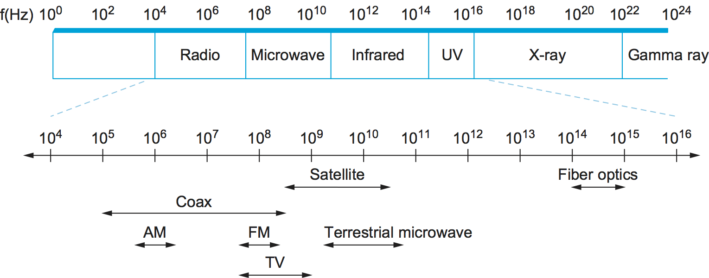

# {{ page.title }}

As we saw in Chapter 1, networks are constructed from two classes of
hardware building blocks: *nodes* and *links*. In this chapter, we focus
on what it takes to make a useful link, so that large, reliable networks
containing millions of links can be built.

<figure class="line">
	
	
	<figcaption>An end-user's view of the  Internet.</figcaption>
</figure>

While the operators of large networks deal with links that span hundreds
or thousands of kilometers connecting refrigerator-sized routers, the
typical user of a network encounters links mostly as a way to connect a
computer to the global Internet. Sometimes this link will be a wireless
(Wi-Fi) link in a coffee shop; sometimes it is an Ethernet link in a
office building or university; for an increasingly large (and fortunate)
slice of the population, it is a fiber optic link provided by a
telecommunications company or ISP; and many others use some sort of
copper wire or cable to connect. Fortunately, there are many common
strategies used on these seemingly disparate types of links so that they
can all be made reliable and useful to higher layers in the protocol
stack. This chapter will examine those strategies.

[Figure 1](#isp-access) illustrates various types of links as
seen by a typical end-user of today's Internet. On the left, we see a
variety of end-user devices ranging from mobile phones to PDAs to
full-fledged computers connected by various means to an Internet
Service Provider. While those links might be of any type mentioned
above, or some other type, they all look the same in this picture—a
straight line connecting a device to a router. Also, there are some
links that connect routers together inside the ISP and a link that
connects the ISP to the "rest of the Internet," which consists of lots
of other ISPs and the hosts to which they connect. These links all
look alike not just because we're not very good artists but because
part of the role of a network architecture is to provide a common
abstraction of something as complex and diverse as a link. The idea is
that your laptop or smartphone doesn't have to care what sort of link
it is connected to—the only thing that matters is that it has a link
to the Internet. Similarly, a router doesn't have to care what sort of
link connects it to other routers—it can send a packet on the link
with a pretty good expectation that the packet will reach the other
end of the link.

How do we make all these different types of link look sufficiently alike
to end users and routers? Essentially, we have to deal with all the
physical limitations and shortcomings of links that exist in the real
world. We sketched out some of these issues in the opening problem
statement for this chapter. The first issue is that links are made of
some physical material that can propagate signals (such as radio waves
or other sorts of electromagnetic radiation), but what we really want to
do is send *bits*. In later sections of this chapter, we'll look at how
to encode bits for transmission on a physical medium, followed by the
other issues mentioned above. By the end of this chapter, we'll
understand how to send complete packets over just about any sort of
link, no matter what physical medium is involved.

## Classes of Links

While most readers of this book have probably encountered at least a few
different types of links, it will help to understand some of the broad
classes of links that exist and their general properties. For a start,
all practical links rely on some sort of electromagnetic radiation
propagating through a medium or, in some cases, through free space. One
way to characterize links, then, is by the medium they use—typically
copper wire in some form, as in Digital Subscriber Line (DSL) and
coaxial cable; optical fiber, as in both commercial fiber-to-the-home
services and many long-distance links in the Internet's backbone; or
air/free space for wireless links.

Another important link characteristic is the *frequency*, measured in
hertz, with which the electromagnetic waves oscillate. The distance
between a pair of adjacent maxima or minima of a wave, typically
measured in meters, is called the wave's *wavelength*. Since all
electromagnetic waves travel at the speed of light (which in turn
depends on the medium), that speed divided by the wave's frequency is
equal to its wavelength. We have already seen the example of a
voice-grade telephone line, which carries continuous electromagnetic
signals ranging between 300 Hz and 3300 Hz; a 300-Hz wave traveling
through copper would have a wavelength of

 SpeedOfLightInCopper / Frequency 

$$
= 2/3 \times 3 \times 10^8 / 300
$$

$$
= 667 \times 10^3\ meters
$$
   
Generally, electromagnetic waves span a much wider range of frequencies,
ranging from radio waves, to infrared light, to visible light, to x-rays
and gamma rays. [Figure 2](#spectrum) depicts the
electromagnetic spectrum and shows which media are commonly used to
carry which frequency bands.

<figure class="line">
	
	
	<figcaption>Electromagnetic spectrum.</figcaption>
</figure>

So far we understand a link to be a physical medium carrying signals in
the form of electromagnetic waves. Such links provide the foundation for
transmitting all sorts of information, including the kind of data we are
interested in transmitting—binary data (1s and 0s). We say that the
binary data is *encoded* in the signal. The problem of encoding binary
data onto electromagnetic signals is a complex topic. To help make the
topic more manageable, we can think of it as being divided into two
layers. The lower layer is concerned with *modulation*—varying the
frequency, amplitude, or phase of the signal to effect the transmission
of information. A simple example of modulation is to vary the power
(amplitude) of a single wavelength. Intuitively, this is equivalent to
turning a light on and off. Because the issue of modulation is secondary
to our discussion of links as a building block for computer networks, we
simply assume that it is possible to transmit a pair of distinguishable
signals—think of them as a "high" signal and a "low" signal—and we
consider only the upper layer, which is concerned with the much simpler
problem of encoding binary data onto these two signals. The next section
discusses such encodings.

Another way to classify links is in terms of how they are used. Various
economic and deployment issues tend to influence where different link
types are found. Most consumers interact with the Internet either
through wireless networks (which they encounter in coffee shops,
airports, universities, etc.) or through so-called "last mile" links
provided by Internet Service Providers, as illustrated in an earlier
[Figure](#isp-access). These link types are summarized in
[Table 1](#home). They typically are chosen because they are cost-
effective ways of reaching millions of consumers; DSL, for example,
was deployed over the existing twisted pair copper wires that already
existed for plain old telephone services. Most of these technologies
are not sufficient for building a complete network from scratch—for
example, you'll likely need some long-distance, very high-speed links
to interconnect cities in a large network.

| Service  | Bandwidth (typical) |
|-------|----------------|
| Dial-up  | 28-56 kbps           |
| ISDN      |  64-128 kbps         |
| DSL        | 128 kbps-100 Mbps |
| CATV (cable TV) | 1-40 Mbps |
| FTTH (fiber to the home) | 50 Mbps-1 Gbps |

 *Table 1. Common services available to connect your
home.* 

Modern long-distance links are almost exclusively fiber today, with
coaxial cables having been largely replaced over the last couple of
decades. These links typically use a technology called SONET
(Synchronous Optical Network), which was developed to meet the demanding
management requirements of telephone carriers. We'll take a closer look
at SONET in a later section.

Finally, in addition to last-mile and backbone links, there are the
links that you find inside a building or a campus—generally referred
to as *local area networks* (LANs). Ethernet, described in a later section.
has for some time been the dominant technology in this space, having
displaced token ring technologies after many years. While Ethernet
continues to be popular, it is now mostly seen alongside wireless
technologies based around the 802.11 standards, which we will discuss
in a later section.

This survey of link types is by no means exhaustive but should have
given you a taste of the diversity of link types that exist and some of
the reasons for that diversity. In the coming sections, we will see how
networking protocols can take advantage of that diversity and present a
consistent view of the network to higher layers in spite of all the
low-level complexity.
