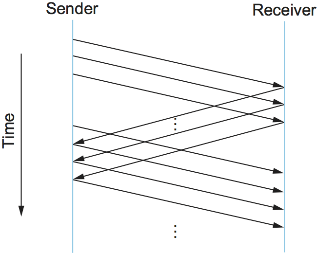
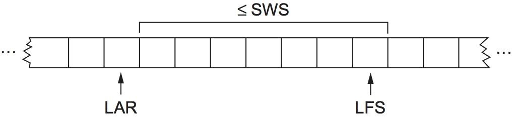
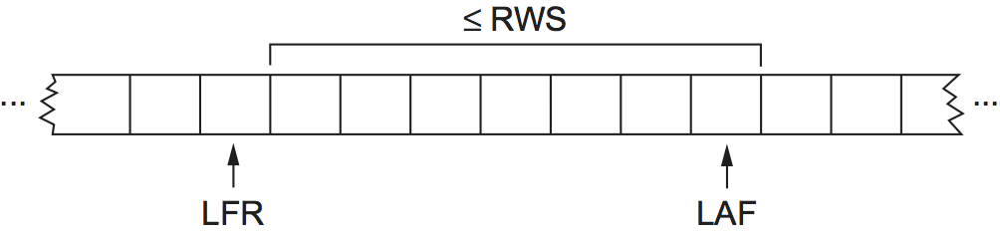

# {{ page.title }}

As we saw in the previous section, frames are sometimes corrupted while
in transit, with an error code like CRC used to detect such errors.
While some error codes are strong enough also to correct errors, in
practice the overhead is typically too large to handle the range of bit
and burst errors that can be introduced on a network link. Even when
error-correcting codes are used (e.g., on wireless links) some errors
will be too severe to be corrected. As a result, some corrupt frames
must be discarded. A link-level protocol that wants to deliver frames
reliably must somehow recover from these discarded (lost) frames.

It's worth noting that reliability is a function that *may* be provided
at the link level, but many modern link technologies omit this function.
Furthermore, reliable delivery is frequently provided at higher levels, including
both transport and sometimes, the application layer. Exactly where it
should be provided is a matter of some debate and depends on many
factors. We describe the basics of reliable delivery here, since the
principles are common across layers, but you should be aware that we're
not just talking about a link-layer function.

This is usually accomplished using a combination of two fundamental
mechanisms—*acknowledgments* and *timeouts*. An acknowledgment (ACK
for short) is a small control frame that a protocol sends back to its
peer saying that it has received an earlier frame. By control frame we
mean a header without any data, although a protocol can *piggyback* an
ACK on a data frame it just happens to be sending in the opposite
direction. The receipt of an acknowledgment indicates to the sender of
the original frame that its frame was successfully delivered. If the
sender does not receive an acknowledgment after a reasonable amount of
time, then it *retransmits* the original frame. This action of waiting a
reasonable amount of time is called a *timeout*.

The general strategy of using acknowledgments and timeouts to implement
reliable delivery is sometimes called *automatic repeat request*
(abbreviated ARQ). This section describes three different ARQ algorithms
using generic language; that is, we do not give detailed information
about a particular protocol's header fields.

## Stop-and-Wait

The simplest ARQ scheme is the *stop-and-wait* algorithm. The idea of
stop-and-wait is straightforward: After transmitting one frame, the
sender waits for an acknowledgment before transmitting the next frame.
If the acknowledgment does not arrive after a certain period of time,
the sender times out and retransmits the original frame.

<figure class="line">
	<a id="ack-timeout"></a>
	
	<figcaption>Timeline showing four different scenarios for the
	stop-and-wait algorithm. (a) The ACK is received before the timer
	expires; (b) the original frame is lost; (c) the ACK is lost;
	(d) the timeout fires too soon.</figcaption>
</figure>

[Figure 1](#ack-timeout) illustrates timeslines for four
different scenarios that result from this basic algorithm. 
The sending side is represented on the left, the
receiving side is depicted on the right, and time flows from top to
bottom. [Figure 1(a)](#ack-timeout) shows the situation in which the
ACK is received before the timer expires; (b) and (c) show the situation
in which the original frame and the ACK, respectively, are lost; and (d)
shows the situation in which the timeout fires too soon. Recall that by
"lost" we mean that the frame was corrupted while in transit, that this
corruption was detected by an error code on the receiver, and that the
frame was subsequently discarded.

The packet timelines shown in this section are examples of a frequently
used tool in teaching, explaining, and designing protocols.
They are useful because they capture
visually the behavior over time of a distributed system—something that
can be quite hard to analyze. When designing a protocol, you often have
to be prepared for the unexpected—a system crashes, a message gets
lost, or something that you expected to happen quickly turns out to take
a long time. These sorts of diagrams can often help us understand what
might go wrong in such cases and thus help a protocol designer be
prepared for every eventuality.

There is one important subtlety in the stop-and-wait algorithm. Suppose
the sender sends a frame and the receiver acknowledges it, but the
acknowledgment is either lost or delayed in arriving. This situation is
illustrated in timelines (c) and (d) of
[Figure 1](#ack-timeout). In both cases, the sender times out and
retransmits the original frame, but the receiver will think that it is
the next frame, since it correctly received and acknowledged the first
frame. This has the potential to cause duplicate copies of a frame to be
delivered. To address this problem, the header for a stop-and-wait
protocol usually includes a 1-bit sequence number—that is, the
sequence number can take on the values 0 and 1—and the sequence
numbers used for each frame alternate, as illustrated in
[Figure 2](#stop-wait). Thus, when the sender retransmits
frame 0, the receiver can determine that it is seeing a second copy of
frame 0 rather than the first copy of frame 1 and therefore can ignore
it (the receiver still acknowledges it, in case the first ACK was lost).

<figure class="line">
	<a id="stop-wait"></a>
	
	<figcaption>Timeline for stop-and-wait with 1-bit sequence
	number.</figcaption>
</figure>

The main shortcoming of the stop-and-wait algorithm is that it allows
the sender to have only one outstanding frame on the link at a time, and
this may be far below the link's capacity. Consider, for example, a
1.5-Mbps link with a 45-ms round-trip time. This link has a
delay $$\times$$ bandwidth product of 67.5 Kb, or approximately 8 KB.
Since the sender can send only one frame per RTT, and assuming a frame
size of 1 KB, this implies a maximum sending rate of


Bits-Per-Frame  / Time-Per-Frame = 1024 $$\times$$ 8 / 0.045 = 182 kbps


or about one-eighth of the link's capacity. To use the link fully, then,
we'd like the sender to be able to transmit up to eight frames before
having to wait for an acknowledgment.

The significance of the delay $$\times$$ bandwidth product is that it
represents the amount of data that could be in transit. We would like to
be able to send this much data without waiting for the first
acknowledgment. The principle at work here is often referred to as
*keeping the pipe full*. The algorithms presented in the following two
subsections do exactly this.

## Sliding Window

Consider again the scenario in which the link has a
delay $$\times$$ bandwidth product of 8 KB and frames are 1 KB in size.
We would like the sender to be ready to transmit the ninth frame at
pretty much the same moment that the ACK for the first frame arrives.
The algorithm that allows us to do this is called *sliding window*, and
an illustrative timeline is given in [Figure 3](#slide-win).

<figure class="line">
	<a id="slide-win"></a>
	
	<figcaption>Timeline for the sliding window algorithm.</figcaption>
</figure>

### The Sliding Window Algorithm

The sliding window algorithm works as follows. First, the sender assigns
a *sequence number*, denoted `SeqNum`, to each frame. For now,
let's ignore the fact that `SeqNum` is implemented by a
finite-size header field and instead assume that it can grow infinitely
large. The sender maintains three variables: The *send window size*,
denoted `SWS`, gives the upper bound on the number of outstanding
(unacknowledged) frames that the sender can transmit; `LAR`
denotes the sequence number of the *last acknowledgment received*; and
`LFS` denotes the sequence number of the *last frame sent*. The
sender also maintains the following invariant:

`LFS - LAR <= SWS`

This situation is illustrated in [Figure 4](#sw-sender).

<figure class="line">
	<a id="sw-sender"></a>
	
	<figcaption>Sliding window on sender.</figcaption>
</figure>

When an acknowledgment arrives, the sender moves `LAR` to the
right, thereby allowing the sender to transmit another frame. Also, the
sender associates a timer with each frame it transmits, and it
retransmits the frame should the timer expire before an ACK is received.
Notice that the sender has to be willing to buffer up to `SWS`
frames since it must be prepared to retransmit them until they are
acknowledged.

The receiver maintains the following three variables: The *receive
window size*, denoted `RWS`, gives the upper bound on the number
of out-of-order frames that the receiver is willing to accept;
`LAF` denotes the sequence number of the *largest acceptable
frame*; and `LFR` denotes the sequence number of the *last frame
received*. The receiver also maintains the following invariant:

`LAF - LFR <= RWS`

This situation is illustrated in [Figure 5](#sw-rcvr).

<figure class="line">
	<a id="sw-rcvr"></a>
	
	<figcaption>Sliding window on receiver.</figcaption>
</figure>

When a frame with sequence number `SeqNum` arrives, the receiver
takes the following action. If `SeqNum <= LFR` or
`SeqNum > LAF`, then the frame is outside the receiver's window and it is
discarded. If `LFR < SeqNum <= LAF`, then the frame is within
the receiver's window and it is accepted. Now the receiver needs to
decide whether or not to send an ACK. Let `SeqNumToAck` denote the
largest sequence number not yet acknowledged, such that all frames with
sequence numbers less than or equal to `SeqNumToAck` have been
received. The receiver acknowledges the receipt of `SeqNumToAck`,
even if higher numbered packets have been received. This acknowledgment
is said to be cumulative. It then sets `LFR = SeqNumToAck` and adjusts
`LAF = LFR + RWS`.

For example, suppose `LFR = 5` (i.e., the last ACK the receiver
sent was for sequence number 5), and `RWS = 4`. This implies
that `LAF = 9`. Should frames 7 and 8 arrive, they will be
buffered because they are within the receiver's window. However, no ACK
needs to be sent since frame 6 has yet to arrive. Frames 7 and 8 are
said to have arrived out of order. (Technically, the receiver could
resend an ACK for frame 5 when frames 7 and 8 arrive.) Should frame 6
then arrive—perhaps it is late because it was lost the first time and
had to be retransmitted, or perhaps it was simply delayed—the
receiver acknowledges frame 8, bumps `LFR` to 8, and sets
`LAF` to 12. If frame 6 was in fact lost, then a timeout will have
occurred at the sender, causing it to retransmit frame 6.

> It's unlikely that a packet could be delayed on a 
> point-to-point link, but later on we will see this same algorithm 
> used on more complex networks where such delays are possible. 

We observe that when a timeout occurs, the amount of data in transit
decreases, since the sender is unable to advance its window until
frame 6 is acknowledged. This means that when packet losses occur, this
scheme is no longer keeping the pipe full. The longer it takes to notice
that a packet loss has occurred, the more severe this problem becomes.

Notice that, in this example, the receiver could have sent a *negative
acknowledgment* (NAK) for frame 6 as soon as frame 7 arrived. However,
this is unnecessary since the sender's timeout mechanism is sufficient
to catch this situation, and sending NAKs adds additional complexity to
the receiver. Also, as we mentioned, it would have been legitimate to
send additional acknowledgments of frame 5 when frames 7 and 8 arrived;
in some cases, a sender can use duplicate ACKs as a clue that a frame
was lost. Both approaches help to improve performance by allowing early
detection of packet losses.

Yet another variation on this scheme would be to use *selective
acknowledgments*. That is, the receiver could acknowledge exactly those
frames it has received rather than just the highest numbered frame
received in order. So, in the above example, the receiver could
acknowledge the receipt of frames 7 and 8. Giving more information to
the sender makes it potentially easier for the sender to keep the pipe
full but adds complexity to the implementation.

The sending window size is selected according to how many frames we want
to have outstanding on the link at a given time; `SWS` is easy to
compute for a given delay $\times$ bandwidth product. On the other
hand, the receiver can set `RWS` to whatever it wants. Two common
settings are `RWS = 1`, which implies that the receiver
will not buffer any frames that arrive out of order, and `RWS = SWS`,
which implies that the receiver can buffer any of the
frames the sender transmits. It makes no sense to set `RWS > SWS`
since it's impossible for more than `SWS` frames to arrive out of order.

### Finite Sequence Numbers and Sliding Window

We now return to the one simplification we introduced into the
algorithm—our assumption that sequence numbers can grow infinitely
large. In practice, of course, a frame's sequence number is specified in
a header field of some finite size. For example, a 3-bit field means
that there are eight possible sequence numbers, 0..7. This makes
it necessary to reuse sequence numbers or, stated another way, sequence
numbers wrap around. This introduces the problem of being able to
distinguish between different incarnations of the same sequence numbers,
which implies that the number of possible sequence numbers must be
larger than the number of outstanding frames allowed. For example,
stop-and-wait allowed one outstanding frame at a time and had two
distinct sequence numbers.

Suppose we have one more number in our space of sequence numbers than we
have potentially outstanding frames; that is, `SWS <= MaxSeqNum - 1`),
where `MaxSeqNum` is the number of
available sequence numbers. Is this sufficient? The answer depends on
`RWS`. If `RWS =  1`, then `MaxSeqNum >= SWS + 1` is sufficient.
If `RWS` is equal to `SWS`, then having a `MaxSeqNum` just one greater
than the sending window size is not good enough. To see this, consider the
situation in which we have the eight sequence numbers 0 through 7, and
`SWS = RWS = 7`. Suppose the sender transmits
frames 0..6, they are successfully received, but the ACKs are
lost. The receiver is now expecting frames $7, 0..5, but the sender
times out and sends frames 0..6. Unfortunately, the receiver is
expecting the second incarnation of frames 0..5 but gets the first
incarnation of these frames. This is exactly the situation we wanted to
avoid.

It turns out that the sending window size can be no more than half as
big as the number of available sequence numbers when `RWS = SWS`, or
stated more precisely,

`SWS < (MaxSeqNum + 1)/ 2`

Intuitively, what this is saying is that the sliding window protocol
alternates between the two halves of the sequence number space, just as
stop-and-wait alternates between sequence numbers 0 and 1. The only
difference is that it continually slides between the two halves rather
than discretely alternating between them.

Note that this rule is specific to the situation where `RWS = SWS`. We
leave it as an exercise to determine the more general
rule that works for arbitrary values of `RWS` and `SWS`.
Also note that the relationship between the window size and the sequence
number space depends on an assumption that is so obvious that it is easy
to overlook, namely that frames are not reordered in transit. This
cannot happen on a direct point-to-point link since there is no way for
one frame to overtake another during transmission. However, we will see
the sliding window algorithm used in a different environments, and we
will need to devise another rule.

### Implementation of Sliding Window

The following routines illustrate how we might implement the sending and
receiving sides of the sliding window algorithm. The routines are taken
from a working protocol named, appropriately enough, Sliding Window
Protocol (SWP). So as not to concern ourselves with the adjacent
protocols in the protocol graph, we denote the protocol sitting above
SWP as the high-level protocol (HLP) and the protocol sitting below SWP
as the link-level protocol (LLP).

We start by defining a pair of data structures. First, the frame header
is very simple: It contains a sequence number (`SeqNum`) and an
acknowledgment number (`AckNum`). It also contains a `Flags`
field that indicates whether the frame is an ACK or carries data.

```c
typedef u_char SwpSeqno;

typedef struct {
    SwpSeqno   SeqNum;   /* sequence number of this frame */
    SwpSeqno   AckNum;   /* ack of received frame */
    u_char     Flags;           /* up to 8 bits worth of flags */
} SwpHdr;
```

Next, the state of the sliding window algorithm has the following
structure. For the sending side of the protocol, this state includes
variables `LAR` and `LFS`, as described earlier in this
section, as well as a queue that holds frames that have been transmitted
but not yet acknowledged (`sendQ`). The sending state also
includes a *counting semaphore* called `sendWindowNotFull`. We
will see how this is used below, but generally a semaphore is a
synchronization primitive that supports `semWait` and
`semSignal` operations. Every invocation of `semSignal`
increments the semaphore by 1, and every invocation of `semWait`
decrements `s` by 1, with the calling process blocked (suspended)
should decrementing the semaphore cause its value to become less than 0.
A process that is blocked during its call to `semWait` will be
allowed to resume as soon as enough `semSignal` operations have
been performed to raise the value of the semaphore above 0.

For the receiving side of the protocol, the state includes the variable
`NFE`. This is the *next frame expected*, the frame with a
sequence number one more that the last frame received (LFR), described
earlier in this section. There is also a queue that holds frames that
have been received out of order (`recvQ`). Finally, although not
shown, the sender and receiver sliding window sizes are defined by
constants `SWS` and `RWS`, respectively.

```c
typedef struct {
    /* sender side state: */
    SwpSeqno    LAR;        /* seqno of last ACK received */
    SwpSeqno    LFS;        /* last frame sent */
    Semaphore   sendWindowNotFull;
    SwpHdr      hdr;        /* pre-initialized header */
    struct sendQ_slot {
        Event   timeout;    /* event associated with send-timeout */
        Msg     msg;
    }   sendQ[SWS];

    /* receiver side state: */
    SwpSeqno    NFE;       /* seqno of next frame expected */
    struct recvQ_slot {
        int     received;  /* is msg valid? */
        Msg     msg;
    }   recvQ[RWS];
} SwpState;
```

The sending side of SWP is implemented by procedure `sendSWP`.
This routine is rather simple. First, `semWait` causes this
process to block on a semaphore until it is OK to send another frame.
Once allowed to proceed, `sendSWP` sets the sequence number in the
frame's header, saves a copy of the frame in the transmit queue
(`sendQ`), schedules a timeout event to handle the case in which
the frame is not acknowledged, and sends the frame to the
next-lower-level protocol, which we denote as `LINK`.

One detail worth noting is the call to `store_swp_hdr` just
before the call to `msgAddHdr`. This routine translates the C
structure that holds the SWP header (`state->hdr`) into a byte
string that can be safely attached to the front of the message
(`hbuf`). This routine (not shown) must translate each integer
field in the header into network byte order and remove any padding that
the compiler has added to the C structure. The issue of byte order is
a non-trivial issue, but for now it is enough to assume
that this routine places the most significant bit of a multiword integer
in the byte with the highest address.

Another piece of complexity in this routine is the use of
`semWait` and the `sendWindowNotFull` semaphore.
`sendWindowNotFull` is initialized to the size of the sender's
sliding window, `SWS` (this initialization is not shown). Each
time the sender transmits a frame, the `semWait` operation
decrements this count and blocks the sender should the count go to 0.
Each time an ACK is received, the `semSignal` operation invoked
in `deliverSWP` (see below) increments this count, thus unblocking
any waiting sender.

```c
static int 
sendSWP(SwpState *state, Msg *frame) 
{
    struct sendQ_slot *slot;
    hbuf[HLEN];

    /* wait for send window to open */
    semWait(&state->sendWindowNotFull);
    state->hdr.SeqNum = ++state->LFS;
    slot = &state->sendQ[state->hdr.SeqNum % SWS];
    store_swp_hdr(state->hdr, hbuf);
    msgAddHdr(frame, hbuf, HLEN);
    msgSaveCopy(&slot->msg, frame);
    slot->timeout = evSchedule(swpTimeout, slot, SWP_SEND_TIMEOUT);
    return send(LINK, frame);
}
```

Before continuing to the receive side of SWP, we need to reconcile a
seeming inconsistency. On the one hand, we have been saying that a
high-level protocol invokes the services of a low-level protocol by
calling the `send` operation, so we would expect that a protocol
that wants to send a message via SWP would call `send(SWP, packet)`.
On the other hand, the procedure that implements SWP's send
operation is called `sendSWP`, and its first argument is a state
variable (`SwpState`). What gives? The answer is that the
operating system provides glue code that translates the generic call to
`send` into a protocol-specific call to `sendSWP`. This glue
code maps the first argument to `send` (the magic protocol
variable `SWP`) into both a function pointer to `sendSWP`
and a pointer to the protocol state that SWP needs to do its job. The
reason we have the high-level protocol indirectly invoke the
protocol-specific function through the generic function call is that we
want to limit how much information the high-level protocol has coded in
it about the low-level protocol. This makes it easier to change the
protocol graph configuration at some time in the future.

Now we move on to SWP's protocol-specific implementation of the
`deliver` operation, which is given in procedure
`deliverSWP`. This routine actually handles two different kinds of
incoming messages: ACKs for frames sent earlier from this node and data
frames arriving at this node. In a sense, the ACK half of this routine
is the counterpart to the sender side of the algorithm given in
`sendSWP`. A decision as to whether the incoming message is an ACK
or a data frame is made by checking the `Flags` field in the
header. Note that this particular implementation does not support
piggybacking ACKs on data frames.

When the incoming frame is an ACK, `deliverSWP` simply finds the
slot in the transmit queue (`sendQ`) that corresponds to the ACK,
cancels the timeout event, and frees the frame saved in that slot. This
work is actually done in a loop since the ACK may be cumulative. The
only other thing to notice about this case is the call to subroutine
`swpInWindow`. This subroutine, which is given below, ensures that
the sequence number for the frame being acknowledged is within the range
of ACKs that the sender currently expects to receive.

When the incoming frame contains data, `deliverSWP` first calls
`msgStripHdr` and `load_swp_hdr` to extract the header
from the frame. Routine `load_swp_hdr` is the counterpart to
`store_swp_hdr` discussed earlier; it translates a byte string
into the C data structure that holds the SWP header. `deliverSWP`
then calls `swpInWindow` to make sure the sequence number of the
frame is within the range of sequence numbers that it expects. If it is,
the routine loops over the set of consecutive frames it has received and
passes them up to the higher-level protocol by invoking the
`deliverHLP` routine. It also sends a cumulative ACK back to the
sender, but does so by looping over the receive queue (it does not use
the `SeqNumToAck` variable used in the prose description given
earlier in this section).

```c
static int 
deliverSWP(SwpState state, Msg *frame) 
{
    SwpHdr   hdr;
    char     *hbuf;

    hbuf = msgStripHdr(frame, HLEN);
    load_swp_hdr(&hdr, hbuf) 
    if (hdr->Flags & FLAG_ACK_VALID) 
    {
        /* received an acknowledgment—do SENDER side */
        if (swpInWindow(hdr.AckNum, state->LAR + 1, state->LFS)) 
        {
            do 
            {
                struct sendQ_slot *slot;

                slot = &state->sendQ[++state->LAR % SWS];
                evCancel(slot->timeout);
                msgDestroy(&slot->msg);
                semSignal(&state->sendWindowNotFull);
            } while (state->LAR != hdr.AckNum);
        }
    }

    if (hdr.Flags & FLAG_HAS_DATA) 
    {
        struct recvQ_slot *slot;

        /* received data packet—do RECEIVER side */
        slot = &state->recvQ[hdr.SeqNum % RWS];
        if (!swpInWindow(hdr.SeqNum, state->NFE, state->NFE + RWS - 1)) 
        {
            /* drop the message */
            return SUCCESS;
        }
        msgSaveCopy(&slot->msg, frame);
        slot->received = TRUE;
        if (hdr.SeqNum == state->NFE) 
        {
            Msg m;

            while (slot->received) 
            {
                deliver(HLP, &slot->msg);
                msgDestroy(&slot->msg);
                slot->received = FALSE;
                slot = &state->recvQ[++state->NFE % RWS];
            }
            /* send ACK: */
            prepare_ack(&m, state->NFE - 1);
            send(LINK, &m);
            msgDestroy(&m);
        }
    }
    return SUCCESS;
}
``` 

Finally,`swpInWindow` is a simple subroutine that checks to see
if a given sequence number falls between some minimum and maximum
sequence number.

```c
static bool 
swpInWindow(SwpSeqno seqno, SwpSeqno min, SwpSeqno max) 
{
    SwpSeqno pos, maxpos;

    pos    = seqno - min;       /* pos *should* be in range [0..MAX) */
    maxpos = max - min + 1;     /* maxpos is in range [0..MAX] */
    return pos < maxpos;
}
 ```

### Frame Order and Flow Control

The sliding window protocol is perhaps the best known algorithm in
computer networking. What is easily confusing about the algorithm,
however, is that it can be used to serve three different roles. The
first role is the one we have been concentrating on in this section—to
reliably deliver frames across an unreliable link. (In general, the
algorithm can be used to reliably deliver messages across an unreliable
network.) This is the core function of the algorithm.

The second role that the sliding window algorithm can serve is to
preserve the order in which frames are transmitted. This is easy to do
at the receiver—since each frame has a sequence number, the receiver
just makes sure that it does not pass a frame up to the
next-higher-level protocol until it has already passed up all frames
with a smaller sequence number. That is, the receiver buffers (i.e.,
does not pass along) out-of-order frames. The version of the sliding
window algorithm described in this section does preserve frame order,
although we could imagine a variation in which the receiver passes
frames to the next protocol without waiting for all earlier frames to be
delivered. A question we should ask ourselves is whether we really need
the sliding window protocol to keep the frames in order, or whether,
instead, this is unnecessary functionality at the link level.
Unfortunately, we have not yet seen enough of the network architecture
to answer this question; we first need to understand how a sequence of
point-to-point links is connected by switches to form an end-to-end
path.

The third role that the sliding window algorithm sometimes plays is to
support *flow control*—a feedback mechanism by which the receiver is
able to throttle the sender. Such a mechanism is used to keep the sender
from over-running the receiver—that is, from transmitting more data
than the receiver is able to process. This is usually accomplished by
augmenting the sliding window protocol so that the receiver not only
acknowledges frames it has received but also informs the sender of how
many frames it has room to receive. The number of frames that the
receiver is capable of receiving corresponds to how much free buffer
space it has. As in the case of ordered delivery, we need to make sure
that flow control is necessary at the link level before incorporating it
into the sliding window protocol.

One important concept to take away from this discussion is the system
design principle we call *separation of concerns*. That is, you must be
careful to distinguish between different functions that are sometimes
rolled together in one mechanism, and you must make sure that each
function is necessary and being supported in the most effective way. In
this particular case, reliable delivery, ordered delivery, and flow
control are sometimes combined in a single sliding window protocol, and
we should ask ourselves if this is the right thing to do at the link
level.

## Concurrent Logical Channels

The data link protocol used in the ARPANET provides an interesting
alternative to the sliding window protocol, in that it is able to keep
the pipe full while still using the simple stop-and-wait algorithm. One
important consequence of this approach is that the frames sent over a
given link are not kept in any particular order. The protocol also
implies nothing about flow control.

The idea underlying the ARPANET protocol, which we refer to as
*concurrent logical channels*, is to multiplex several logical channels
onto a single point-to-point link and to run the stop-and-wait algorithm
on each of these logical channels. There is no relationship maintained
among the frames sent on any of the logical channels, yet because a
different frame can be outstanding on each of the several logical
channels the sender can keep the link full.

More precisely, the sender keeps 3 bits of state for each channel: a
boolean, saying whether the channel is currently busy; the 1-bit
sequence number to use the next time a frame is sent on this logical
channel; and the next sequence number to expect on a frame that arrives
on this channel. When the node has a frame to send, it uses the lowest
idle channel, and otherwise it behaves just like stop-and-wait.

In practice, the ARPANET supported 8 logical channels over each ground
link and 16 over each satellite link. In the ground-link case, the
header for each frame included a 3-bit channel number and a 1-bit
sequence number, for a total of 4 bits. This is exactly the number of
bits the sliding window protocol requires to support up to 8 outstanding
frames on the link when `RWS = SWS`.
