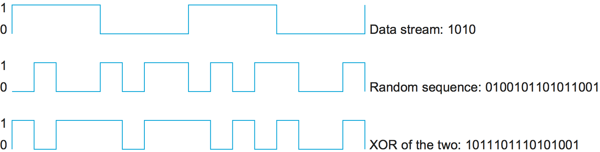
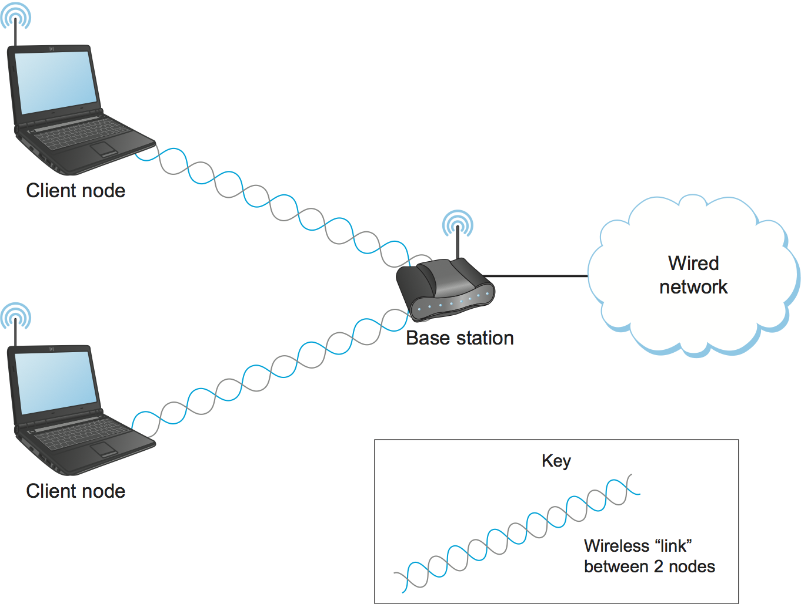
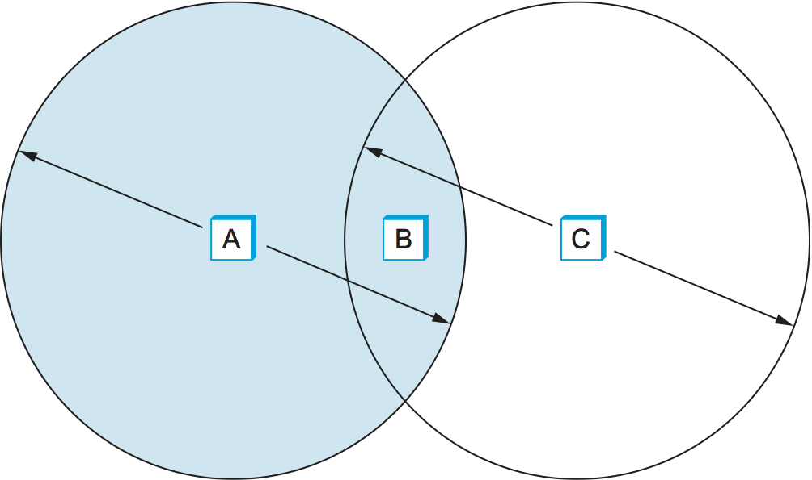

# {{ page.title }}

Wireless technologies differ from wired links in some important ways,
while at the same time sharing many common properties. Like wired links,
issues of bit errors are of great concern—typically even more so due
to the unpredictable noise environment of most wireless links. Framing
and reliability also have to be addressed. Unlike wired links, power is
a big issue for wireless, especially because wireless links are often
used by small mobile devices (like phones and sensors) that have limited
access to power (e.g., a small battery). Furthermore, you can't go
blasting away at arbitrarily high power with a radio transmitter—there
are concerns about interference with other devices and usually
regulations about how much power a device may emit at any given
frequency.

Wireless media are also inherently multi-access; it's difficult to
direct your radio transmission to just a single receiver or to avoid
receiving radio signals from any transmitter with enough power in your
neighborhood. Hence, media access control is a central issue for
wireless links. And, because it's hard to control who receives your
signal when you transmit over the air, issues of eavesdropping may also
have to be addressed.

There is a baffling assortment of different wireless technologies, each
of which makes different tradeoffs in various dimensions. One simple way
to categorize the different technologies is by the data rates they
provide and how far apart communicating nodes can be. Other important
differences include which part of the electromagnetic spectrum they use
(including whether it requires a license) and how much power they
consume. In this section, we discuss three prominent wireless
technologies: Wi-Fi (more formally known as 802.11),
Bluetooth, and the third-generation or "3G" family of
cellular wireless standards. [Table 1](#wirelessTechnologiesTable)
gives an overview of these technologies and how they compare to
each other.

|        | Bluetooth (802.15.1)  |  Wi-Fi (802.11)  |  3G Cellular   | 
|----| -----------------|-------------|-----------|
| Typical link length | 10 m   | 100 m               |  Tens of kilometers |
| Typical data rate    | 2 Mbps (shared) | 54 Mbps (shared) | Hundreds of kbps  (per connection) |
 | Typical use | Link a peripheral to a computer | Link a computer to a  wired base | Link mobile phone to a wired tower |
| Wired technology analogy  | USB  | Ethernet   | DSL |

 *Table 1. Overview of Leading Wireless Technologies*  

You may recall that bandwidth sometimes means the
width of a frequency band in hertz and sometimes the data rate of a
link. Because both these concepts come up in discussions of wireless
networks, we`re going to use *bandwidth* here in its stricter
sense—width of a frequency band—and use the term *data rate* to
describe the number of bits per second that can be sent over the link,
as in [Table 1](#wirelessTechnologiesTable).

Because wireless links all share the same medium, the challenge is to
share that medium efficiently, without unduly interfering with each
other. Most of this sharing is accomplished by dividing it up along the
dimensions of frequency and space. Exclusive use of a particular
frequency in a particular geographic area may be allocated to an
individual entity such as a corporation. It is feasible to limit the
area covered by an electromagnetic signal because such signals weaken,
or *attenuate*, with the distance from their origin. To reduce the area
covered by your signal, reduce the power of your transmitter.

These allocations are typically determined by government agencies, such
as the Federal Communications Commission (FCC) in the United States.
Specific bands (frequency ranges) are allocated to certain uses. Some
bands are reserved for government use. Other bands are reserved for uses
such as AM radio, FM radio, television, satellite communication, and
cellular phones. Specific frequencies within these bands are then
licensed to individual organizations for use within certain geographical
areas. Finally, several frequency bands are set aside for license-exempt
usage—bands in which a license is not needed.

Devices that use license-exempt frequencies are still subject to certain
restrictions to make that otherwise unconstrained sharing work. Most
important of these is a limit on transmission power. This limits the
range of a signal, making it less likely to interfere with another
signal. For example, a cordless phone (a common unlicensed device) might
have a range of about 100 feet.

One idea that shows up a lot when spectrum is shared among many devices
and applications is *spread spectrum*. The idea behind spread spectrum
is to spread the signal over a wider frequency band, so as to minimize
the impact of interference from other devices. (Spread spectrum was
originally designed for military use, so these "other devices" were
often attempting to jam the signal.) For example, *frequency hopping* is
a spread spectrum technique that involves transmitting the signal over a
random sequence of frequencies; that is, first transmitting at one
frequency, then a second, then a third, and so on. The sequence of
frequencies is not truly random but is instead computed algorithmically
by a pseudorandom number generator. The receiver uses the same algorithm
as the sender and initializes it with the same seed; hence, it is able
to hop frequencies in sync with the transmitter to correctly receive the
frame. This scheme reduces interference by making it unlikely that two
signals would be using the same frequency for more than the infrequent
isolated bit.

A second spread spectrum technique, called *direct sequence*, adds
redundancy for greater tolerance of interference. Each bit of data is
represented by multiple bits in the transmitted signal so that, if some
of the transmitted bits are damaged by interference, there is usually
enough redundancy to recover the original bit. For each bit the sender
wants to transmit, it actually sends the exclusive-OR of that bit and
n random bits. As with frequency hopping, the sequence of random bits
is generated by a pseudorandom number generator known to both the sender
and the receiver. The transmitted values, known as an n-bit *chipping
code*, spread the signal across a frequency band that is n times wider
than the frame would have otherwise required. [Figure 1](#chipping)
gives an example of a 4-bit chipping sequence.

<figure class="line">
	
	
	<figcaption>Example 4-bit chipping sequence.</figcaption>
</figure>

Different parts of the electromagnetic spectrum have different
properties, making some better suited to communication, and some less
so. For example, some can penetrate buildings and some cannot.
Governments regulate only the prime communication portion: the radio and
microwave ranges. As demand for prime spectrum increases, there is great
interest in the spectrum that is becoming available as analog television
is phased out in favor of digital.

In many wireless networks today we observe that there are two different
classes of endpoints. One endpoint, sometimes described as the *base
station*, usually has no mobility but has a wired (or at least
high-bandwidth) connection to the Internet or other networks, as shown
in [Figure 2](#wirelessBaseStation). The node at the other end
of the link—shown here as a client node—is often mobile and relies on
its link to the base station for all of its communication with other nodes.

Observe that in [Figure 2](#wirelessBaseStation) we have used
a wavy pair of lines to represent the wireless "link" abstraction provided
between two devices (e.g., between a base station and one of its client
nodes). One of the interesting aspects of wireless communication is that
it naturally supports point-to-multipoint communication, because radio
waves sent by one device can be simultaneously received by many devices.
However, it is often useful to create a point-to-point link abstraction
for higher layer protocols, and we will see examples of how this works
later in this section.

Note that in [Figure 2](#wirelessBaseStation) communication
between non-base (client) nodes is routed via the base station. This
is in spite of the fact that radio waves emitted by one client node
may well be received by other client nodes—the common base station
model does not permit direct communication between the client nodes.

<figure class="line">
	
	
	<figcaption>A wireless network using a base station.</figcaption>
</figure>

This topology implies three qualitatively different levels of mobility.
The first level is no mobility, such as when a receiver must be in a
fixed location to receive a directional transmission from the base
station. The second level is mobility within the range of a base, as is
the case with Bluetooth. The third level is mobility between bases, as
is the case with cell phones and Wi-Fi.

<figure class="line">
	
	
	<figcaption>A wireless ad hoc or mesh network.</figcaption>
</figure>

An alternative topology that is seeing increasing interest is the *mesh*
or *ad hoc* network. In a wireless mesh, nodes are peers; that is, there
is no special base station node. Messages may be forwarded via a chain
of peer nodes as long as each node is within range of the preceding
node. This is illustrated in [Figure 3](#wirelessMesh). This
allows the wireless portion of a network to extend beyond the limited
range of a single radio. From the point of view of competition between
technologies, this allows a shorter-range technology to extend its range
and potentially compete with a longer-range technology. Meshes also
offer fault tolerance by providing multiple routes for a message to get
from point A to point B. A mesh network can be extended incrementally,
with incremental costs. On the other hand, a mesh network requires
non-base nodes to have a certain level of sophistication in their
hardware and software, potentially increasing per-unit costs and power
consumption, a critical consideration for battery-powered devices.
Wireless mesh networks are of considerable research interest (see the
further reading section for some references), but they are still in
their relative infancy compared to networks with base stations. Wireless
sensor networks, another hot emerging technology, often form wireless
meshes.

Now that we have covered some of the common wireless issues, let's take
a look at the details of a few common wireless technologies.

## 802.11/Wi-Fi

Most readers will have used a wireless network based on the IEEE 802.11
standards, often referred to as *Wi-Fi*. Wi-Fi is technically a
trademark, owned by a trade group called the Wi-Fi Alliance, which
certifies product compliance with 802.11. Like Ethernet, 802.11 is
designed for use in a limited geographical area (homes, office
buildings, campuses), and its primary challenge is to mediate access to
a shared communication medium—in this case, signals propagating
through space.

### Physical Properties

802.11 defines a number of different physical layers that operate in
various frequency bands and provide a range of different data rates. At
the time of writing, 802.11n provides the highest maximum data rate,
topping out at 600 Mbps.

The original 802.11 standard defined two radio-based physical layers
standards, one using frequency hopping (over 79 1-MHz-wide frequency
bandwidths) and the other using direct sequence spread spectrum (with an
11-bit chipping sequence). Both provided data rates in the 2 Mbps range.
The physical layer standard 802.11b was added subsequently. Using a
variant of direct sequence, 802.11b provides up to 11 Mbps. These three
standards all operated in the license-exempt 2.4-GHz frequency band of
the electromagnetic spectrum. Then came 802.11a, which delivers up to
54 Mbps using a variant of FDM called *orthogonal frequency division
multiplexing (OFDM)*; 802.11a runs in the license-exempt 5-GHz band. On
one hand, this band is less used, so there is less interference. On the
other hand, there is more absorption of the signal and it is limited to
almost line of sight. 802.11g followed; 802.11g also uses OFDM, delivers
up to 54 Mbps, and is backward compatible with 802.11b (and returns to
the 2.4-GHz band).

Most recently 802.11n has appeared on the scene, with a standard that
was approved in 2009 (although pre-standard products also existed).
802.11n achieves considerable advances in maximum possible data rate
using multiple antennas and allowing greater wireless channel
bandwidths. The use of multiple antennas is often called *MIMO* for
multiple-input, multiple-output.

It is common for commercial products to support more than one flavor of
802.11; some base stations support all four variants (a,b, g, and n).
This not only ensures compatibility with any device that supports any
one of the standards but also makes it possible for two such products to
choose the highest bandwidth option for a particular environment.

It is worth noting that while all the 802.11 standards define a
*maximum* bit rate that can be supported, they mostly support lower bit
rates as well; for example, 802.11a allows for bit rates of 6, 9, 12,
18, 24, 36, 48, and 54 Mbps. At lower bit rates, it is easier to decode
transmitted signals in the presence of noise. Different modulation
schemes are used to achieve the various bit rates; in addition, the
amount of redundant informationin the form of error-correcting codes is
varied. (See for an introduction to error-detecting codes.) More
redundant information means higher resilience to bit errors at the cost
of lowering the effective data rate (since more of the transmitted bits
are redundant).

The systems try to pick an optimal bit rate based on the noise
environment in which they find themselves; the algorithms for bit rate
selection can be quite complex (see the Further Reading section for an
example). Interestingly, the 802.11 standards do not specify a
particular approach but leave the algorithms to the various vendors. The
basic approach to picking a bit rate is to estimate the bit error rate
either by directly measuring the signal-to-noise ratio (SNR) at the
physical layer or by estimating the SNR by measuring how often packets
are successfully transmitted and acknowledged. In some approaches, a
sender will occasionally probe a higher bit rate by sending one or more
packets at that rate to see if it succeeds.

### Collision Avoidance

At first glance, it might seem that a wireless protocol would follow the
same algorithm as the Ethernet—wait until the link becomes idle before
transmitting and back off should a collision occur—and, to a first
approximation, this is what 802.11 does. The additional complication for
wireless is that, while a node on an Ethernet receives every other
node's transmissions and can transmit and receive at the same time,
neither of these conditions holds for wireless nodes. This makes
detection of collisions rather more complex. The reason why wireless
nodes cannot usually transmit and receive at the same time (on the same
frequency) is that the power generated by the transmitter is much higher
than any received is likely to be and so swamps the receiving circuitry.
The reason why a node may not receive transmissions from another node is
because that node may be too far away or blocked by an obstacle. This
situation is a bit more complex than it first appears, as the following
discussion will illustrate.

<figure class="line">
	
	
	<figcaption>The hidden node problem. Although A and C are hidden
	from each other, their signals can collide at B. (B's reach is not
	shown.)</figcaption>
</figure>

Consider the situation depicted in [Figure 4](#wifiHiddenNode),
where A and C are both within range of B but not each
other. Suppose both A and C want to communicate with B and so they
each send it a frame. A and C are unaware of each other since their
signals do not carry that far. These two frames collide with each
other at B, but unlike an Ethernet, neither A nor C is aware of this
collision. A and C are said to be *hidden nodes* with respect to each
other.

<figure class="line">
	
	
	<figcaption>The exposed node problem. Although B and C are exposed
	to each other's signals, there is no interference if B transmits
	to A while C transmits to D. (A and D's reaches are not shown.)</figcaption>
</figure>

A related problem, called the *exposed node problem*, occurs under the
circumstances illustrated in [Figure 5](#wifiExposedNode),
where each of the four nodes is able to send and receive signals that
reach just the nodes to its immediate left and right. For example, B
can exchange frames with A and C but it cannot reach D, while C can
reach B and D but not A. Suppose B is sending to A. Node C is aware of
this communication because it hears B's transmission. It would be a
mistake, however, for C to conclude that it cannot transmit to anyone
just because it can hear B's transmission. For example, suppose C
wants to transmit to node D. This is not a problem since C's
transmission to D will not interfere with A's ability to receive from
B. (It would interfere with A sending to B, but B is transmitting in
our example.)

802.11 addresses these problems by using CSMA/CA, where the CA stands
for collision *avoidance*, in contrast to the collision *detection* of
CSMA/CD used on Ethernets. There are a few pieces to make this work.

The Carrier Sense part seems simple enough: Before sending a packet, the
transmitter checks if it can hear any other transmissions; if not, it
sends. However, because of the hidden terminal problem, just waiting for
the absence of signals from other transmitters does not guarantee that a
collision will not occur from the perspective of the receiver. For this
reason, one part of CSMA/CA is an explicit ACK from the receiver to the
sender. If the packet was successfully decoded and passed its CRC at the
receiver, the receiver sends an ACK back to the sender.

Note that if a collision does occur, it will render the entire packet
useless. For this reason, 802.11 adds an optional mechanism called
RTS-CTS (Ready to Send-Clear to Send). This goes some way toward
addressing the hidden terminal problem. The sender sends an RTS—a
short packet—to the intended receiver, and if that packet is received
successfully the receiver responds with another short packet, the CTS.
Even though the RTS may not have been heard by a hidden terminal, the
CTS probably will be. This effectively tells the nodes within range of
the receiver that they should not send anything for a while—the amount
of time of the intended transmission is included in the RTS and CTS
packets. After that time plus a small interval has passed, the carrier
can be assumed to be available again, and another node is free to try to
send.

Of course, two nodes might detect an idle link and try to transmit an
RTS frame at the same time, causing their RTS frames to collide with
each other. The senders realize the collision has happened when they do
not receive the CTS frame after a period of time, in which case they
each wait a random amount of time before trying again. The amount of
time a given node delays is defined by an exponential backoff algorithm
very much like that used on the Ethernet.

After a successful RTS-CTS exchange, the sender sends its data packet
and, if all goes well, receives an ACK for that packet. In the absence
of a timely ACK, the sender will try again to request usage of the
channel again, using the same process described above. By this time, of
course, other nodes may again be trying to get access to the channel as
well.

### Distribution System

As described so far, 802.11 would be suitable for a network with a mesh
(*ad hoc*) topology, and development of an 802.11s standard for mesh
networks is nearing completion. At the current time, however, nearly all
802.11 networks use a base-station-oriented topology.

Instead of all nodes being created equal, some nodes are allowed to roam
(e.g., your laptop) and some are connected to a wired network
infrastructure. 802.11 calls these base stations *access points* (APs),
and they are connected to each other by a so-called *distribution
system*. [Figure 6](#wireless2) illustrates a distribution
system that connects three access points, each of which services the
nodes in some region. Each access point operates on some channel in
the appropriate frequency range, and each AP will typically be on a
different channel than its neighbors.

<figure class="line">
	
	
	<figcaption>Access points connected to a distribution system.</figcaption>
</figure>

The details of the distribution system are not important to this
discussion—it could be an Ethernet, for example. The only important
point is that the distribution network operates at the link layer, the
same protocol layer as the wireless links. In other words, it does not
depend on any higher-level protocols (such as the network layer).

Although two nodes can communicate directly with each other if they are
within reach of each other, the idea behind this configuration is that
each node associates itself with one access point. For node A to
communicate with node E, for example, A first sends a frame to its
access point (AP-1), which forwards the frame across the distribution
system to AP-3, which finally transmits the frame to E. How AP-1 knew to
forward the message to AP-3 is beyond the scope of 802.11; it may have
used a bridging protocol. What 802.11 does specify is how nodes select
their access points and, more interestingly, how this algorithm works
in light of nodes moving from one cell to another.

The technique for selecting an AP is called *scanning* and involves the
following four steps:

1. The node sends a `Probe` frame.

2. All APs within reach reply with a `Probe Response` frame.

3. The node selects one of the access points and sends that AP an
    `Association Request` frame.

4. The AP replies with an `Association Response` frame.

A node engages this protocol whenever it joins the network, as well as
when it becomes unhappy with its current AP. This might happen, for
example, because the signal from its current AP has weakened due to the
node moving away from it. Whenever a node acquires a new AP, the new AP
notifies the old AP of the change (this happens in step 4) via the
distribution system.

<figure class="line">
	
	
	<figcaption>Node mobility.</figcaption>
</figure>

Consider the situation shown in [Figure 7](#wireless3), where node C
moves from the cell serviced by AP-1 to the cell serviced by AP-2. As
it moves, it sends `Probe` frames, which eventually result in `Probe
Response` frames from AP-2. At some point, C prefers AP-2 over AP-1,
and so it associates itself with that access point.

The mechanism just described is called *active scanning* since the node
is actively searching for an access point. APs also periodically send a
`Beacon` frame that advertises the capabilities of the access point;
these include the transmission rates supported by the AP. This is called
*passive scanning*, and a node can change to this AP based on the
`Beacon` frame simply by sending an `Association Request` frame back to
the access point.

### Frame Format

Most of the 802.11 frame format, which is depicted in
[Figure 8](#802.11-format), is exactly what we would expect. The
frame contains the source and destination node addresses, each of
which is 48 bits long; up to 2312 bytes of data; and a 32-bit CRC. The
`Control` field contains three subfields of interest (not shown): a
6-bit `Type` field that indicates whether the frame carries data, is
an RTS or CTS frame, or is being used by the scanning algorithm, and a
pair of 1-bit fields—called `ToDS` and `FromDS`—that are described
below.

<figure class="line">
	
	
	<figcaption>802.11 frame format.</figcaption>
</figure>

The peculiar thing about the 802.11 frame format is that it contains
four, rather than two, addresses. How these addresses are interpreted
depends on the settings of the `ToDS` and `FromDS` bits in the frame's
`Control` field. This is to account for the possibility that the frame
had to be forwarded across the distribution system, which would mean
that the original sender is not necessarily the same as the most recent
transmitting node. Similar reasoning applies to the destination address.
In the simplest case, when one node is sending directly to another, both
the `DS` bits are 0, `Addr1` identifies the target node, and `Addr2`
identifies the source node. In the most complex case, both `DS` bits are
set to 1, indicating that the message went from a wireless node onto the
distribution system, and then from the distribution system to another
wireless node. With both bits set, `Addr1` identifies the ultimate
destination, `Addr2` identifies the immediate sender (the one that
forwarded the frame from the distribution system to the ultimate
destination), `Addr3` identifies the intermediate destination (the one
that accepted the frame from a wireless node and forwarded it across the
distribution system), and `Addr4` identifies the original source. In
terms of the example given in [Figure 6](#wireless2), `Addr1`
corresponds to E, `Addr2` identifies AP-3, `Addr3` corresponds to AP-1,
and `Addr4` identifies A.

## Bluetooth (802.15.1)

Bluetooth fills the niche of very short range communication between
mobile phones, PDAs, notebook computers, and other personal or
peripheral devices. For example, Bluetooth can be used to connect a
mobile phone to a headset or a notebook computer to a keyboard. Roughly
speaking, Bluetooth is a more convenient alternative to connecting two
devices with a wire. In such applications, it is not necessary to
provide much range or bandwidth. This means that Bluetooth radios can
use quite low power transmission, since transmission power is one of the
main factors affecting bandwidth and range of wireless links. This
matches the target applications for Bluetooth-enabled devices—most of
them are battery powered (such as the ubiquitous phone headset) and
hence it is important that they not consume much power.

Bluetooth operates in the license-exempt band at 2.45 GHz. Bluetooth
links have typical bandwidths around 1 to 3 Mbps and a range of about
10 m. For this reason, and because the communicating devices typically
belong to one individual or group, Bluetooth is sometimes categorized as
a Personal Area Network (PAN).

Bluetooth is specified by an industry consortium called the *Bluetooth
Special Interest Group*. It specifies an entire suite of protocols,
going beyond the link layer to define application protocols, which it
calls *profiles*, for a range of applications. For example, there is a
profile for synchronizing a PDA with a personal computer. Another
profile gives a mobile computer access to a wired LAN in the manner of
802.11, although this was not Bluetooth's original goal. The IEEE
802.15.1 standard is based on Bluetooth but excludes the application
protocols.

The basic Bluetooth network configuration, called a *piconet*, consists
of a master device and up to seven slave devices, as shown in
[Figure 9](#wirelessBluetoothPiconet). Any communication is
between the master and a slave; the slaves do not communicate directly
with each other. Because slaves have a simpler role, their Bluetooth
hardware and software can be simpler and cheaper.

<figure class="line">
	
	
	<figcaption>A Bluetooth piconet.</figcaption>
</figure>

Since Bluetooth operates in an license-exempt band, it is required to
use a spread spectrum technique (as discussed at the start of this
section) to deal with possible interference in the band. It uses
frequency-hopping with 79 *channels* (frequencies), using each for
625 $$\mu$$s at a time. This provides a natural time slot for Bluetooth
to use for synchronous time division multiplexing. A frame takes up 1,
3, or 5 consecutive time slots. Only the master can start to transmit in
odd-numbered slots. A slave can start to transmit in an even-numbered
slot—but only in response to a request from the master during the
previous slot, thereby preventing any contention between the slave
devices.

A slave device can be *parked*; that is, it is set to an inactive,
low-power state. A parked device cannot communicate on the piconet; it
can only be reactivated by the master. A piconet can have up to 255
parked devices in addition to its active slave devices.

In the realm of very low-power, short-range communication there are a
few other technologies besides Bluetooth. One of these is ZigBee,
devised by the ZigBee alliance and standardized as IEEE 802.15.4. It is
designed for situations where the bandwidth requirements are low and
power consumption must be very low to give very long battery life. It is
also intended to be simpler and cheaper than Bluetooth, making it
feasible to incorporate in cheaper devices such as *sensors*. Sensors
are becoming an increasingly important class of networked device, as
technology advances to the point where very cheap small devices can be
deployed in large quantities to monitor things like temperature,
humidity, and energy consumption in a building.

## Cell Phone Technologies

While cellular telephone technology had its beginnings around voice
communication, data services based on cellular standards have become
increasingly popular (thanks in part to the increasing capabilities of
mobile phones or *smartphones*). One drawback compared to the
technologies just described has tended to be the cost to users, due in
part to cellular's use of licensed spectrum (which has historically been
sold off to cellular phone operators for astronomical sums). The
frequency bands that are used for cellular telephones (and now for
cellular data) vary around the world. In Europe, for example, the main
bands for cellular phones are at 900 MHz and 1800 MHz. In North America,
850-MHz and 1900-MHz bands are used. This global variation in spectrum
usage creates problems for users who want to travel from one part of the
world to another and has created a market for phones that can operate at
multiple frequencies (e.g., a tri-band phone can operate at three of the
four frequency bands mentioned above). That problem, however, pales in
comparison to the proliferation of incompatible standards that have
plagued the cellular communication business. Only recently have some
signs of convergence on a small set of standards appeared. And, finally,
there is the problem that, because most cellular technology was designed
for voice communication, high-bandwidth data communication has been a
relatively recent addition to the standards.

Like 802.11 and WiMAX, cellular technology relies on the use of base
stations that are part of a wired network. The geographic area served by
a base station's antenna is called a *cell*. A base station could serve
a single cell or use multiple directional antennas to serve multiple
cells. Cells don't have crisp boundaries, and they overlap. Where they
overlap, a mobile phone could potentially communicate with multiple base
stations. This is somewhat similar to the 802.11 picture shown in
[Figure 6](#wireless2). At any time, however, the phone is in
communication with, and under the control of, just one base station. As
the phone begins to leave a cell, it moves into an area of overlap with
one or more other cells. The current base station senses the weakening
signal from the phone and gives control of the phone to whichever base
station is receiving the strongest signal from it. If the phone is
involved in a call at the time, the call must be transferred to the new
base station in what is called a *handoff*.

As we noted above, there is not one unique standard for cellular, but
rather a collection of competing technologies that support data traffic
in different ways and deliver different speeds. These technologies are
loosely categorized by *generation.* The first generation (1G) was
analog, and thus of limited interest from a data communications
perspective. Second-generation standards moved to digital and introduced
wireless data services, while third generation (3G) allowed greater
bandwidths and simultaneous voice and data transmission. Most of the
widely deployed mobile phone networks today support some sort of 3G,
with 4G starting to appear. Because each of the generations encompasses
a family of standards and technologies, it's often a matter of some
debate (and marketing interest) as to whether a particular network is 3G
or some other generation.

The concept of a third generation was established before there was any
implementation of 3G technologies, with the aim of shaping a single
international standard that would provide much higher data bandwidth
than 2G. Unfortunately, a single standard did not emerge, and this trend
seems likely to continue with 4G. Interestingly, however, most of the 3G
standards are based on variants of CDMA (Code Division Multiple Access).

CDMA uses a form of spread spectrum to multiplex the traffic from
multiple devices into a common wireless channel. Each transmitter uses a
pseudorandom chipping code at a frequency that is high relative to the
data rate and sends the exclusive OR of the data with the chipping code.
Each transmitter's code follows a sequence that is known to the intended
receiver—for example, a base station in a cellular network assigns a
unique code sequence to each mobile device with which it is currently
associated. When a large number of devices broadcast their signals in
the same cell and frequency band, the sum of all the transmissions looks
like random noise. However, a receiver who knows the code being used by
a given transmitter can extract that transmitter's data from the
apparent noise.

Compared to other multiplexing techniques, CDMA has some good properties
for bursty data. There is no hard limit on how many users can share a
piece of spectrum—you just need to make sure they all have unique
chipping codes. The bit error rate does however go up with increasing
numbers of concurrent transmitters. This makes it very well suited for
applications where many users exist but at any given instant many of
them are not transmitting—which pretty well describes many data
applications such as web surfing. And, in practical systems when it is
hard to achieve very tight synchronization among all the mobile
handsets, CDMA achieves better spectral efficiency (i.e., it gets closer
to the theoretical limits of the Shannon-Hartley theorem) than other
multiplexing schemes like TDMA.

## Security of Wireless Links

One of the fairly obvious problems of wireless links compared to wires
or fibers is that you can't be too sure where your data has gone. You
can probably figure out if it was received by the intended receiver, but
there is no telling how many other receivers might have also picked up
your transmission. So, if you are concerned about the privacy of your
data, wireless networks present a challenge.

Even if you are not concerned about data privacy—or perhaps have taken
care of it in some other way—you may be concerned about an
unauthorized user injecting data into your network. If nothing else,
such a user might be able to consume resources that you would prefer
to consume yourself, such as the finite bandwidth between your house
and your ISP.

For these reasons, wireless networks typically come with some sort of
mechanism to control access to both the link itself and the transmitted
data. These mechanisms are often categorized as *wireless security.*
