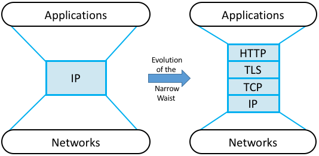

Perspective: HTTP is the New Narrow Waist
=========================================

The Internet has been described as having a *narrow waist* architecture,
with one universal protocol in the middle (IP), widening to support many
transport and application protocols above it (e.g., TCP, UDP, RTP,
SunRPC, DCE-RPC, gRPC, SMTP, HTTP, SNMP) and able to run on top of many
network technologies below (e.g., Ethernet, PPP, WiFi, SONET, ATM). This
general structure has been a key to the Internet becoming ubiquitous: by
keeping the IP layer that everyone has to agree to minimal, a thousand
flowers were allowed to bloom both above and below. This is now a widely
understood strategy for any platform trying to achieve universal
adoption.

But something else has happened over the last 30 years. By not
addressing all the issues the Internet would eventually face as it grew
(e.g., security, congestion, mobility, real-time responsiveness, and so
on) it became necessary to introduce a series of additional features
into the Internet architecture. Having IP’s universal addresses and
best-effort service model was a necessary condition for adoption, but
not a sufficient foundation for all the applications people wanted to
build.

We’re yet to see some of these solutions—future chapters will describe
how the Internet manages congestion (:ref:`Chapter 6 <Chapter 6:
Congestion Control>`), provides security (:ref:`Chapter 8 <Chapter 8:
Network Security>`), and supports real-time multimedia
applications (:ref:`Chapters 7 <Chapter 7: End-to-End Data>` and
:ref:`9 <Chapter 9: Applications>`)—but it is informative to take this
opportunity to reconcile the value of a universal narrow waist with the
evolution that inevitably happens in any long-lived system: the “fixed
point” around which the rest of the architecture evolves has moved to a
new spot in the software stack. In short, HTTP has become the new narrow
waist; the one shared/assumed piece of the global infrastructure that
makes everything else possible. This didn’t happen overnight or by
proclamation, although some did anticipate it would happen. The narrow
waist drifted slowly up the protocol stack as a consequence of an
evolution (to mix geoscience and biological metaphors).
 
.. _fig-waist:

   HTTP (plus TLS, TCP, and IP) forming the narrow
   waist of today's Internet architecture.

Putting the narrow waist label purely on HTTP is an over simplification.
It’s actually a team effort, with the HTTP/TLS/TCP/IP combination now
serving as the Internet’s common platform.

-  HTTP provides global object identifiers (URIs) and a simple GET/PUT
   interface.

-  TLS provides end-to-end communication security.

-  TCP provides connection management, reliable transmission, and
   congestion control.

-  IP provides global host addresses and a network abstraction layer.

In other words, even though you are free to invent your own congestion
control algorithm, TCP solves this problem quite well, so it makes sense
to reuse that solution. Similarly, even though you are free to invent
your own RPC protocol, HTTP provides a perfectly serviceable one (which
because it comes bundled with proven security, has the added feature of
not being blocked by enterprise firewalls), so again, it makes sense to
reuse it rather than reinvent the wheel.

Somewhat less obviously, HTTP also provides a good foundation for
dealing with mobility. If the resource you want to access has moved,
you can have HTTP return a *redirect response* that points the client
to a new location. Similarly, HTTP enables injecting *caching proxies*
between the client and server, making it possible to replicate popular
content in multiple locations and save clients the delay of going all
the way across the Internet to retrieve some piece of
information. (Both of these capabilities are discussed in
:ref:`Section 9.1 <9.1 Traditional Applications>`.) Finally, HTTP has
been used to deliver real-time multimedia, in an approach known as
*adaptive streaming*. (See how in :ref:`Section 7.2 <7.2 Multimedia
Data>`.)

.. admonition:: Broader Perspective

   To continue reading about the cloudification of the Internet, see
   :ref:`Perspective: Software-Defined Traffic Engineering`.

   To learn more about the centrality of HTTP, we recommend: `HTTP:
   An Evolvable Narrow Waist for the Future
   Internet <https://www2.eecs.berkeley.edu/Pubs/TechRpts/2012/EECS-2012-5.pdf>`__,
   January 2012.
