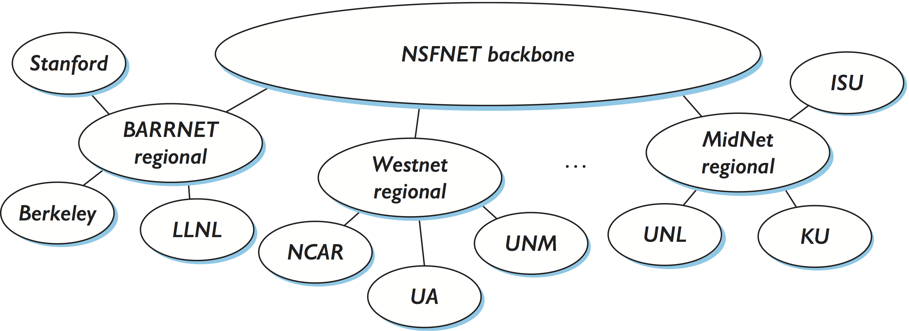
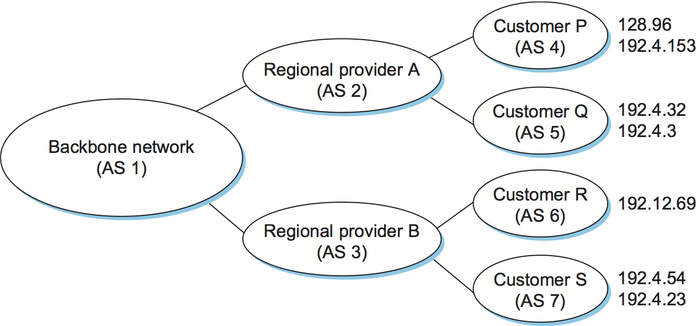
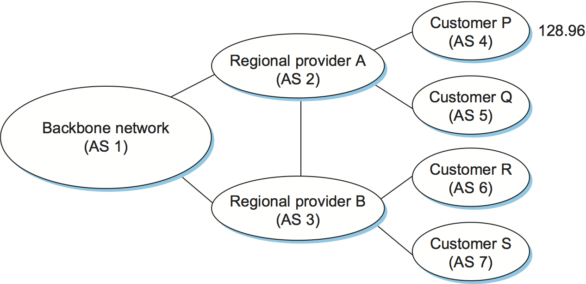
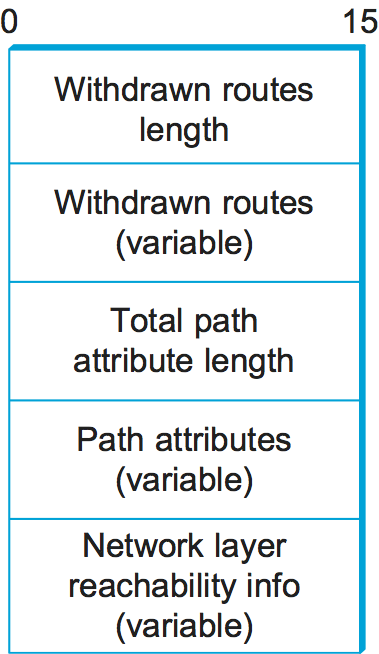
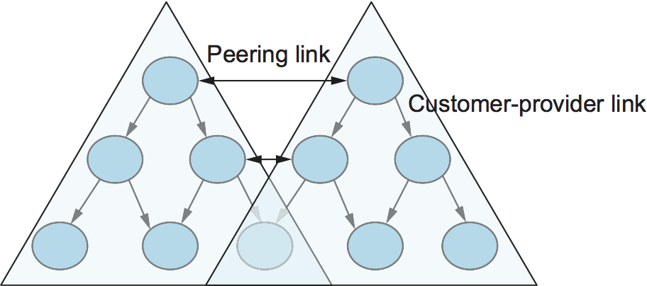
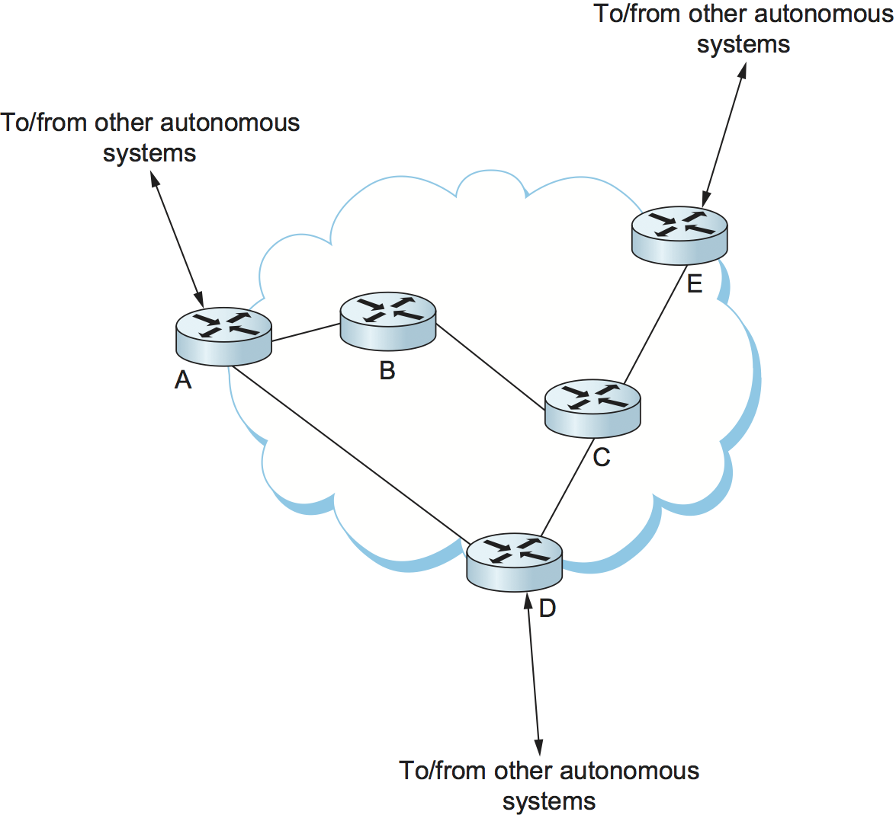

4.1 Global Internet
===================

At this point, we have seen how to connect a heterogeneous collection of
networks to create an internetwork and how to use the simple hierarchy
of the IP address to make routing in an internet somewhat scalable. We
say “somewhat” scalable because, even though each router does not need
to know about all the hosts connected to the internet, it does, in the
model described so far, need to know about all the networks connected to
the internet. Today’s Internet has hundreds of thousands of networks
connected to it (or more, depending on how you count). Routing protocols
such as those we have just discussed do not scale to those kinds of
numbers. This section looks at a variety of techniques that greatly
improve scalability and that have enabled the Internet to grow as far as
it has.

.. _fig-inet-tree:

   The tree structure of the Internet in 1990.

Before getting to these techniques, we need to have a general picture in
our heads of what the global Internet looks like. It is not just a
random interconnection of Ethernets, but instead it takes on a shape
that reflects the fact that it interconnects many different
organizations. :numref:`Figure %s <fig-inet-tree>` gives a simple depiction of the
state of the Internet in 1990. Since that time, the Internet’s topology
has grown much more complex than this figure suggests—we present a
slightly more accurate picture of the current Internet in a later
section—but this picture will do for now.

One of the salient features of this topology is that it consists of
end-user sites (e.g., Stanford University) that connect to service
provider networks (e.g., BARRNET was a provider network that served
sites in the San Francisco Bay Area). In 1990, many providers served a
limited geographic region and were thus known as *regional networks*.
The regional networks were, in turn, connected by a nationwide backbone.
In 1990, this backbone was funded by the National Science Foundation
(NSF) and was therefore called the *NSFNET backbone*.

NSFNET gave way to Internet2, which still runs a backbone on behalf of
Research and Education institutions in the US (there are similar R&E
networks in other countries), but of course most people get their
Internet connectivity from commercial providers. Although the detail is
not shown in the figure, today the largest provider networks (they are
called tier-1) are typically built from dozens of high-end routers
located in major meteropolitan areas (colloquially referred to as “NFL
cities”) connected by point-to-point links (often with 100 Gbps
capacity). Similarly, each end-user site is typically not a single
network but instead consists of multiple physical networks connected by
switches and routers.

Notice that each provider and end-user is likely to be an
administratively independent entity. This has some significant
consequences on routing. For example, it is quite likely that different
providers will have different ideas about the best routing protocol to
use within their networks and on how metrics should be assigned to links
in their network. Because of this independence, each provider’s network
is usually a single *autonomous system* (AS). We will define this term
more precisely in a later section, but for now it is adequate to think
of an AS as a network that is administered independently of other ASs.

The fact that the Internet has a discernible structure can be used to
our advantage as we tackle the problem of scalability. In fact, we need
to deal with two related scaling issues. The first is the scalability of
routing. We need to find ways to minimize the number of network numbers
that get carried around in routing protocols and stored in the routing
tables of routers. The second is address utilization—that is, making
sure that the IP address space does not get consumed too quickly.

Throughout this book, we see the principle of hierarchy used again and
again to improve scalability. We saw in the previous chapter how the
hierarchical structure of IP addresses, especially with the flexibility
provided by Classless Interdomain Routing (CIDR) and subnetting, can
improve the scalability of routing. In the next two sections, we’ll see
further uses of hierarchy (and its partner, aggregation) to provide
greater scalability, first in a single domain and then between domains.
Our final subsection looks at IP version 6, the invention of which was
largely the result of scalability concerns.

4.1.1 Routing Areas
-------------------

As a first example of using hierarchy to scale up the routing system,
we’ll examine how link-state routing protocols (such as OSPF and IS-IS)
can be used to partition a routing domain into subdomains called
*areas*. (The terminology varies somewhat among protocols—we use the
OSPF terminology here.) By adding this extra level of hierarchy, we
enable single domains to grow larger without overburdening the routing
protocols or resorting to the more complex interdomain routing protocols
described later.

An area is a set of routers that are administratively configured to
exchange link-state information with each other. There is one special
area—the backbone area, also known as area 0. An example of a routing
domain divided into areas is shown in :numref:`Figure %s <fig-ospf-area>` .
Routers R1, R2, and R3 are members of the backbone area. They are also
members of at least one nonbackbone area; R1 is actually a member of
both area 1 and area 2. A router that is a member of both the backbone
area and a nonbackbone area is an area border router (ABR). Note that
these are distinct from the routers that are at the edge of an AS, which
are referred to as AS border routers for clarity.
 
.. _fig-ospf-area:
.. figure:: figures/f04-02-9780123850591.png
   :width: 500px
   :align: center

   A domain divided into areas.

Routing within a single area is exactly as described in the previous
chapter. All the routers in the area send link-state advertisements to
each other and thus develop a complete, consistent map of the area.
However, the link-state advertisements of routers that are not area
border routers do not leave the area in which they originated. This has
the effect of making the flooding and route calculation processes
considerably more scalable. For example, router R4 in area 3 will never
see a link-state advertisement from router R8 in area 1. As a
consequence, it will know nothing about the detailed topology of areas
other than its own.

How, then, does a router in one area determine the right next hop for a
packet destined to a network in another area? The answer to this becomes
clear if we imagine the path of a packet that has to travel from one
nonbackbone area to another as being split into three parts. First, it
travels from its source network to the backbone area, then it crosses
the backbone, then it travels from the backbone to the destination
network. To make this work, the area border routers summarize routing
information that they have learned from one area and make it available
in their advertisements to other areas. For example, R1 receives
link-state advertisements from all the routers in area 1 and can thus
determine the cost of reaching any network in area 1. When R1 sends
link-state advertisements into area 0, it advertises the costs of
reaching the networks in area 1 much as if all those networks were
directly connected to R1. This enables all the area 0 routers to learn
the cost to reach all networks in area 1. The area border routers then
summarize this information and advertise it into the nonbackbone areas.
Thus, all routers learn how to reach all networks in the domain.

Note that, in the case of area 2, there are two ABRs and that routers in
area 2 will thus have to make a choice as to which one they use to reach
the backbone. This is easy enough, since both R1 and R2 will be
advertising costs to various networks, so it will become clear which is
the better choice as the routers in area 2 run their shortest-path
algorithm. For example, it is pretty clear that R1 is going to be a
better choice than R2 for destinations in area 1.

When dividing a domain into areas, the network administrator makes a
tradeoff between scalability and optimality of routing. The use of areas
forces all packets traveling from one area to another to go via the
backbone area, even if a shorter path might have been available. For
example, even if R4 and R5 were directly connected, packets would not
flow between them because they are in different nonbackbone areas. It
turns out that the need for scalability is often more important than the
need to use the absolute shortest path.

.. _key-tradeoffs:
.. admonition:: Key Takeaway

   This illustrates an important principle in network design. There is
   frequently a trade-off between scalability and some sort of
   optimality. When hierarchy is introduced, information is hidden
   from some nodes in the network, hindering their ability to make
   perfect decisions. However, information hiding is essential to
   scaling a solution, since it saves all nodes from having global
   knowledge. It is invariably true in large networks that scalability
   is a more pressing design goal than selecting the optimal route.
   :ref:`[Next] <key-scaling>`

Finally, we note that there is a trick by which network administrators
can more flexibly decide which routers go in area 0. This trick uses the
idea of a *virtual link* between routers. Such a virtual link is
obtained by configuring a router that is not directly connected to
area 0 to exchange backbone routing information with a router that is.
For example, a virtual link could be configured from R8 to R1, thus
making R8 part of the backbone. R8 would now participate in link-state
advertisement flooding with the other routers in area 0. The cost of the
virtual link from R8 to R1 is determined by the exchange of routing
information that takes place in area 1. This technique can help to
improve the optimality of routing.

4.1.2 Interdomain Routing (BGP)
-------------------------------

At the beginning of this chapter, we introduced the notion that the
Internet is organized as autonomous systems, each of which is under
the control of a single administrative entity. A corporation’s complex
internal network might be a single AS, as may the national network of
any single Internet Service Provider (ISP). :numref:`Figure %s
<fig-autonomous>` shows a simple network with two autonomous systems.

.. _fig-autonomous:
.. figure:: figures/f04-03-9780123850591.png
   :width: 400px
   :align: center

   A network with two autonomous systems.

The basic idea behind autonomous systems is to provide an additional way
to hierarchically aggregate routing information in a large internet,
thus improving scalability. We now divide the routing problem into two
parts: routing within a single autonomous system and routing between
autonomous systems. Since another name for autonomous systems in the
Internet is routing *domains*, we refer to the two parts of the routing
problem as interdomain routing and intradomain routing. In addition to
improving scalability, the AS model decouples the intradomain routing
that takes place in one AS from that taking place in another. Thus, each
AS can run whatever intradomain routing protocols it chooses. It can
even use static routes or multiple protocols, if desired. The
interdomain routing problem is then one of having different ASs share
reachability information—descriptions of the set of IP addresses that
can be reached via a given AS—with each other.

Challenges in Interdomain Routing
~~~~~~~~~~~~~~~~~~~~~~~~~~~~~~~~~

Perhaps the most important challenge of interdomain routing today is the
need for each AS to determine its own routing *policies*. A simple
example routing policy implemented at a particular AS might look like
this: “Whenever possible, I prefer to send traffic via AS X than via AS
Y, but I’ll use AS Y if it is the only path, and I never want to carry
traffic from AS X to AS Y or *vice versa*.” Such a policy would be
typical when I have paid money to both AS X and AS Y to connect my AS to
the rest of the Internet, and AS X is my preferred provider of
connectivity, with AS Y being the fallback. Because I view both AS X and
AS Y as providers (and presumably I paid them to play this role), I
don’t expect to help them out by carrying traffic between them across my
network (this is called *transit* traffic). The more autonomous systems
I connect to, the more complex policies I might have, especially when
you consider backbone providers, who may interconnect with dozens of
other providers and hundreds of customers and have different economic
arrangements (which affect routing policies) with each one.

A key design goal of interdomain routing is that policies like the
example above, and much more complex ones, should be supported by the
interdomain routing system. To make the problem harder, I need to be
able to implement such a policy without any help from other autonomous
systems, and in the face of possible misconfiguration or malicious
behavior by other autonomous systems. Furthermore, there is often a
desire to keep the policies *private*, because the entities that run the
autonomous systems—mostly ISPs—are often in competition with each other
and don’t want their economic arrangements made public.

There have been two major interdomain routing protocols in the history
of the Internet. The first was the Exterior Gateway Protocol (EGP),
which had a number of limitations, perhaps the most severe of which was
that it constrained the topology of the Internet rather significantly.
EGP was designed when the Internet had a treelike topology, such as that
illustrated in :numref:`Figure %s <fig-inet-tree>`, and did not allow for the
topology to become more general. Note that in this simple treelike
structure there is a single backbone, and autonomous systems are
connected only as parents and children and not as peers.

The replacement for EGP was the Border Gateway Protocol (BGP), which has
iterated through four versions (BGP-4). BGP is often regarded as one of
the more complex parts of the Internet. We’ll cover some of its high
points here.

Unlike its predecessor EGP, BGP makes virtually no assumptions about how
autonomous systems are interconnected—they form an arbitrary graph. This
model is clearly general enough to accommodate non-tree-structured
internetworks, like the simplified picture of a multi-provider Internet
shown in :numref:`Figure %s <fig-inet-1995>`. (It turns out there is still some
sort of structure to the Internet, as we’ll see below, but it’s nothing
like as simple as a tree, and BGP makes no assumptions about such
structure.)

.. _fig-inet-1995:
.. figure:: figures/f04-04-9780123850591.png
   :width: 600px
   :align: center

   A simple multi-provider Internet.

Unlike the simple tree-structured Internet shown in :numref:`Figure
%s <fig-inet-tree>`, or even the fairly simple picture in :numref:`Figure
%s <fig-inet-1995>`, today’s Internet consists of a richly interconnected
set of networks, mostly operated by private companies (ISPs) rather than
governments. Many Internet Service Providers (ISPs) exist mainly to
provide service to “consumers” (i.e., individuals with computers in
their homes), while others offer something more like the old backbone
service, interconnecting other providers and sometimes larger
corporations. Often, many providers arrange to interconnect with each
other at a single *peering point*.

To get a better sense of how we might manage routing among this complex
interconnection of autonomous systems, we can start by defining a few
terms. We define *local traffic* as traffic that originates at or
terminates on nodes within an AS, and *transit traffic* as traffic that
passes through an AS. We can classify autonomous systems into three
broad types:

-  Stub AS—an AS that has only a single connection to one other AS; such
   an AS will only carry local traffic. The small corporation in :numref:`Figure
   %s <fig-inet-1995>` is an example of a stub AS.

-  Multihomed AS—an AS that has connections to more than one other AS
   but that refuses to carry transit traffic, such as the large
   corporation at the top of :numref:`Figure %s <fig-inet-1995>`.

-  Transit AS—an AS that has connections to more than one other AS and
   that is designed to carry both transit and local traffic, such as the
   backbone providers in :numref:`Figure %s <fig-inet-1995>`.

Whereas the discussion of routing in the previous chapter focused on
finding optimal paths based on minimizing some sort of link metric, the
goals of interdomain routing are rather more complex. First, it is
necessary to find *some* path to the intended destination that is loop
free. Second, paths must be compliant with the policies of the various
autonomous systems along the path—and, as we have already seen, those
policies might be almost arbitrarily complex. Thus, while intradomain
focuses on a well-defined problem of optimizing the scalar cost of the
path, interdomain focuses on finding a non-looping, *policy-compliant*
path—a much more complex optimization problem.

There are additional factors that make interdomain routing hard. The
first is simply a matter of scale. An Internet backbone router must be
able to forward any packet destined anywhere in the Internet. That means
having a routing table that will provide a match for any valid IP
address. While CIDR has helped to control the number of distinct
prefixes that are carried in the Internet’s backbone routing, there is
inevitably a lot of routing information to pass around—roughly 700,000
prefixes in mid-2018.

A further challenge in interdomain routing arises from the autonomous
nature of the domains. Note that each domain may run its own interior
routing protocols and use any scheme it chooses to assign metrics to
paths. This means that it is impossible to calculate meaningful path
costs for a path that crosses multiple autonomous systems. A cost of
1000 across one provider might imply a great path, but it might mean an
unacceptably bad one from another provider. As a result, interdomain
routing advertises only *reachability*. The concept of reachability is
basically a statement that “you can reach this network through this AS.”
This means that for interdomain routing to pick an optimal path is
essentially impossible.

The autonomous nature of interdomain raises issue of trust. Provider A
might be unwilling to believe certain advertisements from provider B for
fear that provider B will advertise erroneous routing information. For
example, trusting provider B when he advertises a great route to
anywhere in the Internet can be a disastrous choice if provider B turns
out to have made a mistake configuring his routers or to have
insufficient capacity to carry the traffic.

The issue of trust is also related to the need to support complex
policies as noted above. For example, I might be willing to trust a
particular provider only when he advertises reachability to certain
prefixes, and thus I would have a policy that says, “Use AS X to reach
only prefixes :math:`p` and :math:`q`, if and only if AS X advertises
reachability to those prefixes.”

Basics of BGP
~~~~~~~~~~~~~

Each AS has one or more *border routers* through which packets enter and
leave the AS. In our simple example in :numref:`Figure %s <fig-autonomous>`,
routers R2 and R4 would be border routers. (Over the years, routers have
sometimes also been known as *gateways*, hence the names of the
protocols BGP and EGP). A border router is simply an IP router that is
charged with the task of forwarding packets between autonomous systems.

Each AS that participates in BGP must also have at least one *BGP*
speaker, a router that “speaks” BGP to other BGP speakers in other
autonomous systems. It is common to find that border routers are also
BGP speakers, but that does not have to be the case.

BGP does not belong to either of the two main classes of routing
protocols, distance-vector or link-state. Unlike these protocols, BGP
advertises *complete paths* as an enumerated list of autonomous systems
to reach a particular network. It is sometimes called a *path-vector*
protocol for this reason. The advertisement of complete paths is
necessary to enable the sorts of policy decisions described above to be
made in accordance with the wishes of a particular AS. It also enables
routing loops to be readily detected.

.. _fig-bgpeg:

   Example of a network running BGP.

To see how this works, consider the very simple example network in
:numref:`Figure %s <fig-bgpeg>`. Assume that the providers are transit
networks, while the customer networks are stubs. A BGP speaker for the
AS of provider A (AS 2) would be able to advertise reachability
information for each of the network numbers assigned to customers P
and Q. Thus, it would say, in effect, “The networks 128.96, 192.4.153,
192.4.32, and 192.4.3 can be reached directly from AS 2.” The backbone
network, on receiving this advertisement, can advertise, “The networks
128.96, 192.4.153, 192.4.32, and 192.4.3 can be reached along the path
(AS 1, AS 2).” Similarly, it could advertise, “The networks 192.12.69,
192.4.54, and 192.4.23 can be reached along the path (AS 1, AS 3).”

.. _fig-aspath:

   Example of loop among autonomous systems.

An important job of BGP is to prevent the establishment of looping
paths. For example, consider the network illustrated in
:numref:`Figure %s <fig-aspath>`. It differs from :numref:`Figure %s
<fig-bgpeg>` only in the addition of an extra link between AS 2 and AS
3, but the effect now is that the graph of autonomous systems has a
loop in it. Suppose AS 1 learns that it can reach network 128.96
through AS 2, so it advertises this fact to AS 3, who in turn
advertises it back to AS 2. In the absence of any loop prevention
mechanism, AS 2 could now decide that AS 3 was the preferred route for
packets destined for 128.96. If AS 2 starts sending packets addressed
to 128.96 to AS 3, AS 3 would send them to AS 1; AS 1 would send them
back to AS 2; and they would loop forever.  This is prevented by
carrying the complete AS path in the routing messages. In this case,
the advertisement for a path to 128.96 received by AS 2 from AS 3
would contain an AS path of (AS 3, AS 1, AS 2, AS 4).  AS 2 sees
itself in this path, and thus concludes that this is not a useful path
for it to use.

In order for this loop prevention technique to work, the AS numbers
carried in BGP clearly need to be unique. For example, AS 2 can only
recognize itself in the AS path in the above example if no other AS
identifies itself in the same way. AS numbers are now 32-bits long, and
they are assigned by a central authority to assure uniqueness.

A given AS will only advertise routes that it considers good enough for
itself. That is, if a BGP speaker has a choice of several different
routes to a destination, it will choose the best one according to its
own local policies, and then that will be the route it advertises.
Furthermore, a BGP speaker is under no obligation to advertise any route
to a destination, even if it has one. This is how an AS can implement a
policy of not providing transit—by refusing to advertise routes to
prefixes that are not contained within that AS, even if it knows how to
reach them.

Given that links fail and policies change, BGP speakers need to be
able to cancel previously advertised paths. This is done with a form
of negative advertisement known as a *withdrawn route*. Both positive
and negative reachability information are carried in a BGP update
message, the format of which is shown in :numref:`Figure %s
<fig-bgpup>`. (Note that the fields in this figure are multiples of
16 bits, unlike other packet formats in this chapter.)

.. _fig-bgpup:

   BGP-4 update packet format.

Unlike the routing protocols described in the previous chapter, BGP is
defined to run on top of TCP, the reliable transport protocol. Because
BGP speakers can count on TCP to be reliable, this means that any
information that has been sent from one speaker to another does not need
to be sent again. Thus, as long as nothing has changed, a BGP speaker
can simply send an occasional *keepalive* message that says, in effect,
“I’m still here and nothing has changed.” If that router were to crash
or become disconnected from its peer, it would stop sending the
keepalives, and the other routers that had learned routes from it would
assume that those routes were no longer valid.

Common AS Relationships and Policies
~~~~~~~~~~~~~~~~~~~~~~~~~~~~~~~~~~~~

Having said that policies may be arbitrarily complex, there turn out
to be a few common ones, reflecting common relationships between
autonomous systems. The most common relationships are illustrated in
:numref:`Figure %s <fig-as-rels>`. The three common relationships and
the policies that go with them are as follows:
 
.. _fig-as-rels:

   Common AS relationships.

-  *Provider-Customer—*\ Providers are in the business of connecting
   their customers to the rest of the Internet. A customer might be
   a corporation, or it might be a smaller ISP (which may have customers
   of its own). So the common policy is to advertise all the routes I
   know about to my customer, and advertise routes I learn from my
   customer to everyone.

-  *Customer-Provider—*\ In the other direction, the customer wants to
   get traffic directed to him (and his customers, if he has them) by
   his provider, and he wants to be able to send traffic to the rest of
   the Internet through his provider. So the common policy in this case
   is to advertise my own prefixes and routes learned from my customers
   to my provider, advertise routes learned from my provider to my
   customers, but don’t advertise routes learned from one provider to
   another provider. That last part is to make sure the customer doesn’t
   find himself in the business of carrying traffic from one provider to
   another, which isn’t in his interests if he is paying the providers
   to carry traffic for him.

-  *Peer—*\ The third option is a symmetrical peering between autonomous
   systems. Two providers who view themselves as equals usually peer so
   that they can get access to each other’s customers without having to
   pay another provider. The typical policy here is to advertise routes
   learned from my customers to my peer, advertise routes learned from
   my peer to my customers, but don’t advertise routes from my peer to
   any provider or *vice versa*.

One thing to note about this figure is the way it has brought back some
structure to the apparently unstructured Internet. At the bottom of
the hierarchy we have the stub networks that are customers of one or
more providers, and as we move up the hierarchy we see providers who
have other providers as their customers. At the top, we have providers
who have customers and peers but are not customers of anyone. These
providers are known as the *Tier-1* providers.

.. _key-scaling:
.. admonition:: Key Takeaway

   Let’s return to the real question: How does all this help us to
   build scalable networks? First, the number of nodes participating
   in BGP is on the order of the number of autonomous systems, which
   is much smaller than the number of networks. Second, finding a good
   interdomain route is only a matter of finding a path to the right
   border router, of which there are only a few per AS. Thus, we have
   neatly subdivided the routing problem into manageable parts, once
   again using a new level of hierarchy to increase scalability. The
   complexity of interdomain routing is now on the order of the number
   of autonomous systems, and the complexity of intradomain routing is
   on the order of the number of networks in a single AS. :ref:`[Next]
   <key-e2e>`

Integrating Interdomain and Intradomain Routing
~~~~~~~~~~~~~~~~~~~~~~~~~~~~~~~~~~~~~~~~~~~~~~~

While the preceding discussion illustrates how a BGP speaker learns
interdomain routing information, the question still remains as to how
all the other routers in a domain get this information. There are
several ways this problem can be addressed.

Let’s start with a very simple situation, which is also very common. In
the case of a stub AS that only connects to other autonomous systems at
a single point, the border router is clearly the only choice for all
routes that are outside the AS. Such a router can inject a *default
route* into the intradomain routing protocol. In effect, this is a
statement that any network that has not been explicitly advertised in
the intradomain protocol is reachable through the border router. Recall
from the discussion of IP forwarding in the previous chapter that the
default entry in the forwarding table comes after all the more specific
entries, and it matches anything that failed to match a specific entry.

The next step up in complexity is to have the border routers inject
specific routes they have learned from outside the AS. Consider, for
example, the border router of a provider AS that connects to a customer
AS. That router could learn that the network prefix 192.4.54/24 is
located inside the customer AS, either through BGP or because the
information is configured into the border router. It could inject a
route to that prefix into the routing protocol running inside the
provider AS. This would be an advertisement of the sort, “I have a link
to 192.4.54/24 of cost X.” This would cause other routers in the
provider AS to learn that this border router is the place to send
packets destined for that prefix.

The final level of complexity comes in backbone networks, which learn so
much routing information from BGP that it becomes too costly to inject
it into the intradomain protocol. For example, if a border router wants
to inject 10,000 prefixes that it learned about from another AS, it will
have to send very big link-state packets to the other routers in that
AS, and their shortest-path calculations are going to become very
complex. For this reason, the routers in a backbone network use a
variant of BGP called *interior BGP* (iBGP) to effectively redistribute
the information that is learned by the BGP speakers at the edges of the
AS to all the other routers in the AS. (The other variant of BGP,
discussed above, runs between autonomous systems and is called *exterior
BGP*, or eBGP). iBGP enables any router in the AS to learn the best
border router to use when sending a packet to any address. At the same
time, each router in the AS keeps track of how to get to each border
router using a conventional intradomain protocol with no injected
information. By combining these two sets of information, each router in
the AS is able to determine the appropriate next hop for all prefixes.

.. _fig-ibgp:

   Example of interdomain and intradomain routing. All
   routers run iBGP and an intradomain routing protocol. Border
   routers A, D, and E also run eBGP to other autonomous
   systems.

To see how this all works, consider the simple example network,
representing a single AS, in :numref:`Figure %s <fig-ibgp>`. The three
border routers, A, D, and E, speak eBGP to other autonomous systems
and learn how to reach various prefixes. These three border routers
communicate with each other and with the interior routers B and C by
building a mesh of iBGP sessions among all the routers in the
AS. Let’s now focus in on how router B builds up its complete view of
how to forward packets to any prefix. Look at the top left of
:numref:`Figure %s <fig-ibgptab>`, which shows the information that
router B learns from its iBGP sessions. It learns that some prefixes
are best reached via router A, some via D, and some via E. At the same
time, all the routers in the AS are also running some intradomain
routing protocol such as Routing Information Protocol (RIP) or Open
Shortest Path First (OSPF). (A generic term for intradomain protocols
is an interior gateway protocol, or IGP.) From this completely
separate protocol, B learns how to reach other nodes *inside* the
domain, as shown in the top right table. For example, to reach router
E, B needs to send packets toward router C. Finally, in the bottom
table, B puts the whole picture together, combining the information
about external prefixes learned from iBGP with the information about
interior routes to the border routers learned from the IGP. Thus, if a
prefix like 18.0/16 is reachable via border router E, and the best
interior path to E is via C, then it follows that any packet destined
for 18.0/16 should be forwarded toward C. In this way, any router in
the AS can build up a complete routing table for any prefix that is
reachable via some border router of the AS.

.. _fig-ibgptab:
.. figure:: figures/f04-10-9780123850591.png
   :width: 500px
   :align: center

   BGP routing table, IGP routing table, and combined
   table at router B.
