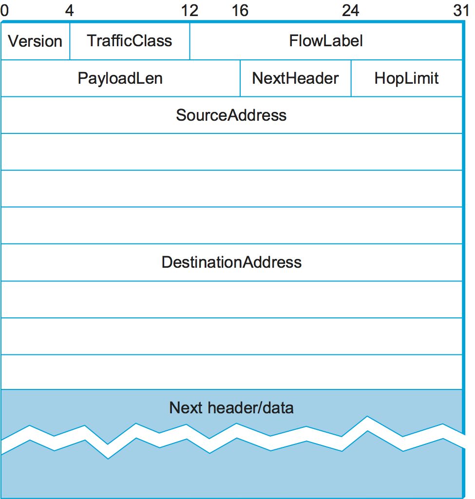
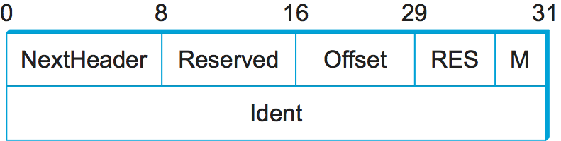

4.2 IP Version 6
================

The motivation for defining a new version of IP is simple: to deal
with exhaustion of the IP address space. CIDR helped considerably to
contain the rate at which the Internet address space was being
consumed and also helped to control the growth of routing table
information needed in the Internet’s routers. However, these
techniques are no longer adequate. In particular, it is virtually
impossible to achieve 100% address utilization efficiency, so the
address space was consumed well before the 4 billionth host was
connected to the Internet. Even if we were able to use all 4 billion
addresses, it is now clear that IP addresses need to be assigned to
more than traditional computers, including smart phones, televisions,
household appliances, and drones. With the clarity of 20/20 hindsight,
a 32-bit address space is quite small.

4.2.1 Historical Perspective
----------------------------

The IETF began looking at the problem of expanding the IP address space
in 1991, and several alternatives were proposed. Since the IP address is
carried in the header of every IP packet, increasing the size of the
address dictates a change in the packet header. This means a new version
of the Internet Protocol and, as a consequence, a need for new software
for every host and router in the Internet. This is clearly not a trivial
matter—it is a major change that needs to be thought about very
carefully.

The effort to define a new version of IP was originally known as IP Next
Generation, or IPng. As the work progressed, an official IP version
number was assigned, so IPng became IPv6. Note that the version
of IP discussed so far in this chapter is version 4 (IPv4). The apparent
discontinuity in numbering is the result of version number 5 being used
for an experimental protocol many years ago.

The significance of changing to a new version of IP caused a snowball
effect. The general feeling among network designers was that if you are
going to make a change of this magnitude you might as well fix as many
other things in IP as possible at the same time. Consequently, the IETF
solicited white papers from anyone who cared to write one, asking for
input on the features that might be desired in a new version of IP. In
addition to the need to accommodate scalable routing and addressing,
some of the other wish list items for IPng included:

-  Support for real-time services

-  Security support

-  Autoconfiguration (i.e., the ability of hosts to automatically
   configure themselves with such information as their own IP address
   and domain name)

-  Enhanced routing functionality, including support for mobile hosts

It is interesting to note that, while many of these features were absent
from IPv4 at the time IPv6 was being designed, support for all of them
has made its way into IPv4 in recent years, often using similar
techniques in both protocols. It can be argued that the freedom to think
of IPv6 as a clean slate facilitated the design of new capabilities for
IP that were then retrofitted into IPv4.

In addition to the wish list, one absolutely non-negotiable feature for
IPv6 was that there must be a transition plan to move from the current
version of IP (version 4) to the new version. With the Internet being so
large and having no centralized control, it would be completely
impossible to have a “flag day” on which everyone shut down their hosts
and routers and installed a new version of IP. The architects expected
a long transition period in which some hosts and routers would run
IPv4 only, some will run IPv4 and IPv6, and some will run IPv6
only. It is doubtful they anticipated that transition period would be
approaching its 30th anniversary.

4.2.2 Addresses and Routing
---------------------------

First and foremost, IPv6 provides a 128-bit address space, as opposed
to the 32 bits of version 4. Thus, while version 4 can potentially
address 4 billion nodes if address assignment efficiency reaches 100%,
IPv6 can address 3.4 × 10\ :sup:`38` nodes, again assuming 100%
efficiency.  As we have seen, though, 100% efficiency in address
assignment is not likely. Some analysis of other addressing schemes,
such as those of the French and U.S. telephone networks, as well as
that of IPv4, have turned up some empirical numbers for address
assignment efficiency. Based on the most pessimistic estimates of
efficiency drawn from this study, the IPv6 address space is predicted
to provide over 1500 addresses per square foot of the Earth’s surface,
which certainly seems like it should serve us well even when toasters
on Venus have IP addresses.

Address Space Allocation
~~~~~~~~~~~~~~~~~~~~~~~~

Drawing on the effectiveness of CIDR in IPv4, IPv6 addresses are also
classless, but the address space is still subdivided in various ways
based on the leading bits. Rather than specifying different address
classes, the leading bits specify different uses of the IPv6 address.
The current assignment of prefixes is listed in :numref:`Table %s
<tab-v6tab>`.

.. _tab-v6tab:
.. table:: Address Prefix Assignments for IPv6.
   :align: center
   :widths: auto
	    
   +-----------------+---------------------+
   | Prefix          | Use                 |
   +=================+=====================+
   | 00…0 (128 bits) | Unspecified         |
   +-----------------+---------------------+
   | 00…1 (128 bits) | Loopback            |
   +-----------------+---------------------+
   | 1111 1111       | Multicast addresses |
   +-----------------+---------------------+
   | 1111 1110 10    | Link-local unicast  |
   +-----------------+---------------------+
   | Everything else | Global Unicast      |
   +-----------------+---------------------+

This allocation of the address space warrants a little discussion.
First, the entire functionality of IPv4’s three main address classes (A,
B, and C) is contained inside the “everything else” range. Global
Unicast Addresses, as we will see shortly, are a lot like classless IPv4
addresses, only much longer. These are the main ones of interest at this
point, with over 99% of the total IPv6 address space available to this
important form of address. (At the time of writing, IPv6 unicast
addresses are being allocated from the block that begins ``001``, with
the remaining address space—about 87%—being reserved for future use.)

The multicast address space is (obviously) for multicast, thereby
serving the same role as class D addresses in IPv4. Note that multicast
addresses are easy to distinguish—they start with a byte of all 1s. We
will see how these addresses are used in a later section.

The idea behind link-local use addresses is to enable a host to
construct an address that will work on the network to which it is
connected without being concerned about the global uniqueness of the
address. This may be useful for autoconfiguration, as we will see below.
Similarly, the site-local use addresses are intended to allow valid
addresses to be constructed on a site (e.g., a private corporate
network) that is not connected to the larger Internet; again, global
uniqueness need not be an issue.

Within the global unicast address space are some important special types
of addresses. A node may be assigned an IPv4-compatible IPv6 address by
zero-extending a 32-bit IPv4 address to 128 bits. A node that is only
capable of understanding IPv4 can be assigned an IPv4-mapped IPv6
address by prefixing the 32-bit IPv4 address with 2 bytes of all 1s and
then zero-extending the result to 128 bits. These two special address
types have uses in the IPv4-to-IPv6 transition (see the sidebar on this
topic).

Address Notation
~~~~~~~~~~~~~~~~

Just as with IPv4, there is some special notation for writing down IPv6
addresses. The standard representation is ``x:x:x:x:x:x:x:x``, where
each ``x`` is a hexadecimal representation of a 16-bit piece of the
address. An example would be

::

   47CD:1234:4422:AC02:0022:1234:A456:0124

Any IPv6 address can be written using this notation. Since there are a
few special types of IPv6 addresses, there are some special notations
that may be helpful in certain circumstances. For example, an address
with a large number of contiguous 0s can be written more compactly by
omitting all the 0 fields. Thus,

::

   47CD:0000:0000:0000:0000:0000:A456:0124

could be written

::

   47CD::A456:0124

Clearly, this form of shorthand can only be used for one set of
contiguous 0s in an address to avoid ambiguity.

The two types of IPv6 addresses that contain an embedded IPv4 address
have their own special notation that makes extraction of the IPv4
address easier. For example, the IPv4-mapped IPv6 address of a host
whose IPv4 address was 128.96.33.81 could be written as

::

   ::FFFF:128.96.33.81

That is, the last 32 bits are written in IPv4 notation, rather than as a
pair of hexadecimal numbers separated by a colon. Note that the double
colon at the front indicates the leading 0s.

Global Unicast Addresses
~~~~~~~~~~~~~~~~~~~~~~~~

By far the most important sort of addressing that IPv6 must provide is
plain old unicast addressing. It must do this in a way that supports the
rapid rate of addition of new hosts to the Internet and that allows
routing to be done in a scalable way as the number of physical networks
in the Internet grows. Thus, at the heart of IPv6 is the unicast address
allocation plan that determines how unicast addresses will be assigned
to service providers, autonomous systems, networks, hosts, and routers.

In fact, the address allocation plan that is proposed for IPv6 unicast
addresses is extremely similar to that being deployed with CIDR in IPv4.
To understand how it works and how it provides scalability, it is
helpful to define some new terms. We may think of a nontransit AS (i.e.,
a stub or multihomed AS) as a *subscriber*, and we may think of a
transit AS as a *provider*. Furthermore, we may subdivide providers into
*direct* and *indirect*. The former are directly connected to
subscribers. The latter primarily connect other providers, are not
connected directly to subscribers, and are often known as *backbone*
*networks*.

With this set of definitions, we can see that the Internet is not just
an arbitrarily interconnected set of autonomous systems; it has some
intrinsic hierarchy. The difficulty lies in making use of this hierarchy
without inventing mechanisms that fail when the hierarchy is not
strictly observed, as happened with EGP. For example, the distinction
between direct and indirect providers becomes blurred when a subscriber
connects to a backbone or when a direct provider starts connecting to
many other providers.

As with CIDR, the goal of the IPv6 address allocation plan is to provide
aggregation of routing information to reduce the burden on intradomain
routers. Again, the key idea is to use an address prefix—a set of
contiguous bits at the most significant end of the address—to aggregate
reachability information to a large number of networks and even to a
large number of autonomous systems. The main way to achieve this is to
assign an address prefix to a direct provider and then for that direct
provider to assign longer prefixes that begin with that prefix to its
subscribers. Thus, a provider can advertise a single prefix for all of
its subscribers.

Of course, the drawback is that if a site decides to change providers,
it will need to obtain a new address prefix and renumber all the nodes
in the site. This could be a colossal undertaking, enough to dissuade
most people from ever changing providers. For this reason, there is
ongoing research on other addressing schemes, such as geographic
addressing, in which a site’s address is a function of its location
rather than the provider to which it attaches. At present, however,
provider-based addressing is necessary to make routing work efficiently.

Note that while IPv6 address assignment is essentially equivalent to the
way address assignment has happened in IPv4 since the introduction of
CIDR, IPv6 has the significant advantage of not having a large installed
base of assigned addresses to fit into its plans.

One question is whether it makes sense for hierarchical aggregation to
take place at other levels in the hierarchy. For example, should all
providers obtain their address prefixes from within a prefix allocated
to the backbone to which they connect? Given that most providers connect
to multiple backbones, this probably doesn’t make sense. Also, since the
number of providers is much smaller than the number of sites, the
benefits of aggregating at this level are much fewer.

One place where aggregation may make sense is at the national or
continental level. Continental boundaries form natural divisions in
the Internet topology. If all addresses in Europe, for example, had a
common prefix, then a great deal of aggregation could be done, and
most routers in other continents would only need one routing table
entry for all networks with the Europe prefix. Providers in Europe
would all select their prefixes such that they began with the European
prefix. Using this scheme, an IPv6 address might look like
:numref:`Figure %s <fig-v6addr>`. The ``RegistryID`` might be an
identifier assigned to a European address registry, with different IDs
assigned to other continents or countries.  Note that prefixes would
be of different lengths under this scenario.  For example, a provider
with few customers could have a longer prefix (and thus less total
address space available) than one with many customers.

.. _fig-v6addr:
.. figure:: figures/f04-11-9780123850591.png
   :width: 500px
   :align: center

   An IPv6 provider-based unicast address.

One tricky situation could occur when a subscriber is connected to more
than one provider. Which prefix should the subscriber use for his or her
site? There is no perfect solution to the problem. For example, suppose
a subscriber is connected to two providers, X and Y. If the subscriber
takes his prefix from X, then Y has to advertise a prefix that has no
relationship to its other subscribers and that as a consequence cannot
be aggregated. If the subscriber numbers part of his AS with the prefix
of X and part with the prefix of Y, he runs the risk of having half his
site become unreachable if the connection to one provider goes down. One
solution that works fairly well if X and Y have a lot of subscribers in
common is for them to have three prefixes between them: one for
subscribers of X only, one for subscribers of Y only, and one for the
sites that are subscribers of both X and Y.

4.2.3 Packet Format
-------------------

Despite the fact that IPv6 extends IPv4 in several ways, its header
format is actually simpler. This simplicity is due to a concerted effort
to remove unnecessary functionality from the protocol. :numref:`Figure
%s <fig-v6header>` shows the result.

As with many headers, this one starts with a ``Version`` field, which is
set to 6 for IPv6. The ``Version`` field is in the same place relative
to the start of the header as IPv4’s ``Version`` field so that
header-processing software can immediately decide which header format to
look for. The ``TrafficClass`` and ``FlowLabel`` fields both relate to
quality of service issues.

The ``PayloadLen`` field gives the length of the packet, excluding the
IPv6 header, measured in bytes. The ``NextHeader`` field cleverly
replaces both the IP options and the ``Protocol`` field of IPv4. If
options are required, then they are carried in one or more special
headers following the IP header, and this is indicated by the value of
the ``NextHeader`` field. If there are no special headers, the
``NextHeader`` field is the demux key identifying the higher-level
protocol running over IP (e.g., TCP or UDP); that is, it serves the
same purpose as the IPv4 ``Protocol`` field. Also, fragmentation is
now handled as an optional header, which means that the
fragmentation-related fields of IPv4 are not included in the IPv6
header. The ``HopLimit`` field is simply the ``TTL`` of IPv4, renamed
to reflect the way it is actually used.

.. _fig-v6header:

   IPv6 packet header.

Finally, the bulk of the header is taken up with the source and
destination addresses, each of which is 16 bytes (128 bits) long. Thus,
the IPv6 header is always 40 bytes long. Considering that IPv6 addresses
are four times longer than those of IPv4, this compares quite well with
the IPv4 header, which is 20 bytes long in the absence of options.

The way that IPv6 handles options is quite an improvement over IPv4. In
IPv4, if any options were present, every router had to parse the entire
options field to see if any of the options were relevant. This is
because the options were all buried at the end of the IP header, as an
unordered collection of ‘(type, length, value)’ tuples. In contrast,
IPv6 treats options as *extension headers* that must, if present, appear
in a specific order. This means that each router can quickly determine
if any of the options are relevant to it; in most cases, they will not
be. Usually this can be determined by just looking at the ``NextHeader``
field. The end result is that option processing is much more efficient
in IPv6, which is an important factor in router performance. In
addition, the new formatting of options as extension headers means that
they can be of arbitrary length, whereas in IPv4 they were limited to
44 bytes at most. We will see how some of the options are used below.

.. _fig-v6ext:

   IPv6 fragmentation extension header.

Each option has its own type of extension header. The type of each
extension header is identified by the value of the ``NextHeader`` field
in the header that precedes it, and each extension header contains a
``NextHeader`` field to identify the header following it. The last
extension header will be followed by a transport-layer header (e.g.,
TCP) and in this case the value of the ``NextHeader`` field is the same
as the value of the ``Protocol`` field would be in an IPv4 header. Thus,
the ``NextHeader`` field does double duty; it may either identify the
type of extension header to follow, or, in the last extension header, it
serves as a demux key to identify the higher-layer protocol running over
IPv6.

Consider the example of the fragmentation header, shown in
:numref:`Figure %s <fig-v6ext>`. This header provides functionality
similar to the fragmentation fields in the IPv4 header, but it is only
present if fragmentation is necessary. Assuming it is the only
extension header present, then the ``NextHeader`` field of the IPv6
header would contain the value \ ``44``, which is the value assigned
to indicate the fragmentation header. The ``NextHeader`` field of the
fragmentation header itself contains a value describing the header
that follows it.  Again, assuming no other extension headers are
present, then the next header might be the TCP header, which results
in ``NextHeader`` containing the value \ ``6``, just as the
``Protocol`` field would in IPv4. If the fragmentation header were
followed by, say, an authentication header, then the fragmentation
header’s ``NextHeader`` field would contain the value \ ``51``.

4.2.4 Advanced Capabilities 
---------------------------

As mentioned at the beginning of this section, the primary motivation 
behind the development of IPv6 was to support the continued growth of 
the Internet. Once the IP header had to be changed for the sake of the 
addresses, however, the door was open for a wide variety of other 
changes, two of which we describe below. But IPv6 includes several
additional features, most of which are covered elsewhere in this book;
e.g., mobility, security, quality-of-service. It is interesting to
note that, in most of these areas, the IPv4 and IPv6 capabilities have
become virtually indistinguishable, so that the main driver for IPv6
remains the need for larger addresses. 

Autoconfiguration
~~~~~~~~~~~~~~~~~

While the Internet’s growth has been impressive, one factor that has
inhibited faster acceptance of the technology is the fact that getting
connected to the Internet has typically required a fair amount of system
administration expertise. In particular, every host that is connected to
the Internet needs to be configured with a certain minimum amount of
information, such as a valid IP address, a subnet mask for the link to
which it attaches, and the address of a name server. Thus, it has not
been possible to unpack a new computer and connect it to the Internet
without some preconfiguration. One goal of IPv6, therefore, is to
provide support for autoconfiguration, sometimes referred to as
*plug-and-play* operation.

As we saw in the previous chapter, autoconfiguration is possible for
IPv4, but it depends on the existence of a server that is configured to
hand out addresses and other configuration information to Dynamic Host
Configuration Protocol (DHCP) clients. The longer address format in IPv6
helps provide a useful, new form of autoconfiguration called *stateless*
autoconfiguration, which does not require a server.

Recall that IPv6 unicast addresses are hierarchical, and that the least
significant portion is the interface ID. Thus, we can subdivide the
autoconfiguration problem into two parts:

1. Obtain an interface ID that is unique on the link to which the host
   is attached.

2. Obtain the correct address prefix for this subnet.

The first part turns out to be rather easy, since every host on a link
must have a unique link-level address. For example, all hosts on an
Ethernet have a unique 48-bit Ethernet address. This can be turned
into a valid link-local use address by adding the appropriate prefix
from :numref:`Table %s <tab-v6tab>` (``1111 1110 10``) followed by
enough 0s to make up 128 bits. For some devices—for example, printers
or hosts on a small routerless network that do not connect to any
other networks—this address may be perfectly adequate. Those devices
that need a globally valid address depend on a router on the same link
to periodically advertise the appropriate prefix for the
link. Clearly, this requires that the router be configured with the
correct address prefix, and that this prefix be chosen in such a way
that there is enough space at the end (e.g., 48 bits) to attach an
appropriate link-level address.

The ability to embed link-level addresses as long as 48 bits into IPv6
addresses was one of the reasons for choosing such a large address size.
Not only does 128 bits allow the embedding, but it leaves plenty of
space for the multilevel hierarchy of addressing that we discussed
above.

Source-Directed Routing
~~~~~~~~~~~~~~~~~~~~~~~

Another of IPv6’s extension headers is the routing header. In the
absence of this header, routing for IPv6 differs very little from that
of IPv4 under CIDR. The routing header contains a list of IPv6 addresses
that represent nodes or topological areas that the packet should visit
en route to its destination. A topological area may be, for example, a
backbone provider’s network. Specifying that packets must visit this
network would be a way of implementing provider selection on a
packet-by-packet basis. Thus, a host could say that it wants some
packets to go through a provider that is cheap, others through a
provider that provides high reliability, and still others through a
provider that the host trusts to provide security.

To provide the ability to specify topological entities rather than
individual nodes, IPv6 defines an *anycast* address. An anycast address
is assigned to a set of interfaces, and packets sent to that address
will go to the “nearest” of those interfaces, with nearest being
determined by the routing protocols. For example, all the routers of a
backbone provider could be assigned a single anycast address, which
would be used in the routing header.

