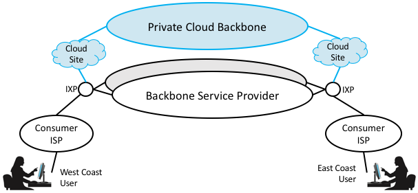

Perspective: The Cloud is Eating the Internet
=============================================

The Cloud and the Internet are symbiotic systems. They were historically
distinct, but today the line between them is increasingly fuzzy. If you
start with the textbook definition, the Internet provides end-to-end
connectivity between any two hosts (e.g., a client laptop and a remote
server machine), and the cloud supports several warehouse-sized
datacenters, each of which provides a cost-effective way to power, cool,
and operate a large number of server machines. End-users connect to the
nearest datacenter over the Internet in exactly the same way they
connect to a server in a remote machine room.

That’s an accurate description of the relationship between the Internet
and the Cloud in the early days of commercial cloud providers like
Amazon, Microsoft, and Google. For example, Amazon’s cloud circa 2009
had two datacenters, one on the east coast of the US and one on the west
coast. Today, however, each of the major cloud providers operates
several dozen datacenters spread across the globe, and it should be no
surprise that they are strategically located in close proximity to
Internet Exchange Points (IXP), each of which provides rich connectivity
to the rest of the Internet. There are over 150 IXPs worldwide, and
while not every cloud provider replicates a full datacenter near each
one (many of these sites are co-location facilities), it is fair to say
the cloud’s most frequently accessed content (e.g., the most popular
Netflix movies, YouTube videos, and Facebook photos) is potentially
distributed to that many locations.

There are two consequences to this wide dispersion of the cloud. One is
that the end-to-end path from client to server doesn’t necessarily
traverse the entire Internet. A user is likely to find the content he or
she wants to access has been replicated at a nearby IXP—which is usually
just one AS hop away—as opposed to being on the far side of the globe.
The second consequence is that the major cloud providers do not use the
public Internet to interconnect their distributed datacenters. It is
common for cloud providers to keep their content synchronized across
distributed datacenters, but they typically do this over a private
backbone. This allows them to take advantage of whatever optimizations
they want without needing to fully inter-operate with anyone else.

In other words, while the figures in :ref:`Section 4.1 <4.1 Global
Internet>` fairly represents the Internet’s overall shape, and BGP
makes it *possible* to connect any pair of hosts, in practice most
users interact with applications running in the Cloud, which looks
more like :numref:`Figure %s <fig-cloud>`. (One important detail that
the figure does not convey is that Cloud providers do not typically
build a WAN by laying their own fiber, but they instead lease fiber
from servicer providers, meaning that the private cloud backbone and
the service provider backbones often share the same physical
infrastructure.)

.. _fig-cloud:

   Cloud is widely distributed throughout the Internet 
   with private backbones.

Note that while it is possible to replicate *content* across the cloud’s
many locations, we do not yet have the technology to replicate *people*.
This means that when widely dispersed users want to talk with each
other—for example, as part of a video conference call—it’s the multicast
tree that gets distributed across the cloud. In other words, multicast
isn’t typically running in the routers of the service provider backbones
(as :ref:`Section 4.3 <4.3 Multicast>` suggests), but it is instead running
in server processes distributed across some subset of the 150+ locations
that serve as the Internet’s major interconnection points. A multicast
tree constructed in this way is called an overlay, which is a topic that
we return to in :ref:`Section 9.4 <9.4 Overlay Networks>`.

.. admonition:: Broader Perspective

   To continue reading about the cloudification of the Internet, see
   :ref:`Perspective: HTTP is the New Narrow Waist`.

   To learn more about the Cloud’s distributed footprint, we recommend
   `How the Internet Travels Across the
   Ocean <https://www.nytimes.com/interactive/2019/03/10/technology/internet-cables-oceans.html>`__,
   New York Times, March 2019.
