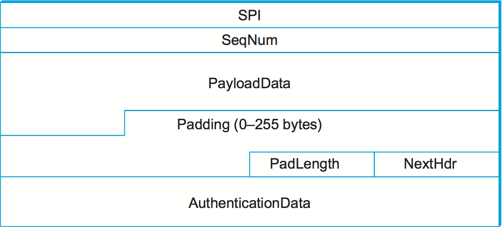
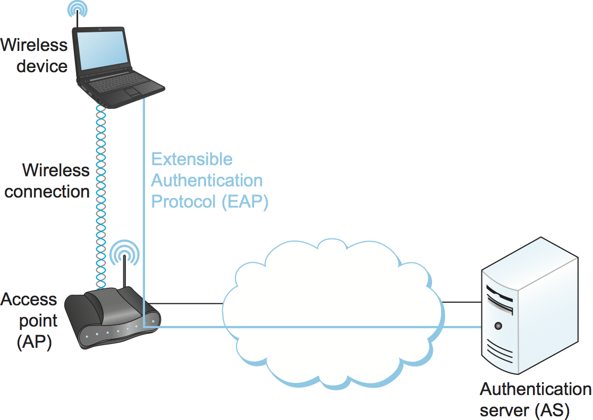
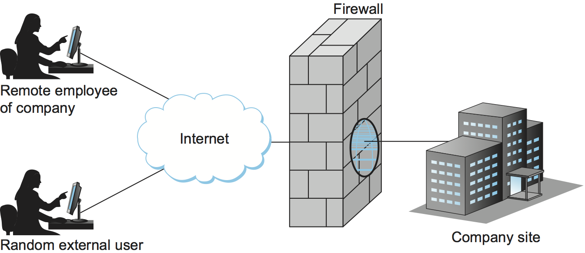

8.5 Example Systems
===================

We have now seen many of the components required to provide one or two
aspects of security. These components include cryptographic algorithms,
key predistribution mechanisms, and authentication protocols. In this
section, we examine some complete systems that use these components.

These systems can be roughly categorized by the protocol layer at which
they operate. Systems that operate at the application layer include
Pretty Good Privacy (PGP), which provides electronic mail security, and
Secure Shell (SSH), a secure remote login facility. At the transport
layer, there is the IETF’s Transport Layer Security (TLS) standard and
the older protocol from which it derives, Secure Socket Layer (SSL). The
IPsec (IP Security) protocols, as their name implies, operate at the IP
(network) layer. 802.11i provides security at the link layer of wireless
networks. This section describes the salient features of each of these
approaches.

You might reasonably wonder why security has to be provided at so many
different layers. One reason is that different threats require different
defensive measures, and this often translates into securing a different
protocol layer. For example, if your main concern is with a person in
the building next door snooping on your traffic as it flows between your
laptop and your 802.11 access point, then you probably want security at
the link layer. However, if you want to be really sure you are connected
to your bank’s website and preventing all the data that you send to the
bank from being read by curious employees of some Internet service
provider, then something that extends all the way from your machine to
the bank’s server—like the transport layer—may be the right place to
secure the traffic. As is often the case, there is no one-size-fits-all
solution.

The security systems described below have the ability to vary which
cryptographic algorithms they use. The idea of making a security system
algorithm independent is a very good one, because you never know when
your favorite cryptographic algorithm might be proved to be
insufficiently strong for your purposes. It would be nice if you could
quickly change to a new algorithm without having to change the protocol
specification or implementation. Note the analogy to being able to
change keys without changing the algorithm; if one of your cryptographic
algorithms turns out to be flawed, it would be great if your entire
security architecture didn’t need an immediate redesign.

Pretty Good Privacy (PGP)
-------------------------

Pretty Good Privacy (PGP) is a widely used approach to providing
security for electronic mail. It provides authentication,
confidentiality, data integrity, and nonrepudiation. Originally devised
by Phil Zimmerman, it has evolved into an IETF standard known as
OpenPGP. As we saw in a previous section, PGP is notable for using a
“web of trust” model for distribution of keys rather than a tree-like
hierarchy.

PGP’s confidentiality and receiver authentication depend on the receiver
of an email message having a public key that is known to the sender. To
provide sender authentication and nonrepudiation, the sender must have a
public key that is known by the receiver. These public keys are
predistributed using certificates and a web-of-trust PKI. PGP supports
RSA and DSS for public key certificates. These certificates may
additionally specify which cryptographic algorithms are supported or
preferred by the key’s owner. The certificates provide bindings between
email addresses and public keys.

.. _fig-pgpMessage:
.. figure:: figures/f08-13-9780123850591.png
   :width: 400px
   :align: center

   PGP’s steps to prepare a message for emailing from Alice to Bob.

Consider the following example of PGP being used to provide both
sender authentication and confidentiality. Suppose Alice has a message
to email to Bob. Alice’s PGP application goes through the steps
illustrated in :numref:`Figure %s <fig-pgpMessage>`. First, the
message is digitally signed by Alice; MD5, SHA-1, and the SHA-2 family
are among the hashes that may be used in the digital signature. Her
PGP application then generates a new session key for just this one
message; AES and 3DES are among the supported secret-key ciphers. The
digitally signed message is encrypted using the session key, then the
session key itself is encrypted using Bob’s public key and appended to
the message. Alice’s PGP application reminds her of the level of trust
she had previously assigned to Bob’s public key, based on the number
of certificates she has for Bob and the trustworthiness of the
individuals who signed the certificates. Finally, not for security but
because email messages have to be sent in ASCII, a base64 encoding is
applied to the message to convert it to an ASCII-compatible
representation. Upon receiving the PGP message in an email, Bob’s PGP
application reverses this process step-by-step to obtain the original
plaintext message and confirm Alice’s digital signature—and reminds
Bob of the level of trust he has in Alice’s public key.

Email has particular characteristics that allow PGP to embed an adequate
authentication protocol in this one-message data transmission protocol,
avoiding the need for any prior message exchange (and sidestepping some
of the complexities described in the previous section). Alice’s digital
signature suffices to authenticate her. Although there is no proof that
the message is timely, legitimate email isn’t guaranteed to be timely
either. There is also no proof that the message is original, but Bob is
an email user and probably a fault-tolerant human who can recover from
duplicate emails (which, again, are not out of the question under normal
operation anyway). Alice can be sure that only Bob could read the
message because the session key was encrypted with his public key.
Although this protocol doesn’t prove to Alice that Bob is actually there
and received the email, an authenticated email from Bob back to Alice
could do this.

The preceding discussion gives a good example of why application-layer
security mechanisms can be helpful. Only with a full knowledge of how
the application works can you make the right choices about which attacks
to defend against (like forged email) versus which to ignore (like
delayed or replayed email).

Secure Shell (SSH)
------------------

The Secure Shell (SSH) protocol is used to provide a remote login
service, replacing the less secure Telnet used in the early days of the
Internet. (SSH can also be used to remotely execute commands and
transfer files, but we will focus first on how SSH supports remote
login.) SSH is most often used to provide strong client/server
authentication/message integrity—where the SSH client runs on the user’s
desktop machine and the SSH server runs on some remote machine that the
user wants to log into—but it also supports confidentiality. Telnet
provides none of these capabilities. Note that “SSH” is often used to
refer to both the SSH protocol and applications that use it; you need to
figure out which from the context.

To better appreciate the importance of SSH on today’s Internet, consider
a couple of the scenarios where it is used. Telecommuters, for example,
often subscribe to ISPs that offer high-speed fiber-to-the-home, and
they use these ISPs (plus some chain of other ISPs) to reach machines
operated by their employer. This means that when a telecommuter logs
into a machine inside his employer’s data center, both the passwords and
all the data sent or received potentially passes through any number of
untrusted networks. SSH provides a way to encrypt the data sent over
these connections and to improve the strength of the authentication
mechanism used to log in. (A similar situation occurs when said employee
connects to work using the public Wi-Fi at Starbucks.) Another usage of
SSH is remote login to a router, perhaps to change its configuration or
read its log files; clearly, a network administrator wants to be sure
that he can log into a router securely and that unauthorized parties can
neither log in nor intercept the commands sent to the router or output
sent back to the administrator.

The latest version of SSH, version 2, consists of three protocols:

-  SSH-TRANS, a transport layer protocol

-  SSH-AUTH, an authentication protocol

-  SSH-CONN, a connection protocol

We focus on the first two, which are involved in remote login. We
briefly discuss the purpose of SSH-CONN at the end of the section.

SSH-TRANS provides an encrypted channel between the client and server
machines. It runs on top of a TCP connection. Any time a user uses an
SSH application to log into a remote machine, the first step is to set
up an SSH-TRANS channel between those two machines. The two machines
establish this secure channel by first having the client authenticate
the server using RSA. Once authenticated, the client and server
establish a session key that they will use to encrypt any data sent over
the channel. This high-level description skims over several details,
including the fact that the SSH-TRANS protocol includes a negotiation of
the encryption algorithm the two sides are going to use. For example,
AES is commonly selected. Also, SSH-TRANS includes a message integrity
check of all data exchanged over the channel.

The one issue we can’t skim over is how the client came to possess the
server’s public key that it needs to authenticate the server. Strange as
it may sound, the server tells the client its public key at connection
time. The first time a client connects to a particular server, the SSH
application warns the user that it has never talked to this machine
before and asks if the user wants to continue. Although it is a risky
thing to do, because SSH is effectively not able to authenticate the
server, users often say “yes” to this question. The SSH application then
remembers the server’s public key, and the next time the user connects
to that same machine it compares this saved key with the one the server
responds with. If they are the same, SSH authenticates the server. If
they are different, however, the SSH application again warns the user
that something is amiss, and the user is then given an opportunity to
abort the connection. Alternatively, the prudent user can learn the
server’s public key through some out-of-band mechanism, save it on the
client machine, and thus never take the “first time” risk.

Once the SSH-TRANS channel exists, the next step is for the user to
actually log into the machine, or more specifically, authenticate
himself or herself to the server. SSH allows three different mechanisms
for doing this. First, since the two machines are communicating over a
secure channel, it is OK for the user to simply send his or her password
to the server. This is not a safe thing to do when using Telnet since
the password would be sent in the clear, but in the case of SSH the
password is encrypted in the SSH-TRANS channel. The second mechanism
uses public-key encryption. This requires that the user has already
placed his or her public key on the server. The third mechanism, called
*host-based authentication*, basically says that any user claiming to be
so-and-so from a certain set of trusted hosts is automatically believed
to be that same user on the server. Host-based authentication requires
that the client *host* authenticate itself to the server when they first
connect; standard SSH-TRANS only authenticates the server by default.

The main thing you should take away from this discussion is that SSH
is a fairly straightforward application of the protocols and
algorithms we have seen throughout this chapter. However, what
sometimes makes SSH a challenge to understand is all the keys a user
has to create and manage, where the exact interface is operating
system dependent. For example, the OpenSSH package that runs on most
Unix machines supports a command that can be used to create
public/private key pairs. These keys are then stored in various files
in directory in the user’s home directory. For example, file
``~/.ssh/known_hosts`` records the keys for all the hosts the user has
logged into, file ``~/.ssh/authorized_keys`` contains the public keys
needed to authenticate the user when he or she logs into this machine
(i.e., they are used on the server side), and file ``~/.ssh/id_rsa``
contains the private keys needed to authenticate the user on remote
machines (i.e., they are used on the client side).

.. _fig-ssh-tunnel:
.. figure:: figures/f08-14-9780123850591.png
   :width: 500px
   :align: center

   Using SSH port forwarding to secure other TCP-based applications.

Finally, SSH has proven so useful as a system for securing remote login,
it has been extended to also support other applications, such as sending
and receiving email. The idea is to run these applications over a secure
“SSH tunnel.” This capability is called *port forwarding*, and it uses
the SSH-CONN protocol. The idea is illustrated in :numref:`Figure
%s <fig-ssh-tunnel>`, where we see a client on host A indirectly
communicating with a server on host B by forwarding its traffic through
an SSH connection. The mechanism is called *port forwarding* because
when messages arrive at the well-known SSH port on the server, SSH first
decrypts the contents and then “forwards” the data to the actual port at
which the server is listening. This is just another sort of tunnel,
which in this case happens to provide confidentiality and
authentication. It’s possible to provide a form of virtual private
network (VPN) using SSH tunnels in this way.

Transport Layer Security (TLS, SSL, HTTPS)
------------------------------------------

To understand the design goals and requirements for the Transport Layer
Security (TLS) standard and the Secure Socket Layer (SSL) on which TLS
is based, it is helpful to consider one of the main problems that they
are intended to solve. As the World Wide Web became popular and
commercial enterprises began to take an interest in it, it became clear
that some level of security would be necessary for transactions on the
Web. The canonical example of this is making purchases by credit card.
There are several issues of concern when sending your credit card
information to a computer on the Web. First, you might worry that the
information would be intercepted in transit and subsequently used to
make unauthorized purchases. You might also worry about the details of a
transaction being modified, such as changing the purchase amount. And
you would certainly like to know that the computer to which you are
sending your credit card information is in fact one belonging to the
vendor in question and not some other party. Thus, we immediately see a
need for confidentiality, integrity, and authentication in Web
transactions. The first widely used solution to this problem was SSL,
originally developed by Netscape and subsequently the basis for the
IETF’s TLS standard.

The designers of SSL and TLS recognized that these problems were not
specific to Web transactions (i.e., those using HTTP) and instead built
a general-purpose protocol that sits between an application protocol
such as HTTP and a transport protocol such as TCP. The reason for
calling this “transport layer security” is that, from the application’s
perspective, this protocol layer looks just like a normal transport
protocol except for the fact that it is secure. That is, the sender can
open connections and deliver bytes for transmission, and the secure
transport layer will get them to the receiver with the necessary
confidentiality, integrity, and authentication. By running the secure
transport layer on top of TCP, all of the normal features of TCP
(reliability, flow control, congestion control, etc.) are also provided
to the application. This arrangement of protocol layers is depicted in
:numref:`Figure %s <fig-tls-stack>`.

.. _fig-tls-stack:
.. figure:: figures/f08-15-9780123850591.png
   :width: 300px
   :align: center

   Secure transport layer inserted between application and TCP layers.

When HTTP is used in this way, it is known as HTTPS (Secure HTTP). In
fact, HTTP itself is unchanged. It simply delivers data to and accepts
data from the SSL/TLS layer rather than TCP. For convenience, a default
TCP port has been assigned to HTTPS (443). That is, if you try to
connect to a server on TCP port 443, you will likely find yourself
talking to the SSL/TLS protocol, which will pass your data through to
HTTP provided all goes well with authentication and decryption. Although
standalone implementations of SSL/TLS are available, it is more common
for an implementation to be bundled with applications that need it,
primarily web browsers.

In the remainder of our discussion of transport layer security, we focus
on TLS. Although SSL and TLS are unfortunately not interoperable, they
differ in only minor ways, so nearly all of this description of TLS
applies to SSL.

Handshake Protocol
~~~~~~~~~~~~~~~~~~

A pair of TLS participants negotiate at runtime which cryptography to
use. The participants negotiate a choice of:

-  Data integrity hash (MD5, SHA-1, etc.), used to implement HMACs

-  secret-key cipher for confidentiality (among the possibilities are
   DES, 3DES, and AES)

-  Session key establishment approach (among the possibilities are
   Diffie-Hellman, and public-key authentication protocols using DSS)

Interestingly, the participants may also negotiate the use of a
compression algorithm, not because this offers any security benefits,
but because it’s easy to do when you’re negotiating all this other stuff
and you’ve already decided to do some expensive per-byte operations on
the data.

In TLS, the confidentiality cipher uses two keys, one for each
direction, and similarly two initialization vectors. The HMACs are
likewise keyed with different keys for the two participants. Thus,
regardless of the choice of cipher and hash, a TLS session requires
effectively six keys. TLS derives all of them from a single shared
*master secret*. The master secret is a 384-bit (48-byte) value that in
turn is derived in part from the “session key” that results from TLS’s
session key establishment protocol.

The part of TLS that negotiates the choices and establishes the shared
master secret is called the *handshake protocol*. (Actual data transfer
is performed by TLS’s *record protocol*.) The handshake protocol is at
heart a session key establishment protocol, with a master secret instead
of a session key. Since TLS supports a choice of approaches to session
key establishment, these call for correspondingly different protocol
variants. Furthermore, the handshake protocol supports a choice between
mutual authentication of both participants, authentication of just one
participant (this is the most common case, such as authenticating a
website but not a user), or no authentication at all (anonymous
Diffie-Hellman). Thus, the handshake protocol knits together several
session key establishment protocols into a single protocol.

:numref:`Figure %s <fig-tls-hand>` shows the handshake protocol at a
high level.  The client initially sends a list of the combinations of
cryptographic algorithms that it supports, in decreasing order of
preference. The server responds, giving the single combination of
cryptographic algorithms it selected from those listed by the
client. These messages also contain a *client nonce* and a *server
nonce*, respectively, that will be incorporated in generating the
master secret later.

.. _fig-tls-hand:
.. figure:: figures/f08-16-9780123850591.png
   :width: 300px
   :align: center

   Handshake protocol to establish TLS session.

At this point, the negotiation phase is complete. The server now sends
additional messages based on the negotiated session key establishment
protocol. That could involve sending a public-key certificate or a set
of Diffie-Hellman parameters. If the server requires authentication of
the client, it sends a separate message indicating that. The client then
responds with its part of the negotiated key exchange protocol.

Now the client and server each have the information necessary to
generate the master secret. The “session key” that they exchanged is not
in fact a key, but instead what TLS calls a *pre-master secret*. The
master secret is computed (using a published algorithm) from this
pre-master secret, the client nonce, and the server nonce. Using the
keys derived from the master secret, the client then sends a message
that includes a hash of all the preceding handshake messages, to which
the server responds with a similar message. This enables them to detect
any discrepancies between the handshake messages they sent and received,
such as would result, for example, if a man in the middle modified the
initial unencrypted client message to weaken its choices of
cryptographic algorithms.

Record Protocol
~~~~~~~~~~~~~~~

Within a session established by the handshake protocol, TLS’s record
protocol adds confidentiality and integrity to the underlying transport
service. Messages handed down from the application layer are:

1. Fragmented or coalesced into blocks of a convenient size for the
   following steps

2. Optionally compressed

3. Integrity-protected using an HMAC

4. Encrypted using a secret-key cipher

5. Passed to the transport layer (normally TCP) for transmission

The record protocol uses an HMAC as an authenticator. The HMAC uses
whichever hash algorithm (MD5, SHA-1, etc.) was negotiated by the
participants. The client and server have different keys to use when
computing HMACs, making them even harder to break. Furthermore, each
record protocol message is assigned a sequence number, which is included
when the HMAC is computed—even though the sequence number is never
explicit in the message. This implicit sequence number prevents replays
or reorderings of messages. This is needed because, although TCP can
deliver sequential, unduplicated messages to the layer above it under
normal assumptions, those assumptions do not include an adversary that
can intercept TCP messages, modify messages, or send bogus ones. On the
other hand, it is TCP’s delivery guarantees that make it possible for
TLS to rely on a legitimate TLS message having the next implicit
sequence number in order.

Another interesting feature of the TLS protocol is the ability to resume
a session. To understand the original motivation for this, it is helpful
to understand how HTTP originally mades use of TCP connections. (The
details of HTTP are presented in the next chapter.) Each HTTP operation,
such as getting a page from a server, required a new TCP connection to
be opened. Retrieving a single page with a number of embedded graphical
objects might take many TCP connections. Opening a TCP connection
requires a three-way handshake before data transmission can start. Once
the TCP connection is ready to accept data, the client would then need
to start the TLS handshake protocol, taking at least another two
round-trip times (and consuming some amount of processing resources and
network bandwidth) before actual application data could be sent. The
resumption capability of TLS was designed to alleviate this problem.

The idea of session resumption is to optimize away the handshake in
those cases where the client and the server have already established
some shared state in the past. The client simply includes the session ID
from a previously established session in its initial handshake message.
If the server finds that it still has state for that session, and the
resumption option was negotiated when that session was originally
created, then the server can reply to the client with an indication of
success, and data transmission can begin using the algorithms and
parameters previously negotiated. If the session ID does not match any
session state cached at the server, or if resumption was not allowed for
the session, then the server will fall back to the normal handshake
process.

The reason the preceeding discussion emphasized the *original*
motivation is that having to do a TCP handshake for every embedded
object in a web page led to so much overhead, independent of TLS, that
HTTP was eventually optimized to support *persistent connections* (also
discussed in the next chapter). Because optimizing HTTP mitigated the
value of session resumption in TLS (plus the realization that reusing
the same session IDs and master secret key in a series of resumed
sessions is a security risk), TLS changed its approach to resumption in
the latest version (1.3).

In TLS 1.3, the client sends an opaque, server-encrypted *session
ticket* to the server upon resumption. This ticket contains all the
information required to resume the session. The same master secret is
used across handshakes, but the default behavior is to perform a session
key exchange upon resumption.

.. _key-layering:
.. admonition:: Key Takeaway

   We call attention to this change in TLS because it illustrates the
   challenge of knowing which layer should solve a given problem. In
   isolation, session resumption as implemented in the earlier version
   of TLS seems like a good idea, but it needs to be considered in the
   context of the dominate use case, which is HTTP. Once the overhead of
   doing multiple TCP connections was addressed by HTTP, the equation
   for how resumption should be implemented by TLS changed. The bigger
   lesson is that we need to avoid rigid thinking about the right
   layer to implement a given function—the answer changes over time
   as the network evolves—where a holistic/cross-layer analysis is
   required to get the design right. :ref:`[Next] <key-naming>`

IP Security (IPsec)
-------------------

Probably the most ambitious of all the efforts to integrate security
into the Internet happens at the IP layer. Support for IPsec, as the
architecture is called, is optional in IPv4 but mandatory in IPv6.

IPsec is really a framework (as opposed to a single protocol or system)
for providing all the security services discussed throughout this
chapter. IPsec provides three degrees of freedom. First, it is highly
modular, allowing users (or more likely, system administrators) to
select from a variety of cryptographic algorithms and specialized
security protocols. Second, IPsec allows users to select from a large
menu of security properties, including access control, integrity,
authentication, originality, and confidentiality. Third, IPsec can be
used to protect narrow streams (e.g., packets belonging to a particular
TCP connection being sent between a pair of hosts) or wide streams
(e.g., all packets flowing between a pair of routers).

When viewed from a high level, IPsec consists of two parts. The first
part is a pair of protocols that implement the available security
services. They are the Authentication Header (AH), which provides access
control, connectionless message integrity, authentication, and
antireplay protection, and the Encapsulating Security Payload (ESP),
which supports these same services, plus confidentiality. AH is rarely
used so we focus on ESP here. The second part is support for key
management, which fits under an umbrella protocol known as the Internet
Security Association and Key Management Protocol (ISAKMP).

The abstraction that binds these two pieces together is the *security
association* (SA). An SA is a simplex (one-way) connection with one or
more of the available security properties. Securing a bidirectional
communication between a pair of hosts—corresponding to a TCP connection,
for example—requires two SAs, one in each direction. Although IP is a
connectionless protocol, security depends on connection state
information such as keys and sequence numbers. When created, an SA is
assigned an ID number called a *security parameters index* (SPI) by the
receiving machine. A combination of this SPI and the destination IP
addresses uniquely identifies an SA. An ESP header includes the SPI so
the receiving host can determine which SA an incoming packet belongs to
and, hence, what algorithms and keys to apply to the packet.

SAs are established, negotiated, modified, and deleted using ISAKMP. It
defines packet formats for exchanging key generation and authentication
data. These formats aren’t terribly interesting because they provide a
framework only—the exact form of the keys and authentication data
depends on the key generation technique, the cipher, and the
authentication mechanism that is used. Moreover, ISAKMP does not specify
a particular key exchange protocol, although it does suggest the
Internet Key Exchange (IKE) as one possibility, and IKE v2 is what is
used in practice.

ESP is the protocol used to securely transport data over an established
SA. In IPv4, the ESP header follows the IP header; in IPv6, it is an
extension header. Its format uses both a header and a trailer, as shown
in :numref:`Figure %s <fig-esp>`. The ``SPI`` field lets the receiving host
identify the security association to which the packet belongs. The
``SeqNum`` field protects against replay attacks. The packet’s
``PayloadData`` contains the data described by the ``NextHdr`` field. If
confidentiality is selected, then the data is encrypted using whatever
cipher was associated with the SA. The ``PadLength`` field records how
much padding was added to the data; padding is sometimes necessary
because, for example, the cipher requires the plaintext to be a multiple
of a certain number of bytes or to ensure that the resulting ciphertext
terminates on a 4-byte boundary. Finally, the ``AuthenticationData``
carries the authenticator.

.. _fig-esp:

   IPSec’s ESP format.

IPsec supports a *tunnel mode* as well as the more straightforward
*transport mode*. Each SA operates in one or the other mode. In a
transport mode SA, ESP’s payload data is simply a message for a higher
layer such as UDP or TCP. In this mode, IPsec acts as an intermediate
protocol layer, much like SSL/TLS does between TCP and a higher layer.
When an ESP message is received, its payload is passed to the higher
level protocol.

In a tunnel mode SA, however, ESP’s payload data is itself an IP
packet, as in :numref:`Figure %s <fig-espTunnelPacket>`. The source
and destination of this inner IP packet may be different from those of
the outer IP packet.  When an ESP message is received, its payload is
forwarded on as a normal IP packet. The most common way to use the ESP
is to build an “IPsec tunnel” between two routers, typically
firewalls. For example, a corporation wanting to link two sites using
the Internet could open a pair of tunnel-mode SAs between a router at
one site and a router at the other site. An IP packet outgoing from
one site would, at the outgoing router, become the payload of an ESP
message sent to the other site’s router. The receiving router would
unwrap the payload IP packet and forward it on to its true
destination.

.. _fig-espTunnelPacket:
.. figure:: figures/f08-18-9780123850591.png
   :width: 600px
   :align: center

   An IP packet with a nested IP packet encapsulated using ESP in tunnel
   mode. Note that the inner and outer packets have different addresses.

These tunnels may also be configured to use ESP with confidentiality and
authentication, thus preventing unauthorized access to the data that
traverses this virtual link and ensuring that no spurious data is
received at the far end of the tunnel. Furthermore, tunnels can provide
traffic confidentiality, since multiplexing multiple flows through a
single tunnel obscures information about how much traffic is flowing
between particular endpoints. A network of such tunnels can be used to
implement an entire virtual private network. Hosts communicating over a
VPN need not even be aware that it exists.

Wireless Security (802.11i)
---------------------------

Wireless links are particularly exposed to security threats due to the
lack of any physical security on the medium. While the convenience of
802.11 has prompted widespread acceptance of the technology, lack of
security has been a recurring problem. For example, it is all too easy
for an employee of a corporation to connect an 802.11 access point to
the corporate network. Since radio waves pass through most walls, if
the access point lacks the correct security measures, an attacker can
now gain access to the corporate network from outside the building.
Similarly, a computer with a wireless network adaptor inside the
building could connect to an access point outside the building,
potentially exposing it to attack, not to mention the rest of the
corporate network if that same computer has, say, an Ethernet
connection as well.

Consequently, there has been considerable work on securing Wi-Fi links.
Somewhat surprisingly, one of the early security techniques developed
for 802.11, known as Wired Equivalent Privacy (WEP), turned out to be
seriously flawed and quite easily breakable.

The IEEE 802.11i standard provides authentication, message integrity,
and confidentiality to 802.11 (Wi-Fi) at the link layer. *WPA3* (Wi-Fi
Protected Access 3) is often used as a synonym for 802.11i, although it
is technically a trademark of the Wi-Fi Alliance that certifies product
compliance with 802.11i.

For backward compatibility, 802.11i includes definitions of
first-generation security algorithms—including WEP—that are now known to
have major security flaws. We will focus here on 802.11i’s newer,
stronger algorithms.

802.11i authentication supports two modes. In either mode, the end
result of successful authentication is a shared Pairwise Master Key.
*Personal mode*, also known as *Pre-Shared Key (PSK) mode*, provides
weaker security but is more convenient and economical for situations
like a home 802.11 network. The wireless device and the Access Point
(AP) are preconfigured with a shared *passphrase*—essentially a very
long password—from which the Pairwise Master Key is cryptographically
derived.

802.11i’s stronger authentication mode is based on the IEEE 802.1X
framework for controlling access to a LAN, which uses an
Authentication Server (AS) as in :numref:`Figure %s
<fig-AuthenServer>`. The AS and AP must be connected by a secure
channel and could even be implemented as a single box, but they are
logically separate. The AP forwards authentication messages between
the wireless device and the AS. The protocol used for authentication
is called the *Extensible Authentication Protocol* (EAP).  EAP is
designed to support multiple authentication methods—smart cards,
Kerberos, one-time passwords, public key authentication, and so on—as
well as both one-sided and mutual authentication. So EAP is better
thought of as an authentication framework than a protocol. Specific
EAP-compliant protocols, of which there are many, are called *EAP
methods*. For example, EAP-TLS is an EAP method based on TLS
authentication.

.. _fig-AuthenServer:

   Use of an Authentication Server in 802.11i.

802.11i does not place any restrictions on what the EAP method can use
as a basis for authentication. It does, however, require an EAP method
that performs *mutual* authentication, because not only do we want to
prevent an adversary from accessing the network via our AP, we also want
to prevent an adversary from fooling our wireless devices with a bogus,
malicious AP. The end result of a successful authentication is a
Pairwise Master Key shared between the wireless device and the AS, which
the AS then conveys to the AP.

One of the main differences between the stronger AS-based mode and the
weaker personal mode is that the former readily supports a unique key
per client. This in turn makes it easier to change the set of clients
that can authenticate themselves (e.g., to revoke access to one client)
without needing to change the secret stored in every client.

With a Pairwise Master Key in hand, the wireless device and the AP
execute a session key establishment protocol called the 4-way handshake
to establish a Pairwise Transient Key. This Pairwise Transient Key is
really a collection of keys that includes a session key called a
*Temporal Key*. This session key is used by the protocol, called *CCMP*,
that provides 802.11i’s data confidentiality and integrity.

CCMP stands for CTR (Counter Mode) with CBC-MAC (Cipher-Block Chaining
with Message Authentication Code) Protocol. CCMP uses AES in counter
mode to encrypt for confidentiality. Recall that in counter mode
encryption successive values of a counter are incorporated into the
encryption of successive blocks of plaintext.

CCMP uses a Message Authentication Code (MAC) as an authenticator. The
MAC algorithm is based on CBC, even though CCMP doesn’t use CBC in the
confidentiality encryption. In effect, CBC is performed without
transmitting any of the CBC-encrypted blocks, solely so that the last
CBC-encrypted block can be used as a MAC (only its first 8 bytes are
actually used). The role of initialization vector is played by a
specially constructed first block that includes a 48-bit packet number—a
sequence number. (The packet number is also incorporated in the
confidentiality encryption and serves to expose replay attacks.) The MAC
is subsequently encrypted along with the plaintext in order to prevent
birthday attacks, which depend on finding different messages with the
same authenticator.

Firewalls
---------

Whereas much of this chapter has focused on the uses of cryptography to
provide such security features as authentication and confidentiality,
there is a whole set of security issues that are not readily addressed
by cryptographic means. For example, worms and viruses spread by
exploiting bugs in operating systems and application programs (and
sometimes human gullibility as well), and no amount of cryptography can
help you if your machine has unpatched vulnerabilities. So other
approaches are often used to keep out various forms of potentially
harmful traffic. Firewalls are one of the most common ways to do this.

A firewall is a system that typically sits at some point of
connectivity between a site it protects and the rest of the network,
as illustrated in :numref:`Figure %s <fig-firewall>`. It is usually
implemented as an “appliance” or part of a router, although a
“personal firewall” may be implemented on an end-user
machine. Firewall-based security depends on the firewall being the
only connectivity to the site from outside; there should be no way to
bypass the firewall via other gateways, wireless connections, or
dial-up connections. The wall metaphor is somewhat misleading in the
context of networks since a great deal of traffic passes through a
firewall. One way to think of a firewall is that by default it blocks
traffic unless that traffic is specifically allowed to pass
through. For example, it might filter out all incoming messages except
those addresses to a particular set of IP addresses or to particular
TCP port numbers.

.. _fig-firewall:

   A firewall filters packets flowing between a site and the rest of the
   Internet.

In effect, a firewall divides a network into a more-trusted zone
internal to the firewall and a less-trusted zone external to the
firewall. This is useful if you do not want external users to access a
particular host or service within your site. Much of the complexity
comes from the fact that you want to allow different kinds of access to
different external users, ranging from the general public, to business
partners, to remotely located members of your organization. A firewall
may also impose restrictions on outgoing traffic to prevent certain
attacks and to limit losses if an adversary succeeds in getting access
inside the firewall.

The location of a firewall also often happens to be the dividing line
between globally addressable regions and those that use local
addresses. Hence, Network Address Translation (NAT) functionality and
firewall functionality often are found in the same device, even though
they are logically separate.

Firewalls may be used to create multiple *zones of trust*, such as a
hierarchy of increasingly trusted zones. A common arrangement involves
three zones of trust: the internal network, the *DMZ* (“demilitarized
zone”); and the rest of the Internet. The DMZ is used to hold services
such as DNS and email servers that need to be accessible to the outside.
Both the internal network and the outside world can access the DMZ, but
hosts in the DMZ cannot access the internal network; therefore, an
adversary who succeeds in compromising a host in the exposed DMZ still
cannot access the internal network. The DMZ can be periodically restored
to a clean state.

Firewalls filter based on IP, TCP, and UDP information, among other
things. They are configured with a table of addresses that characterize
the packets they will, and will not, forward. By addresses, we mean more
than just the destination’s IP address, although that is one
possibility. Generally, each entry in the table is a 4-tuple: It gives
the IP address and TCP (or UDP) port number for both the source and
destination.

For example, a firewall might be configured to filter out (not forward)
all packets that match the following description:

.. code:: c

   (192.12.13.14, 1234, 128.7.6.5, 80)

This pattern says to discard all packets from port 1234 on host
192.12.13.14 addressed to port 80 on host 128.7.6.5. (Port 80 is the
well-known TCP port for HTTP.) Of course, it’s often not practical to
name every source host whose packets you want to filter, so the patterns
can include wildcards. For example,

.. code:: c

   (*,  *, 128.7.6.5, 80)

says to filter out all packets addressed to port 80 on 128.7.6.5,
regardless of what source host or port sent the packet. Notice that
address patterns like these require the firewall to make
forwarding/filtering decisions based on level 4 port numbers, in
addition to level 3 host addresses. It is for this reason that network
layer firewalls are sometimes called *level 4 switches*.

In the preceding discussion, the firewall forwards everything except
where specifically instructed to filter out certain kinds of packets. A
firewall could also filter out everything unless explicitly instructed
to forward it, or use a mix of the two strategies. For example, instead
of blocking access to port 80 on host 128.7.6.5, the firewall might be
instructed to only allow access to port 25 (the SMTP mail port) on a
particular mail server, such as

.. code:: c

   (*,  *, 128.19.20.21, 25)

but to block all other traffic. Experience has shown that firewalls are
very frequently configured incorrectly, allowing unsafe access. Part of
the problem is that filtering rules can overlap in complex ways, making
it hard for a system administrator to correctly express the intended
filtering. A design principle that maximizes security is to configure a
firewall to discard all packets other than those that are explicitly
allowed. Of course, this means that some valid applications might be
accidentally disabled; presumably users of those applications eventually
notice and ask the system administrator to make the appropriate change.

Many client/server applications dynamically assign a port to the client.
If a client inside a firewall initiates access to an external server,
the server’s response would be addressed to the dynamically assigned
port. This poses a problem: How can a firewall be configured to allow an
arbitrary server’s response packet but disallow a similar packet for
which there was no client request? This is not possible with a
*stateless firewall*, which evaluates each packet in isolation. It
requires a *stateful firewall*, which keeps track of the state of each
connection. An incoming packet addressed to a dynamically assigned port
would then be allowed only if it is a valid response in the current
state of a connection on that port.

Modern firewalls also understand and filter based on many specific
application-level protocols such as HTTP, Telnet, or FTP. They use
information specific to that protocol, such as URLs in the case of HTTP,
to decide whether to discard a message.

Strengths and Weaknesses of Firewalls
~~~~~~~~~~~~~~~~~~~~~~~~~~~~~~~~~~~~~

At best, a firewall protects a network from undesired access from the
rest of the Internet; it cannot provide security to legitimate
communication between the inside and the outside of the firewall. In
contrast, the cryptography-based security mechanisms described in this
chapter are capable of providing secure communication between any
participants anywhere. This being the case, why are firewalls so common?
One reason is that firewalls can be deployed unilaterally, using mature
commercial products, while cryptography-based security requires support
at both endpoints of the communication. A more fundamental reason for
the dominance of firewalls is that they encapsulate security in a
centralized place, in effect factoring security out of the rest of the
network. A system administrator can manage the firewall to provide
security, freeing the users and applications inside the firewall from
security concerns—at least some kinds of security concerns.

Unfortunately, firewalls have serious limitations. Since a firewall does
not restrict communication between hosts that are inside the firewall,
the adversary who does manage to run code internal to a site can access
all local hosts. How might an adversary get inside the firewall? The
adversary could be a disgruntled employee with legitimate access, or the
adversary’s software could be hidden in some software installed from a
CD or downloaded from the Web. It might be possible to bypass the
firewall by using wireless communication or dial-up connections.

Another problem is that any parties granted access through your
firewall, such as business partners or externally located employees,
become a security vulnerability. If their security is not as good as
yours, then an adversary could penetrate your security by penetrating
their security.

On of the most serious problems for firewalls is their vulnerability to
the exploitation of bugs in machines inside the firewall. Such bugs are
discovered regularly, so a system administrator has to constantly
monitor announcements of them. Administrators frequently fail to do so,
since firewall security breaches routinely exploit security flaws that
have been known for some time and have straightforward solutions.

*Malware* (for “malicious software”) is the term for software that is
designed to act on a computer in ways concealed from and unwanted by the
computer’s user. Viruses, worms, and spyware are common types of
malware. (*Virus* is sometimes used synonymously with *malware*, but we
will use it in the narrower sense in which it refers to only a
particular kind of malware.) Malware code need not be natively
executable object code; it could as well be interpreted code such as a
script or an executable macro such as those used by Microsoft Word.

*Viruses* and *worms* are characterized by the ability to make and
spread copies of themselves; the difference between them is that a worm
is a complete program that replicates itself, while a virus is a bit of
code that is inserted (and inserts copies of itself) into another piece
of software or a file, so that it is executed as part of the execution
of that piece of software or as a result of opening the file. Viruses
and worms typically cause problems such as consuming network bandwidth
as mere side effects of attempting to spread copies of themselves. Even
worse, they can also deliberately damage a system or undermine its
security in various ways. They could, for example, install a
*backdoor*—software that allows remote access to the system without the
normal authentication. This could lead to a firewall exposing a service
that should be providing its own authentication procedures but has been
undermined by a backdoor.

Spyware is software that, without authorization, collects and transmits
private information about a computer system or its users. Usually
spyware is secretly embedded in an otherwise useful program and is
spread by users deliberately installing copies. The problem for
firewalls is that the transmission of the private information looks like
legitimate communication.

A natural question to ask is whether firewalls (or cryptographic
security) could keep malware out of a system in the first place. Most
malware is indeed transmitted via networks, although it may also be
transmitted via portable storage devices such as CDs and memory sticks.
Certainly this is one argument in favor of the “block everything not
explicitly allowed” approach taken by many administrators in their
firewall configurations.

One approach that is used to detect malware is to search for segments of
code from known malware, sometimes called a *signature*. This approach
has its own challenges, as cleverly designed malware can tweak its
representation in various ways. There is also a potential impact on
network performance to perform such detailed inspection of data entering
a network. Cryptographic security cannot eliminate the problem either,
although it does provide a means to authenticate the originator of a
piece of software and detect any tampering, such as when a virus inserts
a copy of itself.

Related to firewalls are systems known as *intrusion detection systems*
(IDS) and *intrusion prevention systems* (IPS). These systems try to
look for anomalous activity, such as an unusually large amount of
traffic targeting a given host or port number, for example, and generate
alarms for network managers or perhaps even take direct action to limit
a possible attack. While there are commercial products in this space
today, it is still a developing field.
