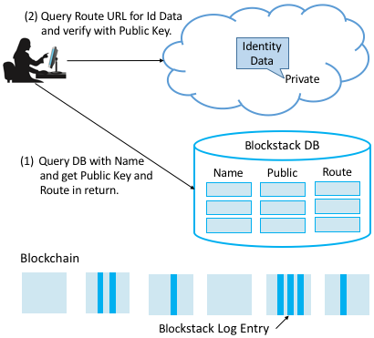

Perspective: Blockchain and a Decentralized Internet
====================================================

Probably without giving it much thought, users have invested enormous
trust in the applications they use, especially those like Facebook and
Google that not only store their personal photos and videos, but also
manage their identity (i.e., provide *Single Sign On* for other web
applications). This is troubling to many people, which has sparked
interest in *decentralized platforms*, systems for which users do not
have to trust a third-party. Such systems often build on top of a
cryptocurrency like Bitcoin, not for its monetary value, but because
cryptocurrency is itself based on a decentralized technology (called a
*blockchain*) that no single organization controls. It’s easy to be
distracted by all the hype, but a blockchain is essentially a
decentralized log (ledger) that anyone can write a “fact” to, and later
prove to the world that that fact was recorded.

Blockstack is an open source implementation of a decentralized platform,
including the blockchain, but more interestingly, it has been used to
implement a self-sovereign identity service for Internet applications. A
self-sovereign identity service is a type of identity service that is
*administratively decentralized*: it has no distinct service operator,
and no single principal can control who can create an identity and who
cannot. Blockstack uses a commodity public blockchain to build a
replicated identity database log. When this database log is replayed by
a Blockstack node, it produces the same view of all identities in the
system as every other Blockstack node reading the same view of the
underlying blockchain. Anyone can register an identity in Blockstack by
appending to the blockchain.

Instead of requiring users to place trust in a distinct set of identity
providers, Blockstack’s identity protocol instead asks users to trust
that the majority of the decision-making nodes in the blockchain (called
*miners*) will preserve the order of writes (called *transactions*). The
underlying blockchain provides a cryptocurrency to incentivize miners to
do this. Under normal operation, miners stand to earn the most
cryptocurrency by participating honestly. This allows Blockstack’s
database log to remain secure against tampering without a distinct
service operator. An adversary who wishes to tamper with the log must
compete against the majority of miners to produce an alternative
transaction history in the underlying blockchain that the blockchain
peer network will accept as the canonical write history.

The protocol for reading and appending to the Blockstack identity
database log operates at a logical layer above the blockchain.
Blockchain transactions are data frames for identity database log
entries. A client appends to the identity database log by sending a
blockchain transaction that embeds the database log entry, and a client
reads the log back by extracting the log entries from blockchain
transactions in the blockchain-given order. This makes it possible to
implement the database log “on top” of any blockchain.

Identities in Blockstack are distinguished by user-chosen names.
Blockstack’s identity protocol binds a name to a public key and to some
*routing state* (described below). It ensures that names are globally
unique by assigning them on a first-come first-serve basis.

Names are registered in a two-step process—one to bind the client’s
public key to the *salted hash* of the name, and one to reveal the name
itself. The two-step process is necessary to prevent front-running—only
the client that signed the name hash may reveal the name, and only the
client that calculated the salted hash can reveal the preimage. Once a
name is registered, only the owner of the name’s private key can
transfer or revoke the name, or update its routing state.

.. _fig-blockstack:

   Decentralized identity management built on a blockchain foundation.

Each name in Blockstack has an associated piece of routing state that
contains one or more URLs that point to where the user’s identity
information can be found online. This data is too big and expensive to
store on the blockchain directly, so instead Blockstack implements a
layer of indirection: the hash of the routing state is written to the
identity database log, and Blockstack peers implement a gossip network
for disseminating and authenticating the routing state. Each peer
maintains a full copy of the routing state.

Putting it all together, :numref:`Figure %s <fig-blockstack>` shows
how resolving a name to its corresponding identity state works. Given
a name, a client first queries a Blockstack peer for the corresponding
public key and routing state (Step 1). Once it has the routing state,
the client obtains the identity data by resolving the URL(s) contained
within it and authenticates the identity information by verifying that
it is signed by the name’s public key (Step 2).

.. admonition:: Broader Perspective

   To continue reading about the cloudification of the Internet, see
   :ref:`Perspective: The Cloud is the New Internet`.

   To learn more about Blockstack and decentralizing the Internet, we
   recommend: `Blockstack: A New Internet for Decentralized
   Applications <https://blockstack.org/whitepaper.pdf>`__, October
   2017.
