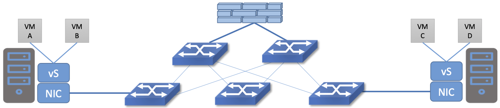

Perspective: Is Security Getting Worse or Better?
====================================================

Security breaches are now a standard risk of connecting any system to
the Internet, and it is rare for a week to go by without news of some
new attack. Verizon, a large telco, conducts an annual review of the state of
cyber-attacks; in 2024 they reached a milestone with over 10,000
incidents, such as ransomware and phishing attacks, covered in the
report. Measured by number of attacks then, it seems that things are
getting worse. By contrast, an analysis of the economic impact of
cyber-attacks performed by *The Economist* argued that the
peak days of cyber-attacks might be behind us. The worst era for
attacks in their economic analysis was 2003–2004 by a large margin.

There are certainly some respects in which security is improving. This
can be attributed both to greater awareness of the need for strong
security whenever important information is being handled, and the
development of new techniques that enable better security practices. 

One example of a technology development that improved security
implementations is SDN (software-defined networking). SDN has enabled
a relatively new approach to providing isolation among systems known
as *microsegmentation*.

Microsegmentation stands in contrast to traditional approaches to
segmenting networks, in which large sets of machines would
connect to a “zone” and firewalls would be used to filter traffic
passing between zones. While this made for relatively simple network
configuration, it meant that lots of machines would be in the same
zone even if there was no need for them to communicate. Furthermore,
the complexity of firewall rules would grow over time as more and more
rules would need to be added to describe the traffic allowed to pass
from one zone to another. 

By contrast, SDN allows for the creation of precisely defined virtual
networks that determine both which machines can communicate with each
other and how they can do so. For example, a three-tier application
can have its own microsegmentation policy which states:  machines
in the web-facing tier of the application can talk to the machines in
the application tier on some set of specified ports, but 
web-facing machines may not talk to each other. This is a policy that
was difficult to implement in the past, because all the web-facing
machines would sit on the same network segment.

Prior to microsegmentation, the complexity of configuring segments was
such that machines from many applications would likely sit on the same
segment, creating opportunities for an attack to spread from one
application to another. The lateral movement of attacks within
datacenters has been well documented as a key strategy of successful
cyberattacks over many years.

Consider the arrangement of VMs and the firewall in :numref:`Figure %s
<fig-standard-firewall>`. Suppose that, without network
virtualization, we wanted to put VM A and VM B in different segments
and apply a firewall rule for traffic going from VM A to VM B. We have
to prevent VM A from sending traffic directly to VM B. To do this,
would have to configure two VLANs in the physical network, connect A
to one of them, and B to the other, and then configure the routing
such that the path from the first VLAN to the second passed through
the firewall. If at some point VM A was moved to another server, we’d then
have to make sure the appropriate VLAN reached *that* server, connect VM
A to it, and ensure that the routing configuration was still forcing
traffic through the firewall. This situation may seem a little
contrived, but it demonstrates why microsegmentation was effectively
impossible to manage before the arrival of SDN. By contrast, SDN allows the
firewall function to be implemented in each virtual switch (vS in the
figure). Thus, traffic from VM A to VM B passes through the
firewall without any special routing configuration. It is the job of
the SDN controller to create the appropriate firewall rule to enforce
the desired isolation between VM A and VM B (and deal with movements
of VM A and VM B if they occur). There is no magic, but SDN gave us a
new tool to make a finer degree of isolation much easier to manage.

.. _fig-standard-firewall:

    A set of virtual machines communicate through a firewall
    
The development of microsegmentation over the last decade was one of
the major drives of SDN adoption in the enterprise. It became the
basis for a best practice in security known as “zero-trust”
networking. Zero trust means that, as much as possible, every system in
the network is assumed to be untrusted, and hence should be isolated
for all other systems aside from precisely those systems it needs
access to in order to do its assigned job.

The importance of the Internet in the running of
critical systems and as the underpinning for
much of the world's commerce has made it an attractive target for
hackers. At the same time it drives home the importance of developing and adopting
best practices such as zero-trust networking. When we read of breaches
today, it is often the case that some best practice has not been
followed. The Verizon cybersecurity report, by documenting what has
gone wrong in thousands of attacks, provides useful information about
how many of those attacks could be prevented through using established
cyber-hygiene techniques.

.. admonition:: Broader Perspective

   Verizon's data breach report can be obtained from
   `Data Breach Investigations Report
   <https://www.verizon.com/business/resources/reports/dbir/>`__.
   
   
   The economic impact of cyber-attacks is analyzed by *The Economist*
   in this article: `Unexpectedly, the cost of big cyber-attacks is
   falling
   <https://www.economist.com/graphic-detail/2024/05/17/unexpectedly-the-cost-of-big-cyber-attacks-is-falling>`__,
   May 2024.

   A deeper discussion on the use of SDN techniques to improve
   security is provided in Chapter 8 of our book `Software-Defined
   Networking: A Systems Approach
   <https://sdn.systemsapproach.org/>`__. 
   

